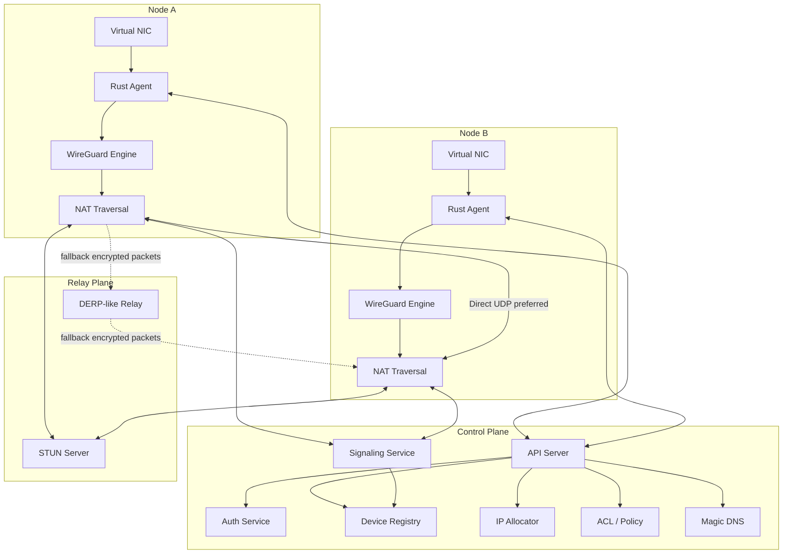

# P2WLAN / P2PNet 项目设计文档

Version: 0.1  
Date: 2026-07-16  
Status: Design Draft

## 1. 项目简介

P2WLAN 是一个高性能、跨平台、低资源占用的 P2P 虚拟内网系统。它让多台设备加入同一个加密 overlay network，并通过虚拟 IP 直接互访：

```text
电脑 A: 10.20.0.2
电脑 B: 10.20.0.3

ping 10.20.0.3
ssh 10.20.0.3
curl http://10.20.0.3:8080
```

用户无需公网 IP，也不需要手动配置复杂防火墙规则。系统优先尝试直连 P2P，直连失败时通过 Relay Server 转发加密数据包。

## 2. 产品目标

### 核心目标

- 高性能：数据面尽量接近 WireGuard 的延迟和吞吐。
- 跨平台：优先支持 Linux、Windows、macOS。
- 低内存：常驻客户端 MVP 目标低于 50 MB。
- 高度原生化：使用 Linux TUN、Windows Wintun、macOS utun/Network Extension。
- P2P 优先：优先 UDP hole punching，Relay 只做 fallback。
- 私有化部署：控制面、Relay、STUN/TURN 均可自建。
- 虚拟内网：通过虚拟 IP、DNS、ACL 和路由规则实现内网互访。
- 端口映射：支持 TCP/UDP 本地端口暴露、反向隧道和 Relay 公网入口。

### 非目标

- 不在 MVP 阶段实现全球级商业网络运营。
- 不自研加密算法。
- 不在第一阶段实现完整移动端 VPN 权限适配。
- 不在第一阶段实现复杂企业 IAM、审计、计费和多租户隔离。

## 3. 总体架构



架构分为三层：

- 控制面：认证、设备注册、虚拟 IP 分配、节点发现、策略下发、信令。
- 数据面：虚拟网卡、WireGuard 加密隧道、UDP P2P 传输。
- Relay 面：STUN 探测、公网 Relay fallback、可选公网端口映射入口。

## 4. 技术选型

### 客户端核心

建议使用 Rust 实现常驻 daemon。

原因：

- 内存安全，适合长期驻留进程。
- 跨平台系统 API 调用能力强。
- async 网络生态成熟。
- 容易与 Tauri 桌面端共享核心库。

客户端核心模块：

```text
client/
  daemon/        # 进程生命周期、配置、日志、权限检查
  tun/           # Linux TUN / Windows Wintun / macOS utun 抽象
  wireguard/     # 用户态 WireGuard 引擎封装
  nat/           # STUN、候选地址、打洞状态机
  transport/     # UDP socket、Relay transport、keepalive
  control/       # gRPC/HTTP API client、信令流
  routing/       # 路由表、DNS、子网路由
  portmap/       # TCP/UDP 端口映射
  crypto/        # 设备身份、签名、密钥保存
```

### 控制面

建议使用 Go 实现服务端。

原因：

- 网络服务开发效率高。
- gRPC、HTTP、PostgreSQL、Redis 生态成熟。
- 部署简单，单二进制体验好。

服务端模块：

```text
server/
  api/           # REST/gRPC API
  auth/          # 用户登录、token、设备授权
  devices/       # 设备注册、在线状态、端点信息
  networks/      # 虚拟网络、CIDR、IP 分配
  signaling/     # 节点间候选地址交换
  policy/        # ACL、路由策略
  dns/           # Magic DNS
  relayctl/      # Relay 发现与调度
```

### 桌面端 UI

建议使用 Tauri + React。

UI 只负责操作入口和状态展示，核心网络逻辑必须留在 Rust daemon 中：

- 登录/退出。
- 设备列表和在线状态。
- 当前连接类型：direct / relay。
- 虚拟 IP、DNS、路由状态。
- 端口映射规则管理。
- 日志与诊断。

## 5. 虚拟网卡设计

统一抽象：

```rust
pub trait VirtualInterface {
    fn name(&self) -> &str;
    fn mtu(&self) -> u16;
    fn configure(&mut self, config: InterfaceConfig) -> Result<()>;
    async fn read_packet(&mut self, buf: &mut [u8]) -> Result<usize>;
    async fn write_packet(&mut self, packet: &[u8]) -> Result<usize>;
}
```

平台实现：

| 平台 | 首选实现 | 备注 |
| --- | --- | --- |
| Linux | `/dev/net/tun` + `ioctl(TUNSETIFF)` | MVP 第一优先级，后续支持 multiqueue |
| Windows | Wintun | WireGuard 官方生态使用的 Layer 3 TUN 驱动 |
| macOS | Network Extension / utun | App 分发优先 Network Extension，开发阶段可先 utun |

MVP 建议只把 Linux TUN 做到可跑通。Windows/macOS 先保留 trait 和 feature gate，避免早期把工程复杂度拉满。

## 6. 数据面设计

数据流：

```text
App TCP/UDP packet
  -> OS route table
  -> Virtual NIC
  -> Rust daemon
  -> WireGuard encryption
  -> UDP direct path or Relay path
  -> Remote Rust daemon
  -> WireGuard decryption
  -> Remote Virtual NIC
  -> Remote app
```

推荐策略：

- MVP 使用用户态 WireGuard 引擎，避免强依赖内核 WireGuard 配置。
- WireGuard 只负责点对点加密隧道和 cryptokey routing。
- 节点发现、NAT 穿透、Relay、虚拟 IP 分配和 ACL 全部由 P2WLAN 控制面实现。
- Relay 只转发已加密 WireGuard packet，不能解密用户流量。

## 7. NAT 穿透设计

采用 ICE-inspired 流程，但不在第一版完整实现 WebRTC ICE 全规范。先实现工程上可控的最小集合：

1. 客户端启动 UDP socket。
2. 向 STUN server 发送 Binding Request，获得公网 endpoint。
3. 上报 host candidate、server-reflexive candidate、NAT 探测结果。
4. Signaling Service 把候选地址转发给目标节点。
5. 两端同时向对方候选地址发送 probe packet。
6. 任一候选路径收到有效响应后，升级为 direct path。
7. 直连失败、超时或网络切换时 fallback 到 Relay。

连接状态机：

```text
Idle
  -> GatheringCandidates
  -> Signaling
  -> Probing
  -> Direct
  -> Degraded
  -> Relay
  -> Reprobe
```

必须保留诊断信息：

- 当前连接类型：direct / relay。
- 本地 endpoint、公网 endpoint、Relay region。
- NAT 类型估计。
- 最近一次直连失败原因。
- RTT、丢包、吞吐估算。

## 8. Relay 设计

Relay 类似 DERP/TURN 的用途：在直连失败时保证连接可用。

原则：

- Relay 只处理节点身份、连接保活和密文转发。
- Relay 不保存、不解密、不解析用户内网 IP 包。
- Relay 要支持多区域部署和延迟选择。
- Relay 可作为端口映射的公网入口，但这属于独立功能，不混入基础 packet relay。

Relay 数据路径：

```text
Node A
  -> Relay session keyed by A public key
  -> Relay frame { dst_node, encrypted_payload }
  -> Node B session
```

MVP 可以先用 WebSocket/TCP over TLS 保证可用性，再补 UDP/QUIC relay 优化性能。

## 9. 控制面设计

控制面职责：

- 用户和设备认证。
- 设备注册、授权、下线。
- 虚拟网络和虚拟 IP 分配。
- 节点在线状态和 endpoint 同步。
- 信令消息转发。
- ACL、路由、DNS 配置下发。
- Relay 列表和区域调度。

核心数据库表：

```sql
users(id, email, password_hash, created_at)
networks(id, name, cidr_v4, cidr_v6, owner_user_id, created_at)
devices(id, user_id, network_id, name, public_key, virtual_ipv4, virtual_ipv6, os, created_at)
device_sessions(id, device_id, last_seen, endpoint, nat_type, relay_region, version)
acl_rules(id, network_id, source, destination, proto, port_range, action, priority)
port_mappings(id, device_id, proto, local_addr, local_port, public_port, mode, enabled)
```

在线状态建议放 Redis：

```text
online:{device_id} -> session metadata, ttl 30s
signal:{device_id} -> ephemeral stream/session id
```

## 10. 端口映射设计

端口映射分三类：

1. Peer local service：把某个节点的本地端口暴露给同一虚拟网络内其他节点。
2. Reverse tunnel：节点主动连到 Relay，由 Relay 暴露公网端口。
3. NAT port mapping：尝试 UPnP/NAT-PMP/PCP 在本地网关上开端口。

MVP 推荐先做第 1 类：

```text
p2wlan port add --name web --proto tcp --local 127.0.0.1:8080 --allow network
```

虚拟网络内访问：

```text
curl http://device-name.p2wlan:8080
```

公网端口映射必须显式声明风险，并默认关闭。

## 11. 安全设计

### 身份

- 每个设备生成长期 Device Identity Key。
- Device ID = public key hash。
- 控制面只接受已授权设备加入网络。
- 设备密钥存储使用平台原生安全存储：Keychain、Windows DPAPI、Linux secret service 或受限权限文件。

### 数据加密

- 数据面使用 WireGuard 加密。
- 控制面使用 TLS。
- 信令消息必须做身份认证和重放防护。
- Relay 只转发密文。

### ACL

默认策略建议：

- MVP：同网络设备默认互通，允许用户关闭。
- 企业模式：default deny，通过 ACL 显式允许。

策略维度：

```text
source device/group/user
destination device/subnet/service
protocol tcp/udp/icmp/any
port/range
action allow/deny
priority
```

## 12. 性能目标

MVP 性能目标：

| 指标 | 目标 |
| --- | --- |
| 客户端启动 | < 1s |
| 空闲内存 | < 50 MB |
| 空闲 CPU | < 1% |
| 直连延迟额外开销 | < 5 ms |
| 单连接吞吐 | > 500 Mbps |
| Relay 可用性 | 直连失败时 5s 内切换 |
| 节点数量 | 单网络 100 节点可用 |

长期目标：

- Linux multiqueue TUN。
- UDP socket batching。
- Relay 多区域调度。
- NAT reprobe 和网络切换快速恢复。
- 大网络下的差量配置下发。

## 13. 推荐 Monorepo 结构

```text
p2wlan/
  README.md
  P2PNet-Design.md
  docs/
    PROTOCOL.md
    ROADMAP.md
    RESEARCH_NOTES.md
    AI_IMPLEMENTATION_PROMPT.md
  proto/
    p2wlan/v1/control.proto
    p2wlan/v1/signaling.proto
    p2wlan/v1/relay.proto
  client/
    Cargo.toml
    crates/
      p2wlan-daemon/
      p2wlan-tun/
      p2wlan-wireguard/
      p2wlan-nat/
      p2wlan-control/
      p2wlan-portmap/
      p2wlan-cli/
  server/
    go.mod
    cmd/
      p2wlan-control/
      p2wlan-relay/
      p2wlan-stun/
    internal/
      auth/
      devices/
      networks/
      signaling/
      relay/
      policy/
      database/
  desktop/
    src/
    src-tauri/
  deploy/
    docker-compose.yml
    k8s/
  tests/
    nat-lab/
    integration/
```

## 14. MVP 验收标准

第一版必须证明数据面打通：

1. 两台 Linux 机器安装 client daemon。
2. daemon 创建 TUN 设备并配置虚拟 IP。
3. 控制面完成设备注册和 peer 配置下发。
4. 两节点在同一公网/局域网 UDP 可达环境下建立加密通道。
5. A 可以 `ping 10.20.0.3`，B 可以 `ping 10.20.0.2`。
6. 断开 direct UDP 后可以 fallback 到 Relay。
7. 客户端诊断命令能显示连接类型、RTT、endpoint 和最近错误。

## 15. 主要风险

- NAT 兼容性：对称 NAT、运营商 CGNAT、企业代理网络会显著降低直连率。
- 跨平台权限：Windows 驱动、macOS Network Extension entitlement、Linux capabilities 都需要单独处理。
- WireGuard 集成：需要明确用户态引擎边界，避免一边管理系统 WireGuard 一边管理自有 TUN 导致路由冲突。
- Relay 成本：大流量 fallback 会造成公网带宽成本。
- 安全边界：控制面、信令、Relay、数据面身份必须严格分离。
- 移动端：iOS/Android VPN API 对后台、权限和分发限制更多，应后置。

## 16. 参考资料

- [Tailscale connection types](https://tailscale.com/docs/reference/connection-types)
- [Tailscale DERP package](https://pkg.go.dev/tailscale.com/derp)
- [Tailscale derper README](https://github.com/tailscale/tailscale/blob/main/cmd/derper/README.md)
- [NetBird: How NetBird Works](https://docs.netbird.io/about-netbird/how-netbird-works)
- [WireGuard whitepaper](https://www.wireguard.com/papers/wireguard.pdf)
- [Wintun driver](https://www.wintun.net/)
- [Linux Universal TUN/TAP driver](https://docs.kernel.org/next/networking/tuntap.html)
- [Apple NEPacketTunnelProvider](https://developer.apple.com/documentation/networkextension/nepackettunnelprovider)
- [RFC 8445: ICE](https://www.rfc-editor.org/rfc/rfc8445)
- [RFC 8489: STUN](https://www.rfc-editor.org/rfc/rfc8489)
- [libp2p DCUtR](https://libp2p.io/docs/dcutr/)
- [libp2p Circuit Relay](https://docs.libp2p.io/concepts/circuit-relay/)

