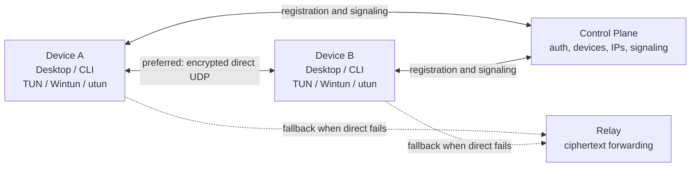

<div align="center">
  
  <h1>P2WLAN</h1>
  <p><strong>An encrypted virtual LAN for real devices, real networks, and real diagnostics.</strong></p>
  <p>Connect Mac, Windows, Linux, cloud servers, NAS devices, and home machines with stable private virtual IPs.</p>

  <p>
    <a href="README.md">简体中文</a>
    · <a href="README.en.md"><strong>English</strong></a>
  </p>

  <p>
    <a href="https://github.com/yhan-sun/p2wlan/actions/workflows/ci.yml"></a>
    <a href="https://github.com/yhan-sun/p2wlan/releases"></a>
    <a href="LICENSE"></a>
    
    
  </p>

  <p>
    <a href="https://github.com/yhan-sun/p2wlan/releases"><strong>Download</strong></a>
    · <a href="#quick-start">Quick Start</a>
    · <a href="#connection-paths">Connection Paths</a>
    · <a href="#protocol-boundaries">Protocols</a>
    · <a href="#self-hosting">Self-hosting</a>
    · <a href="#security-boundaries">Security</a>
  </p>
</div>

## Overview

P2WLAN is an open-source, P2P-first, self-hostable virtual LAN. It creates a real system network interface on each device, assigns stable `10.20.x.x` private addresses, and prefers end-to-end encrypted UDP direct paths whenever the network allows it.

When direct connectivity is blocked by NAT, CGNAT, enterprise firewalls, campus networks, or cloud security groups, P2WLAN falls back to encrypted relay forwarding so the private network stays usable. It also keeps connection state visible: peers can be LAN direct, public UDP direct, relayed, or unreachable.

> P2WLAN is currently in **Preview**. It already includes an encrypted data plane, NAT probing, UDP hole punching, and relay fallback, but it has not completed an independent security audit and should not be treated as an official WireGuard-compatible implementation. For sensitive production traffic, review the security model and remember that direct connectivity still depends on both network environments.

## Highlights

<table>
  <tr>
    <td width="33%" valign="top">
      <h3>Real virtual interfaces</h3>
      <p>macOS <code>utun</code>, Windows Wintun, and Linux TUN let virtual IPs work with <code>ping</code>, SSH, RDP, databases, and browsers.</p>
    </td>
    <td width="33%" valign="top">
      <h3>P2P first</h3>
      <p>Prefer LAN and public UDP direct paths, keep mappings alive, and fall back to relay only when direct transport is not confirmed.</p>
    </td>
    <td width="33%" valign="top">
      <h3>Encrypted data plane</h3>
      <p>Device traffic travels through WireGuard-like Noise sessions; relay nodes forward ciphertext and do not terminate private payloads.</p>
    </td>
  </tr>
  <tr>
    <td width="33%" valign="top">
      <h3>Observable by design</h3>
      <p>Inspect peer state, path type, latency, endpoint candidates, and local diagnostics from the desktop client or CLI.</p>
    </td>
    <td width="33%" valign="top">
      <h3>Fully self-hostable</h3>
      <p>Run the control plane, SQLite database, and relay on your own public Linux instance.</p>
    </td>
    <td width="33%" valign="top">
      <h3>Cross-platform</h3>
      <p>Tauri desktop apps for macOS and Windows, plus a Linux CLI for servers, NAS devices, and headless environments.</p>
    </td>
  </tr>
</table>

## Use Cases

- **Cloud machine access**: reach SSH, RDP, dashboards, databases, and development services through virtual IPs.
- **Home labs and NAS**: connect laptops, mini PCs, NAS devices, and remote servers without hand-maintained VPN routes.
- **Cross-cloud networking**: give machines from different providers and regions one private address space.
- **Temporary field networks**: connect devices across hotel Wi-Fi, mobile hotspots, campus networks, and home broadband.
- **Self-hosted networking research**: inspect NAT probing, relay tickets, revocation feeds, diagnostics, and protocol boundaries from source.

## Quick Start

Download the latest client from [GitHub Releases](https://github.com/yhan-sun/p2wlan/releases), sign in on at least two devices, start the virtual interface, then test another peer by virtual IP:

```bash
ping 10.20.0.5
ssh user@10.20.0.5
```

### macOS

Download the universal `.dmg`, drag P2WLAN into Applications, open it, and approve the system authorization prompt when starting the virtual interface.

Preview builds may not yet be Apple-notarized. If Gatekeeper blocks the first launch, open the app from Finder with right-click -> Open.

### Windows

Download the Windows archive, keep these files in the same directory, and run `p2wlan-desktop.exe`:

```text
p2wlan-desktop.exe
p2pnet-daemon.exe
wintun.dll
```

Windows asks for UAC approval when the virtual adapter starts. P2WLAN does not read or store your administrator password.

### Linux

The current Linux release focuses on server, NAS, and headless CLI workflows:

```bash
curl -fsSL https://raw.githubusercontent.com/yhan-sun/p2wlan/main/scripts/install-linux-cli.sh -o /tmp/p2wlan-install.sh
sudo sh /tmp/p2wlan-install.sh

p2wlan login -u you@example.com
p2wlan up
p2wlan status
```

Useful commands:

```bash
p2wlan doctor
p2wlan logs -f
p2wlan down
p2wlan update
```

## Connection Paths

P2WLAN shows the active path directly so troubleshooting starts with facts.

| Path | Meaning | Common environment |
| --- | --- | --- |
| **LAN direct** | Devices can reach each other on the local network. | Home LAN, office network, lab network |
| **Public UDP direct** | Devices communicate through public UDP endpoints after NAT probing, peer-reflexive discovery, or explicit UDP exposure. | Cloud server with fixed UDP ingress, less restrictive NAT |
| **Encrypted relay** | Direct path is not confirmed, so packets are forwarded as ciphertext through a DERP-like relay. | CGNAT, blocked UDP, missing cloud security-group rule |
| **Unreachable** | No valid direct or relay path is currently confirmed. | Peer offline, expired credentials, network partition, relay unavailable |

Direct candidates can come from local interfaces, STUN observations, manual public UDP configuration, peer-reflexive observations, and a small bounded prediction window. In complex networks, direct success depends on both peers' NAT mapping and filtering behavior. For cloud servers that should accept public UDP directly, configure a stable UDP listen port and allow it in both the cloud firewall and the operating-system firewall.

## Architecture



| Layer | Implementation | Responsibility |
| --- | --- | --- |
| Desktop client | React, Tauri | Login, device status, system authorization, tray, settings, diagnostics |
| Local daemon | Rust | Virtual interface, encrypted sessions, peer state, NAT probing, relay fallback |
| Control plane | Go, SQLite | Accounts, device registry, virtual IPs, credential state, relay tickets, signaling |
| Relay | Go | Ciphertext forwarding, ticket validation, revocation synchronization |

## Protocol Boundaries

P2WLAN currently uses a self-contained WireGuard-like data plane instead of calling kernel WireGuard or `wireguard-go` directly. This keeps TUN handling, desktop diagnostics, signaling, and relay fallback tightly integrated, but it also means production use needs stronger validation and review.

| Boundary | Current implementation | Notes |
| --- | --- | --- |
| Data-plane handshake | `Noise_IKpsk2_25519_ChaChaPoly_BLAKE2s` style | Tracks WireGuard's Noise IK shape, but does not claim official WireGuard interoperability |
| Key exchange | X25519 | Used for peer-to-peer encrypted session negotiation |
| Encryption | ChaCha20-Poly1305 | AEAD for handshake messages and transport payloads |
| Hash / KDF | BLAKE2s / HKDF-BLAKE2s | Keeps WireGuard-style semantics; P2WLAN does not use BLAKE3 here |
| Device auth | Ed25519 challenge-response | Used for control-plane device credentials and signaling identity binding |
| Control signaling | JSON over HTTPS / WSS | Easy to inspect; `proto/` contains a protobuf draft |
| Relay | DERP-like TCP/TLS ciphertext forwarder | Not standard TURN; relays do not decrypt private payloads |

There are two credible production-hardening paths: reuse `boringtun`, `wireguard-go`, or platform WireGuard implementations to reduce cryptographic maintenance risk; or keep the in-repo data plane and add test vectors, fuzzing, replay/rekey/malformed-packet coverage, interoperability notes, and independent security review.

For the full release gate, see the [production hardening checklist](docs/production-hardening.en.md), and use the [NAT traversal acceptance matrix](docs/nat-traversal-matrix.en.md) for real-network validation.

## NAT And Relay

P2WLAN's traversal layer is more than a single STUN lookup. The daemon gathers host and STUN server-reflexive candidates, performs UDP hole punching, learns peer-reflexive endpoints, maintains direct-path keepalives, and falls back to relay when direct transport is not confirmed.

Important limits:

- **Not a complete RFC8445 ICE checklist**: candidate priority, nomination, retries, and failure reasons exist as foundations, but this is not the full browser-grade ICE/TURN stack.
- **Not standard TURN**: relay is a DERP-like forwarder. Environments that require TURN allocation/permission/channel semantics need an additional gateway or future implementation.
- **Complex NAT success is not guaranteed**: campus networks, enterprise networks, mobile networks, CGNAT, and double symmetric NAT require real-world matrix testing; use the [NAT traversal acceptance matrix](docs/nat-traversal-matrix.en.md) to record each run.
- **Relays still expose metadata**: relays see node identifiers, timing, and packet sizes even though payloads remain encrypted.

## MTU And Performance

The default TUN MTU is `1420`, which fits many WireGuard-style encapsulation scenarios, but it is not the result of automatic path MTU discovery. Some networks have a lower practical MTU and may show large-packet loss, stalled SSH sessions, incomplete page loads, or poor relay throughput.

Troubleshooting guidance:

- If small `ping` packets work but larger flows stall, try lowering MTU to `1380`, `1360`, or `1280`.
- Relay paths carry ciphertext over TCP/TLS, so latency and congestion behavior differ from direct UDP.
- Networks that drop ICMP fragmentation-needed messages can create PMTU blackholes; automatic PMTU probing is a key future hardening item.
- P2WLAN is a transparent layer-3 virtual network. It does not split SSH, file transfer, or game traffic into separate application streams. If QUIC is introduced later, QUIC DATAGRAM or relay transport is the more natural starting point than rewriting application protocols.

## Platform Status

| Platform | Client | Virtual interface | Status |
| --- | --- | --- | --- |
| macOS Apple Silicon / Intel | Desktop app | `utun` | Preview, real bidirectional virtual-IP testing completed |
| Windows 10/11 x64 | Portable desktop app | Wintun | Preview, remote smoke coverage is expanding |
| Linux x64 / arm64 | CLI | TUN | Preview, server and headless workflows supported |

## Self-hosting

P2WLAN can run on your own public Linux server. For personal testing or small self-hosted networks, one small machine is usually enough for both control and relay services.

```bash
cd server
mkdir -p data
go build -o p2wlan-control .
go build -o p2wlan-relay ./relay
```

Control plane example:

```bash
JWT_SECRET="replace-with-a-long-random-secret" \
DB_PATH="./data/p2wlan.db" \
PORT=18080 \
RELAY_SERVERS="default@relay.example.com:18081" \
RELAY_REVOCATION_FEED_TOKEN="replace-with-a-second-random-secret" \
./p2wlan-control
```

Relay example:

```bash
RELAY_BIND=":18081" \
RELAY_REVOCATION_FEED_URL="https://control.example.com/api/v1/relay/revocations" \
RELAY_REVOCATION_FEED_TOKEN="same-token-as-control-plane" \
RELAY_REVOCATION_POLL_INTERVAL="30s" \
./p2wlan-relay
```

Put HTTPS/WSS in front of internet-facing control planes, and keep SQLite files, diagnostics endpoints, and relay tokens private.

## Security Boundaries

- Devices joined to the same virtual network should be treated as nodes within the same trust boundary.
- X25519 node identity is used for data-plane handshakes; Ed25519 device identity is used for control-plane challenge signing and signaling identity binding.
- The control plane can see accounts, device identities, virtual IPs, endpoint candidates, relay tickets, and connection metadata.
- Relays can see node identifiers, timing, and packet sizes, but forward encrypted payloads.
- Self-hosted internet-facing control planes should use HTTPS/WSS, public relays should use TLS, and operators should rotate JWT secrets, relay revocation tokens, and device credentials.
- Local static denylists only affect the local daemon or relay instance; online relay revocation is driven by the control plane feed.
- Preview releases have not completed independent security audit. For sensitive deployments, self-host, enable TLS, rotate relay tokens, review release artifacts, and roll out only within an accepted risk boundary.

## Troubleshooting

| Symptom | Check first |
| --- | --- |
| Peer is online but direct path fails | Local firewall, UDP listen port, STUN reachability, cloud security-group UDP ingress |
| Traffic always uses relay | CGNAT, enterprise/campus UDP filtering, symmetric NAT, expired candidates |
| `ping` works but SSH/RDP stalls | MTU too high, PMTU blackhole, relay latency or loss |
| Self-hosted relay cannot connect | Relay endpoint format, TLS certificate, revocation token, control-plane relay catalog |
| Device credential fails | Ed25519 keypair, challenge-response flow, control-plane clock, credential state |

## Build from Source

Install Rust stable, Go 1.22+, Node.js 20+, and pnpm 10+. Linux desktop builds also need GTK/WebKit2GTK development dependencies.

```bash
git clone https://github.com/yhan-sun/p2wlan.git
cd p2wlan
pnpm install --frozen-lockfile

cargo build -p p2pnet-daemon
cargo tauri dev
```

For macOS packages, use the project scripts so the daemon is placed into the app resource directory:

```bash
pnpm run icons
pnpm run package:macos
```

## Quality Gates

Run relevant checks before submitting code changes:

```bash
cargo fmt --all --check
cargo clippy --workspace --all-targets --all-features -- -D warnings
cargo test --workspace --all-targets

cd server
go vet ./...
go test ./... -count=1
cd ..

pnpm audit --audit-level high
pnpm run build
./scripts/control-smoke.sh
```

Real TUN smoke tests require administrator privileges:

```bash
sudo -E ./scripts/tun-ping-smoke.sh
sudo -E ./scripts/mac-remote-smoke.sh --tun
```

## Repository Map

```text
client/       Rust networking core: TUN, encrypted sessions, NAT, relay, daemon, CLI
server/       Go control plane, auth, SQLite, signaling, relay server, revocation feed
src/          React desktop client interface
src-tauri/    Tauri shell, tray, permissions, daemon lifecycle, platform packaging
scripts/      Build, install, packaging, direct-path, and cross-platform smoke scripts
fuzz/         Protocol and parser fuzzing
proto/        Protobuf protocol draft
```

## Contributing

Issues, pull requests, real-world network reports, platform compatibility feedback, and security review are welcome.

Please keep the repository clean. Do not commit `.docx`, `.pdf`, `.dmg`, `.zip`, `.tar.gz`, logs, local databases, or runtime-generated files. Use Markdown source files and reproducible scripts instead.

## License

P2WLAN is released under the [MIT License](LICENSE).
