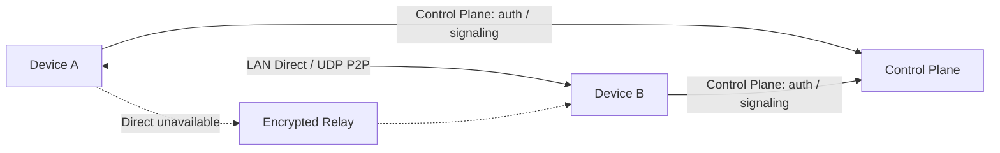

<div align="center">
  
  <h1>P2WLAN</h1>
  <p><strong>Connect devices across different networks as if they were on the same LAN.</strong></p>
  <p>Automatic virtual LAN · P2P first · Relay fallback · Cross-platform · Self-hostable</p>

  <p>
    <a href="README.md">简体中文</a>
    · <a href="README.en.md"><strong>English</strong></a>
  </p>

  <p>
    <a href="https://github.com/yhan-sun/p2wlan/releases"><strong>Download</strong></a>
    · <a href="#quick-start">Quick Start</a>
    · <a href="#how-it-works">How It Works</a>
    · <a href="#self-hosting">Self-hosting</a>
  </p>

  <p>
    <a href="https://github.com/yhan-sun/p2wlan/releases"></a>
    <a href="https://github.com/yhan-sun/p2wlan/actions/workflows/ci.yml"></a>
    <a href="LICENSE"></a>
  </p>
</div>

## What is P2WLAN?

P2WLAN is an open-source, P2P-first, self-hostable virtual LAN. Each device gets a private virtual IP, so ordinary applications such as `ping`, SSH, RDP, databases, and web services can communicate without maintaining separate public ports and routes.

When a connection is established, P2WLAN prefers a local or public UDP direct path. If the network does not allow a direct path, it automatically falls back to an encrypted relay.

> **Preview:** P2WLAN is intended for real-network testing, self-hosting, and development validation. It has not received an independent security audit and is not an official WireGuard implementation or a WireGuard interoperability solution.

## Why P2WLAN

| Capability | What it means |
| --- | --- |
| **P2P First** | Prefer LAN and public UDP direct paths before using a relay. |
| **NAT Traversal** | Probe network conditions and attempt UDP P2P connectivity; complex NAT environments are not guaranteed to succeed. |
| **End-to-End Encryption** | Device traffic is carried in encrypted sessions; relays forward ciphertext only. |
| **Automatic Relay Fallback** | If Direct cannot be confirmed, traffic can move to Relay without changing the application endpoint. |
| **Cross-platform** | Flutter clients cover desktop and mobile preview targets; the Rust daemon / CLI also supports servers and headless environments. |
| **Self-hosted** | The Control Plane, SQLite database, and Relay can run on your own Linux server. |

## Use Cases

- Remote access to computers, cloud instances, NAS, and HomeLab machines
- SSH / RDP / web administration / database access
- Connecting development devices across regions or cloud providers
- Linking devices across home broadband, mobile hotspots, campus networks, and other different networks
- Running the Control Plane and Relay on infrastructure you control

## Quick Start

**1. Download**

Get the latest release from [GitHub Releases](https://github.com/yhan-sun/p2wlan/releases).

| Platform | Release artifact | Status |
| --- | --- | --- |
| macOS 12+ Apple Silicon | `p2wlan-flutter-macos-arm64.dmg` | Supported |
| macOS 12+ Intel | `p2wlan-flutter-macos-x64.dmg` | Supported |
| Windows x64 | `p2wlan-flutter-windows-x64-setup.exe` | Supported |
| Linux x64 | Flutter `.tar.gz` / CLI `.tar.gz` | Supported |
| Linux arm64 | CLI `.tar.gz` | Supported |
| Android 7.0+ (API 24+) arm64 | `p2wlan-flutter-android-arm64-release.apk` | Preview |
| iOS 15+ arm64 | `p2wlan-flutter-ios-arm64-unsigned.ipa` | Experimental, requires signing |

**2. Sign in**

Open the client and sign in. On servers or headless systems, use the CLI:

```bash
p2wlan login -u you@example.com
```

**3. Start the virtual network**

Start the network from the client, or run:

```bash
p2wlan up
p2wlan status
```

**4. Use the virtual IP**

Once the peer is connected, use its P2WLAN virtual IP like any other private address:

```bash
ping 10.20.0.5
ssh user@10.20.0.5
```

**5. Check the connection path**

The client shows the active peer path. For CLI diagnostics:

```bash
p2wlan doctor
p2wlan logs -f
```

For Linux CLI installation, the repository also provides an installer:

```bash
curl -fsSL https://raw.githubusercontent.com/yhan-sun/p2wlan/main/scripts/install-linux-cli.sh -o /tmp/p2wlan-install.sh
sudo sh /tmp/p2wlan-install.sh
```

## How It Works

P2WLAN separates connection control from data transport. The Control Plane handles identity, devices, virtual IPs, and signaling. The Rust daemon owns the local virtual interface, encrypted data plane, and path selection. A Relay is used only when needed and forwards ciphertext.



The connection strategy can be summarized as:

**LAN Direct → Public UDP Direct → Encrypted Relay**

Direct connectivity depends on both real network environments. NAT, CGNAT, firewalls, or cloud security groups can prevent direct connectivity; Relay provides the fallback path when it is available.

## Connection Status

| Status | Meaning |
| --- | --- |
| **LAN Direct** | Direct communication over the local network. |
| **Direct** | P2P communication over public UDP. |
| **Relay** | Ciphertext is forwarded through an encrypted relay path. |
| **Connecting** | A connection path is being established or confirmed. |
| **Offline** | The peer is offline or no usable path is currently confirmed. |

## Architecture

| Component | Technology | Responsibility |
| --- | --- | --- |
| GUI | Flutter | Sign-in, device management, connection status, and diagnostics. |
| Data Plane / Daemon | Rust | TUN, routing, peers, NAT traversal, encrypted sessions, and relay fallback. |
| Virtual interface | macOS `utun` / Windows Wintun / Linux TUN | Provides a normal layer-3 virtual network interface to applications. |
| Control Plane | Go + SQLite | Authentication, device registry, virtual IPs, credentials, signaling, and relay information. |
| Relay | Go | Relay connections, ticket validation, and ciphertext forwarding. |

P2WLAN uses a self-contained **WireGuard-like Noise** data plane with X25519, ChaCha20-Poly1305, BLAKE2s, and related primitives. **P2WLAN is not an official WireGuard implementation and does not claim WireGuard interoperability.**

## Self-hosting

The Control Plane and Relay live under [`server/`](server/). Linux CLI / daemon components are part of the Rust workspace. A minimal build from the repository root is:

```bash
cd server
go build -o p2wlan-control .
go build -o p2wlan-relay ./relay
```

For production deployment, configure HTTPS/WSS, the database, authentication secrets, and relay addresses according to the current code under [`server/`](server/). The project homepage intentionally does not duplicate the full production configuration.

## Security Boundaries

- Device traffic uses an encrypted data plane between endpoints.
- Relays forward ciphertext and do not decrypt private payloads.
- Relays may still observe connection metadata such as node identifiers, timing, and packet sizes.
- The project is in **Preview** and has **not completed an independent security audit**.
- P2P connectivity is not guaranteed across arbitrary NAT environments; relay availability also depends on the Control Plane and Relay being reachable.
- For sensitive production environments, perform your own security assessment before deployment.

## Developers

Flutter development and releases use Flutter 3.47.2 with Dart 3.13.2. The
repository-root `.fvmrc` is the version source for local FVM, CI, and release
workflows.

The repository is organized by responsibility:

- [`apps/flutter_client/`](apps/flutter_client/) — Flutter client
- [`client/daemon/`](client/daemon/) — Rust daemon
- [`client/cli/`](client/cli/) — Rust CLI
- [`client/tun/`](client/tun/) — TUN / virtual interface abstraction
- [`client/crypto/`](client/crypto/) — cryptographic components
- [`server/`](server/) — Go Control Plane
- [`server/relay/`](server/relay/) — Go Relay

Implementation details should be confirmed from source, tests, and CI rather than duplicated as internal state-machine documentation on the project homepage.

## License

[MIT](LICENSE)
