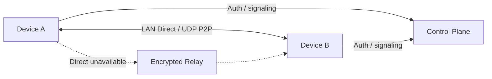

<p align="center">
  
</p>

<div align="center">
  <h1>P2WLAN</h1>
  <p><strong>Connect remote devices as if they were on the same LAN.</strong></p>
  <p>P2P first · NAT traversal · Relay fallback · Cross-platform · Rooms · Self-hostable</p>

  <p>
    <a href="README.md">简体中文</a>
    · <a href="README.en.md"><strong>English</strong></a>
  </p>

  <p>
    <a href="https://github.com/yhan-sun/p2wlan/releases"><strong>Download</strong></a>
    · <a href="#quick-start">Quick Start</a>
    · <a href="#use-cases">Use Cases</a>
    · <a href="#how-it-works">How It Works</a>
    · <a href="#self-hosting">Self-hosting</a>
  </p>

  <p>
    <a href="https://github.com/yhan-sun/p2wlan/releases"></a>
    <a href="https://github.com/yhan-sun/p2wlan/actions/workflows/ci.yml"></a>
    <a href="LICENSE"></a>
  </p>
</div>

## What is P2WLAN?

P2WLAN is an open-source, P2P-first, self-hostable virtual LAN. It gives devices private virtual IP addresses so machines on home broadband, mobile networks, campus networks, cloud servers, and other remote networks can communicate as if they were on the same LAN.

When establishing a connection, P2WLAN prefers **LAN Direct / public UDP P2P**. If NAT, firewalls, or the current network prevent a direct path, it automatically falls back to an **Encrypted Relay**. Applications keep using the same virtual IP, without requiring a separate public port, DDNS entry, or custom route for every device.

> [!IMPORTANT]
> P2WLAN is currently a **Preview** project intended for real-network testing, self-hosting, and development validation. It has not completed an independent security audit. P2WLAN is not an official WireGuard implementation and does not claim WireGuard interoperability.

## At a glance

| Capability | What it means |
| --- | --- |
| **P2P First** | Prefer local and public UDP direct paths before using a relay. |
| **NAT Traversal** | Probe network conditions and attempt UDP hole punching; complex NAT environments are not guaranteed to succeed. |
| **Relay Fallback** | Automatically move to an encrypted relay when Direct is unavailable. |
| **End-to-End Encryption** | Peer traffic is carried in encrypted sessions; relays forward ciphertext only. |
| **Rooms** | Organize a fixed or temporary group of devices for game sessions, collaboration, or private services. |
| **Cross-platform** | GUI clients cover Windows, macOS, Linux, and mobile preview targets; CLI / daemon builds support servers and headless systems. |
| **Self-hosted** | Run the Control Plane, SQLite database, and Relay on infrastructure you control. |

## Screenshots

<p align="center">
  
</p>

The client surfaces network health, peer availability, rooms, active paths, and end-to-end latency in one place. Device names and values shown in the screenshots are demo data.

## Use Cases

P2WLAN provides a virtual layer-3 network rather than defining what must run on top of it. If an application communicates over IP, it can usually use the P2WLAN virtual network in the same way it would use a normal private LAN.

| Scenario | Example |
| --- | --- |
| **NAS / HomeLab** | Reach NAS administration pages, home servers, VMs, and internal services without exposing each one through a public port. |
| **Minecraft** | Put friends' computers in the same room and connect to a self-hosted Minecraft server through its virtual IP. |
| **Terraria** | Place players on different real networks into one virtual network for multiplayer sessions. |
| **Self-hosted services** | Reach web apps, APIs, databases, admin panels, and game servers that should stay private. |
| **Remote development** | SSH, RDP, database access, development machines, and cross-region testing. |
| **Cross-region networking** | Link home broadband, mobile hotspots, campus networks, cloud instances, and different cloud providers. |

### Rooms: organize who should be connected

Rooms are useful when a network needs its own boundary: a Minecraft survival server, a temporary game session, a set of NAS maintenance devices, or a development environment. The client can present members, availability, virtual IPs, active paths, and latency without mixing every device into a single view.

## Quick Start

### 1. Download

Get the latest build from [GitHub Releases](https://github.com/yhan-sun/p2wlan/releases).

| Platform | Release artifact | Status |
| --- | --- | --- |
| macOS 12+ Apple Silicon | `p2wlan-flutter-macos-arm64.dmg` | Supported |
| macOS 12+ Intel | `p2wlan-flutter-macos-x64.dmg` | Supported |
| Windows x64 | `p2wlan-flutter-windows-x64-setup.exe` | Supported |
| Linux x64 | Flutter `.tar.gz` / CLI `.tar.gz` | Supported |
| Linux arm64 | CLI `.tar.gz` | Supported |
| Android 7.0+ (API 24+) arm64 | `p2wlan-flutter-android-arm64-release.apk` | Preview |
| iOS 15+ arm64 | `p2wlan-flutter-ios-arm64-unsigned.ipa` | Experimental, requires signing |

### 2. Sign in

Open the GUI and sign in. Servers and headless systems can use the CLI:

```bash
p2wlan login -u you@example.com
```

### 3. Start the virtual network

Start networking from the client, or run:

```bash
p2wlan up
p2wlan status
```

### 4. Use the virtual IP

Once the peer is connected, use its P2WLAN virtual IP like any other private address:

```bash
ping 10.20.0.5
ssh user@10.20.0.5
```

The same applies to game servers, NAS services, web panels, databases, and other IP-based applications: connect to the peer's virtual IP and the service port.

### 5. Check the connection path

The client shows the active peer path. For CLI diagnostics:

```bash
p2wlan doctor
p2wlan logs -f
```

The repository also includes a Linux CLI installer:

```bash
curl -fsSL https://raw.githubusercontent.com/yhan-sun/p2wlan/main/scripts/install-linux-cli.sh -o /tmp/p2wlan-install.sh
sudo sh /tmp/p2wlan-install.sh
```

## How It Works

P2WLAN separates connection control from data transport:

- **Control Plane** handles identity, devices, virtual IPs, credentials, and signaling.
- **Rust daemon** manages the virtual interface, routing, peers, NAT traversal, encrypted data plane, and path selection.
- **Relay** participates only when Direct is unavailable and forwards ciphertext.



The path strategy can be summarized as:

**LAN Direct → Public UDP Direct → Encrypted Relay**

Direct connectivity depends on both real network environments. NAT, CGNAT, firewalls, and cloud security groups may prevent a direct path. Relay is the fallback path, not a guarantee that P2P will succeed across every NAT topology.

## Connection Status

| Status | Meaning |
| --- | --- |
| **LAN Direct** | Direct communication over the local network. |
| **Direct** | P2P communication over public UDP. |
| **Relay** | Encrypted traffic is forwarded through a Relay. |
| **Connecting** | A path is being established or confirmed. |
| **Offline** | The peer is offline or no usable path is currently available. |

## Architecture

| Component | Technology | Responsibility |
| --- | --- | --- |
| GUI | Flutter | Sign-in, device / room management, connection status, and diagnostics. |
| Data Plane / Daemon | Rust | TUN, routing, peers, NAT traversal, encrypted sessions, and Relay fallback. |
| Virtual interface | macOS `utun` / Windows Wintun / Linux TUN | Provides a standard layer-3 virtual network interface to applications. |
| Control Plane | Go + SQLite | Authentication, device registry, virtual IPs, credentials, signaling, and Relay information. |
| Relay | Go | Relay connections, ticket validation, and ciphertext forwarding. |

P2WLAN uses a self-contained **WireGuard-like Noise** data plane with X25519, ChaCha20-Poly1305, BLAKE2s, and related primitives. **P2WLAN is not an official WireGuard implementation and does not claim WireGuard interoperability.**

## Self-hosting

The Control Plane and Relay live under [`server/`](server/). Linux CLI / daemon components are part of the Rust workspace. A minimal build from the repository root is:

```bash
cd server
go build -o p2wlan-control .
go build -o p2wlan-relay ./relay
```

Production deployment also requires HTTPS/WSS, database, authentication secrets, and Relay addresses to be configured according to the current code. This README keeps only the high-level entry point; use the implementation under [`server/`](server/) as the source of truth for deployment details.

## Security Boundaries

- Device traffic uses an encrypted data plane between endpoints.
- Relays forward ciphertext and do not decrypt private payloads.
- Relays may still observe connection metadata such as node identifiers, timing, and packet sizes.
- The project is in **Preview** and has **not completed an independent security audit**.
- P2P connectivity is not guaranteed across arbitrary NAT environments; Relay availability also depends on the Control Plane and Relay being reachable.
- Perform your own security assessment before sensitive production deployment.

## Developers

Flutter development and releases use **Flutter 3.47.2 / Dart 3.13.2**. The repository-root `.fvmrc` is the version source for local FVM, CI, and release workflows.

Repository structure:

- [`apps/flutter_client/`](apps/flutter_client/) — Flutter client
- [`client/daemon/`](client/daemon/) — Rust daemon
- [`client/cli/`](client/cli/) — Rust CLI
- [`client/tun/`](client/tun/) — TUN / virtual interface abstraction
- [`client/crypto/`](client/crypto/) — cryptographic components
- [`server/`](server/) — Go Control Plane
- [`server/relay/`](server/relay/) — Go Relay

Prefer source, tests, and CI as the source of truth for implementation details.

## License

[MIT](LICENSE)
