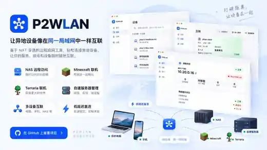
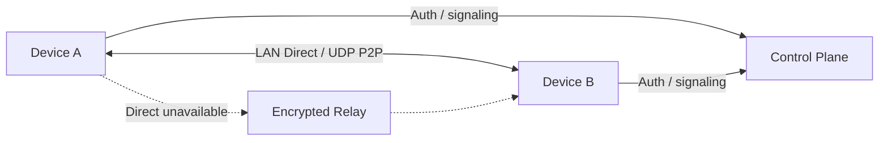

<p align="center">
  
</p>

<div align="center">
  <h1>P2WLAN</h1>
  <p><strong>Connect remote devices as if they were on the same LAN.</strong></p>
  <p>Remote gaming · Private access · P2P first · Encrypted relay · Free and open source · Self-hostable</p>

  <p>
    <a href="README.md">简体中文</a>
    · <a href="README.en.md"><strong>English</strong></a>
  </p>

  <p>
    <a href="https://github.com/yhan-sun/p2wlan/releases"><strong>Download a release</strong></a>
    · <a href="#quick-start">Quick Start</a>
    · <a href="#why-choose-p2wlan">Why P2WLAN</a>
    · <a href="#compare-with-similar-software">Compare</a>
    · <a href="#screenshots">Screenshots</a>
    · <a href="#use-cases">Use Cases</a>
    · <a href="#how-it-works">How It Works</a>
    · <a href="#self-hosting">Self-hosting</a>
  </p>

  <p>
    <a href="https://github.com/yhan-sun/p2wlan/releases"></a>
    <a href="https://github.com/yhan-sun/p2wlan/actions/workflows/ci.yml"></a>
    <a href="LICENSE"></a>
  </p>

  <p>
    <a href="https://trendshift.io/repositories/239992"></a>
    <a href="https://trendshift.io/repositories/239992"></a>
  </p>
</div>

## What is P2WLAN?

P2WLAN is **free, open-source virtual LAN software** for multiplayer games, remote access, and connecting devices across networks. Play Minecraft with friends, reach your home NAS while away, or connect to a remote development machine through one private network. It supports **Windows, macOS, Linux, and Android**, with graphical clients and a CLI for servers.

Participating devices receive private virtual IPs. P2WLAN prefers **LAN / IPv6 / IPv4 UDP direct connections**, then automatically uses an **end-to-end encrypted relay** when a direct path is unavailable. Applications keep using the same virtual IP, without a separate public port or DDNS entry for each service.

**Get started:** [Download a client](https://github.com/yhan-sun/p2wlan/releases) → use an administrator's Control address or [host your own service](docs/guides/self-hosting.md) → sign in and connect your personal network or a room → play or access services through virtual IPs.

## Why choose P2WLAN

- **Bring friends together in a room.** Manage room codes, invitations, members, and devices in the client. Keep games, collaboration, and maintenance environments in separate networks.
- **Prefer direct paths and avoid relay detours.** Use local paths on the same LAN and try IPv6 or UDP hole punching across networks. Once direct connectivity is established, application traffic does not consume relay bandwidth.
- **Keep a fallback for restrictive networks.** Automatically use an encrypted relay when needed and keep trying to recover a direct path. Applications retain their virtual IP endpoint.
- **Reach multiple services through one private network.** Connect to SSH, RDP, NAS services, web panels, and game servers by virtual IP and service port.
- **See how devices connect.** View availability, Direct / Relay paths, latency, and traffic information, with built-in diagnostics for troubleshooting.
- **Control your infrastructure.** Client, Control, and Relay source code is available under MIT. Choose server locations and manage accounts and data yourself. Hosting, bandwidth, and domain costs remain the deployer's responsibility.

## Screenshots

<table align="center">
    <tr>
      <td align="center" width="50%">
        <br />
        <sub>Home · network health and online devices</sub>
      </td>
      <td align="center" width="50%">
        <br />
        <sub>Devices · nodes, rates, and availability</sub>
      </td>
    </tr>
    <tr>
      <td align="center" width="50%">
        <br />
        <sub>Rooms · room management and connection latency</sub>
      </td>
      <td align="center" width="50%">
        <br />
        <sub>Room details · virtual IPs, paths, and latency</sub>
      </td>
    </tr>
</table>

The client surfaces network health, peer availability, rooms, active paths, and end-to-end latency in one place. Device names and values shown in the screenshots are demo data.

## Use Cases

P2WLAN provides a virtual layer-3 network. Applications connect to a peer's virtual IP and service port; the target service must listen on a reachable address and allow the corresponding traffic through its firewall.

| Scenario | Example |
| --- | --- |
| **NAS / HomeLab** | Reach services on a NAS, home server, or VM running P2WLAN without exposing each one through a public port. |
| **Minecraft** | Put friends' computers in the same room and connect to a self-hosted Minecraft server through its virtual IP. |
| **Terraria** | Place players on different real networks into one virtual network for multiplayer sessions. |
| **Self-hosted services** | Reach web apps, APIs, databases, admin panels, and game servers that should stay private. |
| **Remote development** | SSH, RDP, database access, development machines, and cross-region testing. |
| **Cross-region networking** | Link home broadband, mobile hotspots, campus networks, cloud instances, and different cloud providers. |

Installing P2WLAN does not automatically connect other devices on the same home or office network. The examples above assume that the target device also runs P2WLAN.

### Rooms: organize who should be connected

Rooms are useful when a network needs its own boundary: a Minecraft survival server, a temporary game session, a set of NAS maintenance devices, or a development environment. The client can present members, availability, virtual IPs, active paths, and latency without mixing every device into a single view.

## Compare with similar software

### Strengths and practical tradeoffs

| Software | Main strengths | Practical tradeoffs |
| --- | --- | --- |
| **P2WLAN** | Rooms, graphical clients, direct-first paths, and encrypted relay fallback; MIT client and server code for gaming, NAS access, and development. | Requires an administrator's Control or self-hosting. Uses layer-3 TUN networking: install a client on each participating device and connect by virtual IP; Ethernet layer-2 broadcast bridging is not provided. |
| **Tailscale** | Hosted coordination, WireGuard, access policies, and device management for personal or organizational access. | Use the hosted service or deploy Headscale separately and check its feature scope. Double hard NAT requires Peer Relay / DERP. |
| **ZeroTier** | Virtual Ethernet, layer-2 bridging, and a self-hostable network controller. | Configure membership and network rules; physical bridging needs additional setup. Symmetric or multiple NAT layers can force relaying. |
| **EasyTier** | Decentralized mesh, multiple transports, subnet proxying, automatic routing, and documented NAT4↔NAT4 traversal. | Configure consistent network identities and secrets plus reachable entry nodes; manage routing and relay topology for the deployment. |

**Choose P2WLAN when you want a graphical room workflow for friends, home devices, and development machines, with your own Control and Relay infrastructure.**

### NAT pairs: hole-punching support at a glance

**Find your NAT in the row and the peer's NAT in the column.** This matrix shows P2WLAN's IPv4 UDP traversal paths under classic NAT behavior. Both devices must reach the same Control, UDP must be allowed, public IPs must remain stable, mappings must stay active, and host firewalls must permit traffic.

**🟢 Standard support**: ordinary UDP probes and authenticated source-address learning can establish a direct path. **🟡 Conditional support**: requires measured allocation behavior, compatible filtering, and coordinated probes; otherwise use a reachable Relay automatically. These labels describe supported paths, not measured success rates or guarantees.

| Local ↓ / Peer → | Full cone | Restricted cone | Port-restricted cone | Symmetric NAT |
| --- | --- | --- | --- | --- |
| **Full cone** | 🟢 Standard | 🟢 Standard | 🟢 Standard | 🟢 Standard |
| **Restricted cone** | 🟢 Standard | 🟢 Standard | 🟢 Standard | 🟢 Standard |
| **Port-restricted cone** | 🟢 Standard | 🟢 Standard | 🟢 Standard | 🟡 Conditional |
| **Symmetric NAT** | 🟢 Standard | 🟢 Standard | 🟡 Conditional | 🟡 Both ends conditional |

| NAT type | Mapping and inbound rules | Effect on traversal |
| --- | --- | --- |
| **Full cone** | A local port keeps the same public mapping; inbound sources are unrestricted while it exists. | A symmetric peer can send to that stable endpoint; the receiver learns its actual source address and replies. |
| **Restricted cone** | A stable public mapping accepts packets from previously contacted IPs, regardless of source port. | After contacting the peer's public IP, it can receive a symmetric peer's probe even if its source port changes. |
| **Port-restricted cone** | A stable public mapping accepts packets only from a previously contacted IP and port. | Cone pairs can open mappings mutually; a symmetric pairing needs the actual target port. |
| **Symmetric NAT** | The public mapping changes with the destination; the classic model permits replies only from the contacted IP and port. | Two symmetric endpoints need coordination of both actual mappings and filtering windows. |

**P2WLAN does not abandon direct connectivity just because a NAT is labeled symmetric.** Conditional pairs use measured capabilities to select port prediction, fixed-anchor, or bounded birthday probes. With high-entropy random mappings and strict filtering at both ends, Relay takes priority; new direct-path evidence can trigger recovery. Relay availability depends on a configured, reachable Relay.

| Other network conditions | Connection path |
| --- | --- |
| One reachable public IPv4 endpoint with UDP and firewall access | The other device can initiate toward that endpoint without both sides predicting NAT ports. |
| Both endpoints have reachable public IPv6 with UDP allowed | Try IPv6 direct connectivity first, bypassing IPv4 NAT. |
| IPv4 UDP is blocked and no other direct path is available | 🔴 No hole punching over that UDP path; use a reachable TLS Relay. |

Multiple NAT layers, CGNAT, campus networks, and mobile networks describe deployment environments, not a definitive matrix category. The table uses [RFC 3489's classic names](https://www.rfc-editor.org/rfc/rfc3489#section-5) for explanation; actual strategies measure [RFC 4787 mapping and filtering behavior](https://www.rfc-editor.org/rfc/rfc4787) separately. NAT1–NAT4 labels are not a shared standard across products. See the [network documentation](docs/reference/networking.md) for details.

### Hole-punching success: compare network conditions

Success depends on **both endpoints' mapping and filtering, UDP reachability, port allocation, retry windows, and load**. This comparison does not include measurements of all four products using the same real networks, specified versions, and observation window. The table compares implemented or documented strategies rather than ranking success rates.

| Network condition | P2WLAN | Tailscale | ZeroTier | EasyTier |
| --- | --- | --- | --- | --- |
| Typical home NAT with bidirectional UDP | Automatic UDP punching | Automatic traversal | Automatic UDP punching | Automatic UDP punching |
| Both ends restricted, including destination-dependent mapping and strict filtering | Measured prediction, fixed-anchor, or birthday probing; outcome depends on allocation and filtering | Documented double hard NAT prevents direct paths; relay fallback | Symmetric NAT hinders P2P; relaying may be needed | Documents NAT4↔NAT4 support; specific mapping/filtering combinations need measurement |
| Reachable public IPv6 with UDP allowed | IPv6 direct | IPv6 direct | IPv6 direct | IPv6 direct |
| UDP blocked, forwarding endpoints reachable | TLS encrypted Relay | DERP / reachable Peer Relay | TCP fallback | Configured TCP / WSS forwarding nodes |

**P2WLAN combines direct-first selection, multiple probing strategies, and automatic fallback.** High-entropy random mappings with strict filtering can still require Relay. Public IPv6 bypasses IPv4 NAT and is not an IPv4 hole-punching success. Relay latency and throughput depend on location, routing, and bandwidth.

For measurements, report **UDP hole-punching success** (rounds with bidirectional business traffic established through IPv4 NAT within the deadline / all punching rounds), **overall direct connectivity** (including LAN / IPv6), and **business availability** (including Relay) separately. Keep failures and report time to first usable traffic, RTT, and throughput. See the [network rules](docs/reference/networking.md) and [path observability](docs/reference/path-observability.md) for P2WLAN's evidence definitions.

Sources: [Tailscale connections](https://tailscale.com/docs/reference/connection-types), [access policies](https://tailscale.com/docs/features/access-control/acls), [Headscale](https://github.com/juanfont/headscale), [ZeroTier router tips](https://docs.zerotier.com/routertips/), [protocol and virtual Ethernet](https://docs.zerotier.com/protocol/), [self-hosted controller](https://docs.zerotier.com/controller/), and [EasyTier's official README](https://github.com/EasyTier/EasyTier). Refer to each project's current documentation for features and conditions.

## Quick Start

**Prepare a Control address first.** Fresh installs do not contain or contact a project-operated Control Plane or Relay, and do not automatically register an account. Obtain a trusted Control address from your administrator, or complete [self-hosting setup](docs/guides/self-hosting.md) first. Devices that need to communicate should use the same Control; different accounts connect through a shared room.

### 1. Download

Choose the appropriate platform artifact from a client **`vX.Y.Z`** release on [GitHub Releases](https://github.com/yhan-sun/p2wlan/releases). Server **`server-vX.Y.Z`** releases are separate and are not client installers.

| Platform | Release artifact | Status |
| --- | --- | --- |
| macOS 12+ Apple Silicon | `p2wlan-macos-arm64.dmg` | Supported |
| macOS 12+ Intel | `p2wlan-macos-x64.dmg` | Supported |
| Windows x64 | `p2wlan-windows-x64-setup.exe` | Supported |
| Linux x64 | `p2wlan-linux-x64.tar.gz` (GUI) / `p2wlan-linux-x64-cli.tar.gz` (CLI + daemon) | Supported |
| Linux arm64 | `p2wlan-linux-arm64-cli.tar.gz` (CLI + daemon) | Supported |
| Android 7.0+ (API 24+) arm64 | `p2wlan-android-arm64-release.apk` | Supported |

For headless Linux, choose the CLI package or use the installer with a fixed version. Replace `vX.Y.Z` with an actual client Release tag:

```bash
P2WLAN_VERSION=vX.Y.Z
curl -fsSL "https://raw.githubusercontent.com/yhan-sun/p2wlan/$P2WLAN_VERSION/scripts/install-linux-cli.sh" -o /tmp/p2wlan-install.sh
sudo sh /tmp/p2wlan-install.sh --version "$P2WLAN_VERSION"
```

### 2. Configure Control

On the client's sign-in page, enter the Control address under **Advanced options → Self-hosted server**. `https://control.example.com` is a placeholder and must be replaced with your actual server address. For the CLI:

```bash
p2wlan config set control https://control.example.com
```

### 3. Register / sign in

Register an account or sign in to an existing account in the client. To sign in with the CLI:

```bash
p2wlan login -u your-name
p2wlan account show
```

If you do not have an account, use `p2wlan register -u you@example.com` to register and save the session. Registration requires an email; sign-in accepts an email or a username you have set. Passwords are prompted in the terminal. Run configuration and authentication commands as your normal user, without `sudo`.

### 4. Connect devices

**Connect your own devices:** sign in to the same account on each device, complete first-run setup, and start the personal network. For the CLI:

```bash
p2wlan up
p2wlan status
```

**Connect friends or other accounts:** use the same Control on each device. Create a room or join by room code / invitation in the client, then select the room's **连接本机** (connect this device) action. Joining a room establishes membership; it does not automatically start the local network.

For the CLI, the owner first creates a room with `p2wlan room create --name my-room`, enters a room password when prompted, and shares the room code with the other members. After joining, both the owner and members must connect to the room:

```bash
# Members: replace 12345678 with the actual eight-digit code; enter the room password when prompted
p2wlan room join --code 12345678
# Owner and members: list rooms and connect this device
p2wlan room list
p2wlan room connect 12345678
p2wlan room show 12345678
```

Rooms have independent networks and virtual IPs. `p2wlan up` starts the personal network and does not replace `p2wlan room connect`. A device may need the owner's approval before it can communicate. See the [room guide](docs/guides/rooms.md) for details.

### 5. Use the virtual IP

Wait for the peer to connect, then find its virtual IP for the current network in the device list or room details. The following uses the demo room address `10.21.0.5`; replace it with the actual address:

```bash
ping 10.21.0.5
ssh user@10.21.0.5
```

The same applies to game servers, NAS services, web panels, and databases: connect to the peer's virtual IP and service port. Successful sign-in, an online device, or a Direct/Relay label alone does not prove that the application is reachable; verify the actual service.

### 6. Check the connection path

The client shows the active peer path. For CLI diagnostics:

```bash
p2wlan status --json
p2wlan doctor
p2wlan route verify
p2wlan logs -f
```

`p2wlan support-bundle` creates a local diagnostic bundle. Add `--upload` explicitly only after checking the recipient, contents, and retention period. See the [client guide](docs/guides/client.md), [CLI reference](docs/reference/cli.md), and [troubleshooting guide](docs/guides/troubleshooting.md) for more operations.

## How It Works

P2WLAN separates connection control from data transport:

- **Control Plane** handles identity, devices, virtual IPs, credentials, and signaling.
- **Rust daemon** manages the virtual interface, routing, peers, NAT traversal, encrypted data plane, and path selection.
- **Relay** participates only when Direct is unavailable and forwards ciphertext.


```mermaid
flowchart LR
    A[Device A] <-->|"LAN Direct / UDP P2P"| B[Device B]
    A -->|"Auth / signaling"| C[Control Plane]
    B -->|"Auth / signaling"| C
    A -.->|"Direct unavailable"| R[Encrypted Relay]
    R -.-> B
```

The path strategy can be summarized as:

**LAN Direct → IPv6 / IPv4 UDP Direct → Encrypted Relay**

The default policy reserves a 5-second direct window while preparing Relay. Once it expires, a confirmed encrypted Relay may carry traffic. If an established Direct path fails, Relay can take over while direct recovery continues. NAT, CGNAT, firewalls, and cloud security groups affect path selection; see the [path policy](docs/reference/configuration.md#客户端路径策略).

## Connection Status

| Status | Meaning |
| --- | --- |
| **LAN Direct** | Direct communication over the local network. |
| **Direct** | P2P communication over public UDP. |
| **Relay** | Encrypted traffic is forwarded through a Relay. |
| **Connecting** | A path is being established or confirmed. |
| **Offline** | The peer is offline or no usable path is currently available. |

## Architecture

| Component | Technology | Responsibility |
| --- | --- | --- |
| GUI | Flutter | Sign-in, device / room management, connection status, and diagnostics. |
| Data Plane / Daemon | Rust | TUN, routing, peers, NAT traversal, encrypted sessions, and Relay fallback. |
| Virtual interface | macOS `utun` / Windows Wintun / Linux TUN | Provides a standard layer-3 virtual network interface to applications. |
| Control Plane | Go + SQLite | Authentication, device registry, virtual IPs, credentials, signaling, and Relay information. |
| Relay | Go | Relay connections, ticket validation, and ciphertext forwarding. |

P2WLAN uses a self-contained **WireGuard-like Noise** data plane with X25519, ChaCha20-Poly1305, BLAKE2s, and related primitives. **P2WLAN is not an official WireGuard implementation and does not claim WireGuard interoperability.**

## Self-hosting

The Control Plane and Relay live under [`server/`](server/). Fixed server packages use **`server-vX.Y.Z`** tags; the public installation and upgrade path is **Linux + systemd**. Ordinary deployments do not require Go or Node.js on the server.

Deployment requires a trusted Control HTTPS/WSS endpoint, a Relay TLS endpoint, persistent storage, and matching authentication configuration. Starting server services does not automatically make the host a virtual-network node; install and connect a client if it should participate as a node.

The detailed guides are currently in Chinese:

- [Self-hosting guide](docs/guides/self-hosting.md): fixed-version installation, configuration, TLS, admin console, and Docker Compose boundaries.
- [Upgrade and recovery](docs/guides/upgrade-and-recovery.md): backups, upgrades, restore, and rollback.
- [Operations guide](docs/guides/operations.md): service management, health checks, logs, and certificates.

## Security Boundaries

- Device traffic uses an encrypted data plane between endpoints.
- Relays forward ciphertext and do not decrypt private payloads.
- Relays may still observe connection metadata such as node identifiers, timing, and packet sizes.
- P2P connectivity is not guaranteed across arbitrary NAT environments; Relay availability also depends on the Control Plane and Relay being reachable.

Credential boundaries and security limitations are documented in [SECURITY.md](SECURITY.md), [PRIVACY.md](PRIVACY.md), and the [security model](docs/explanation/security-model.md). Published-asset identity is defined in the [release contract](docs/reference/release-contract.md).

## Developers

Flutter development and releases use **Flutter 3.47.2 / Dart 3.13.2**. The repository-root `.fvmrc` is the version source for local FVM, CI, and release workflows.

Repository structure:

- [`apps/flutter_client/`](apps/flutter_client/) — Flutter client
- [`client/daemon/`](client/daemon/) — Rust daemon
- [`client/cli/`](client/cli/) — Rust CLI
- [`client/tun/`](client/tun/) — TUN / virtual interface abstraction
- [`client/crypto/`](client/crypto/) — cryptographic components
- [`server/`](server/) — Go Control Plane
- [`server/relay/`](server/relay/) — Go Relay

See [CONTRIBUTING.md](CONTRIBUTING.md) for build, validation, and contribution rules, and [docs/README.md](docs/README.md) for the complete documentation index. Prefer source, tests, and CI as the source of truth for implementation details.

## License

[MIT](LICENSE)
