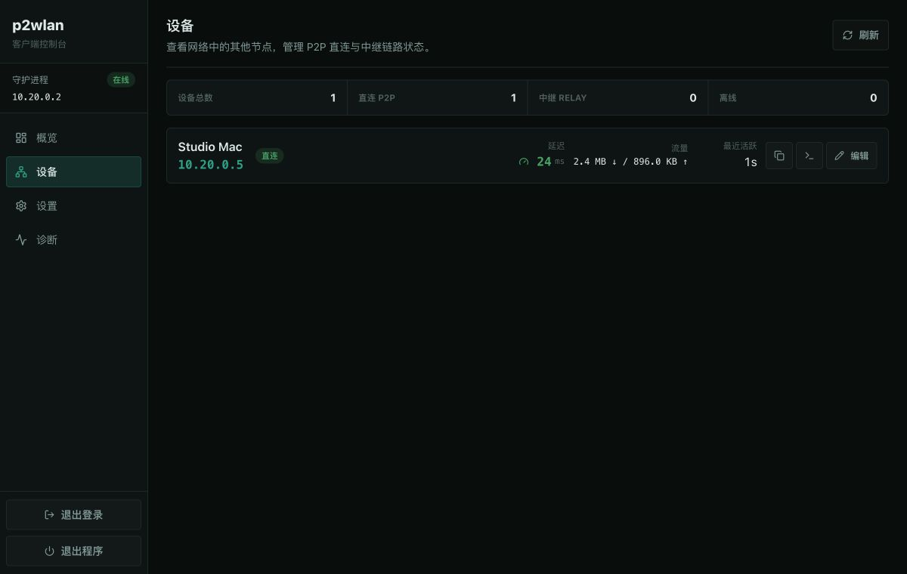
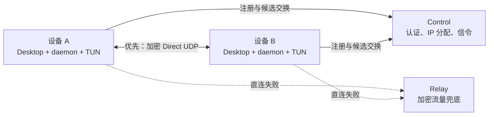

<div align="center">
  
  <h1>P2WLAN</h1>
  <p><strong>让分散在不同网络中的设备，像连接在同一个局域网。</strong></p>
  <p>开源、跨平台、P2P 优先的虚拟内网。直连失败时自动切换加密中继。</p>

  <p>
    <a href="https://github.com/yhan-sun/p2wlan/actions/workflows/ci.yml"></a>
    <a href="https://github.com/yhan-sun/p2wlan/releases"></a>
    <a href="LICENSE"></a>
    
    
  </p>

  <p>
    <a href="https://github.com/yhan-sun/p2wlan/releases"><strong>下载客户端</strong></a>
    · <a href="P2PNet-Design.md">设计文档</a>
    · <a href="docs/ENGINE_OPTIMIZATION_PLAN.md">架构优化方案</a>
    · <a href="docs/ROADMAP.md">路线图</a>
    · <a href="https://github.com/yhan-sun/p2wlan/issues">反馈问题</a>
  </p>
</div>



## P2WLAN 是什么

P2WLAN 是一个面向个人、开发者和自托管用户的虚拟内网项目。它在设备上创建系统虚拟网卡，为每台设备分配稳定的虚拟 IP，并优先通过 UDP 打洞建立端到端加密的 P2P 通道。

当 NAT、企业网络或防火墙阻止直连时，客户端会自动回退到 Relay。应用负责登录、系统授权、设备状态、延迟、诊断和后台生命周期，用户不需要手工配置路由表。

项目当前处于 **Preview** 阶段，已经完成 macOS 双向 TUN 实机互通、Windows Wintun 与 Linux TUN 数据面实现，并持续通过 Rust、Go 和前端 CI。它适合试用、开发和自托管验证；用于重要生产网络前，请先阅读[安全说明](#安全说明)和[平台状态](#平台状态)。

## 核心能力

- **P2P 优先**：STUN/ICE 风格候选收集、UDP Hole Punching、NAT 保活和直连恢复。
- **中继兜底**：直连不可用时自动使用 Relay，网络变化或 Relay 重启后自动重连。
- **加密数据面**：Noise/WireGuard 风格握手与 ChaCha20-Poly1305 加密，Relay 只转发密文。
- **真实虚拟网卡**：macOS `utun`、Linux TUN、Windows Wintun，支持虚拟 IP 双向访问。
- **原生桌面体验**：Tauri 桌面外壳、系统托盘、管理员授权、后台运行和安全退出。
- **可观察连接**：设备列表、直连/中继路径、真实 RTT、流量、端点、NAT 和故障诊断。
- **可自托管**：Go 控制面、SQLite 数据库和轻量 Relay 均可独立部署。
- **低资源设计**：Rust 网络核心、按需任务和窗口隐藏降频，适合长期后台运行。

## 适合场景

- **云电脑访问云服务器**：让 Windows 云电脑、Linux 云服务器和本地电脑出现在同一段 `10.20.0.0/16` 虚拟内网里。
- **远程运维**：用虚拟 IP 访问 SSH、RDP、数据库、Web 管理面板和开发服务，避免把业务端口直接暴露到公网。
- **跨云组网**：把不同云厂商、不同地域、家庭宽带和移动热点下的设备临时拉成一个小型私有网络。
- **自托管验证**：在自己的公网服务器上部署 Control/Relay，用真实 TUN 和真实网络环境测试 P2P 直连率。

## 四步开始使用

1. 从 [GitHub Releases](https://github.com/yhan-sun/p2wlan/releases) 下载对应平台客户端。
2. 打开 P2WLAN，注册或登录控制面账号。
3. 点击“授权启动 TUN”，在系统授权窗口中确认管理员权限。
4. 在另一台设备登录同一账号并启动 TUN，然后使用设备列表中的虚拟 IP 测试：

```bash
ping 10.20.0.5
```

### macOS

下载 `p2wlan-macos-universal.dmg`，拖入 Applications 后运行。当前 Preview 包使用 ad-hoc 签名，尚未完成 Apple 公证；如果 Gatekeeper 阻止首次打开，请右键应用并选择“打开”。

### Windows

下载并解压 `p2wlan-windows-x64.zip`，保持以下文件位于同一目录，然后运行 `p2wlan-desktop.exe`：

```text
p2wlan-desktop.exe
p2pnet-daemon.exe
wintun.dll
```

启动 TUN 时 Windows 会显示 UAC 授权窗口。P2WLAN 不读取或保存系统管理员密码。

### Linux

当前 release 提供无桌面的 Linux CLI，适合云服务器、NAS、开发机和 headless TUN 场景。

推荐用在线安装脚本安装最新版：

```bash
curl -fsSL https://raw.githubusercontent.com/yhan-sun/p2wlan/main/scripts/install-linux-cli.sh -o /tmp/p2wlan-install.sh
sudo sh /tmp/p2wlan-install.sh

p2wlan --version
p2wlan help
```

安装指定版本：

```bash
curl -fsSL https://raw.githubusercontent.com/yhan-sun/p2wlan/main/scripts/install-linux-cli.sh -o /tmp/p2wlan-install.sh
sudo sh /tmp/p2wlan-install.sh --version v0.1.24
```

先预览将要下载的包，或安装到用户目录：

```bash
sh /tmp/p2wlan-install.sh --version v0.1.24 --dry-run
sh /tmp/p2wlan-install.sh --install-dir "$HOME/.local/bin"
```

自定义仓库或系统安装目录：

```bash
sudo sh /tmp/p2wlan-install.sh --repo yhan-sun/p2wlan --install-dir /usr/local/bin
```

也可以从 [GitHub Releases](https://github.com/yhan-sun/p2wlan/releases) 下载对应架构的 `p2wlan-linux-x64-cli.tar.gz` 或 `p2wlan-linux-arm64-cli.tar.gz` 后手动安装：

```bash
tar -xzf p2wlan-linux-x64-cli.tar.gz
cd p2wlan-linux-x64-cli
sudo ./install.sh
```

登录并启动 TUN：

```bash
p2wlan login -u you@example.com
p2wlan up
p2wlan status
```

自动化环境也可以直接传入密码：

```bash
p2wlan login -u you@example.com -p 'your-password'
```

直接传入的密码可能被 shell history 或本机进程列表记录，日常使用建议省略 `-p`，在隐藏输入提示中填写。`p2wlan up` 会在创建 TUN 和系统路由时自动请求 `sudo`，其余命令不要使用 `sudo`。

常用管理命令：

```bash
p2wlan help
p2wlan config show
p2wlan config set device-name linux-server
p2wlan config set mtu 1420
p2wlan config set udp-bind 0.0.0.0:60207
p2wlan config set udp-advertise 203.0.113.10:60207
p2wlan config set relay default@47.109.40.237:18081
p2wlan doctor
p2wlan update
p2wlan logs -n 100
p2wlan logs -f
p2wlan down
p2wlan logout
```

配置默认保存在 `~/.config/p2wlan/p2pnet-config.json`，权限为 `0600`。可通过 `p2wlan config path` 查看实际位置；私钥、token、设备凭据和控制面分配的虚拟 IP 不应手工编辑。

Linux 桌面安装包仍在完善中；当前 release 优先提供 headless/server 场景的 CLI 包。

### Linux CLI 配置参考

`p2wlan config set <key> <value>` 当前支持：

| 配置项 | 示例 | 说明 |
| --- | --- | --- |
| `control` | `http://47.109.40.237:18080` | 控制面地址；修改后需要重新登录 |
| `network` | `default` | 加入的虚拟网络 ID |
| `device-name` | `linux-server` | 控制台和诊断里显示的设备名 |
| `interface` | `p2pnet0` | Linux TUN 网卡名 |
| `mtu` | `1420` | 虚拟网卡 MTU |
| `udp-bind` | `0.0.0.0:60207` | 本机直连 UDP 监听地址；云服务器建议固定端口 |
| `udp-advertise` | `203.0.113.10:60207` | 发布给其他节点的公网 UDP 地址；用 `off` 清空 |
| `stun` | `stun.l.google.com:19302,stun1.l.google.com:19302` | STUN 服务器列表，支持域名或 IP；用 `off` 禁用 |
| `diagnostics` | `127.0.0.1:39277` | 本机诊断端点，只允许回环地址 |
| `relay` | `default@47.109.40.237:18081` | Relay 候选列表 |
| `relay-policy` | `auto` / `relay` | `auto` 优先直连，`relay` 强制中继 |
| `direct-timeout` | `5000ms` | 直连确认超时后回退 Relay 的时间 |

升级 Linux CLI：

```bash
p2wlan update
p2wlan update --dry-run
p2wlan update --version v0.1.24
```

`p2wlan update` 默认从 GitHub 最新 release 下载与当前 CPU 架构匹配的 Linux CLI 包，并安装到 `/usr/local/bin`。如果 daemon 正在运行，更新后执行 `p2wlan down && p2wlan up` 让新版 daemon 生效。`p2wlan doctor` 会列出 peer 上报的 UDP 候选；如果只看到 `192.168.x.x`、`10.x.x.x` 或 `127.0.0.1`，说明对端还没有正确配置公网 `udp-advertise`。

### 直连与中继排查

P2WLAN 会优先尝试 Direct UDP，失败后自动走 Relay。Relay 可用说明账号、控制面、虚拟网卡和加密数据面大概率是通的；如果 Windows 云电脑和 Linux 云服务器只能中继，通常是云安全组、系统防火墙或 NAT 类型导致对端打不到你的 UDP 端口。

Linux 云服务器建议固定端口并发布公网地址：

```bash
p2wlan down
p2wlan config set udp-bind 0.0.0.0:60207
p2wlan config set udp-advertise 203.0.113.10:60207
p2wlan config set relay-policy auto
p2wlan up
p2wlan doctor
```

同时在云厂商安全组和 Linux 防火墙中放行 UDP `60207` 入站。Windows 云电脑也需要在云安全组和 Windows Defender 防火墙中放行对应 UDP 入站；如果 Windows 端没有可被公网访问的 UDP 入口，双方仍可能只能由 Linux 侧被动接收或回退 Relay。

Windows 桌面端从 `v0.1.23` 开始可在“设置 > 高级配置项”里填写同样的直连参数：`UDP 监听地址` 填 `0.0.0.0:60207`，`公网 UDP 地址` 填云电脑的公网 `IP:端口`。保存后需要停止并重新启动 TUN，让 daemon 重新注册候选端点。

常见现象：

| 现象 | 处理方式 |
| --- | --- |
| `endpoint not advertised because bind address is unspecified` | 设置 `udp-bind 0.0.0.0:<固定端口>` 和 `udp-advertise <公网IP>:<同一端口>` |
| `p2wlan doctor` 显示 `path=relay` | 检查两端 UDP 入站规则，确认公网 IP 和端口没有写错 |
| `ping 10.20.x.x` 不通但 Peer 在线 | 检查系统 ICMP 防火墙；也可以先用 SSH/RDP/HTTP 端口验证虚拟 IP |
| 频繁弹 UAC 或启动后退出 | 在 Windows 授权窗口确认管理员权限，保持 `p2wlan-desktop.exe`、`p2pnet-daemon.exe`、`wintun.dll` 同目录 |
| 本地诊断端点无法访问 | 运行 `p2wlan logs -n 100`，确认 daemon 没有提前退出，必要时 `p2wlan down && p2wlan up` |

## 平台状态

| 平台 | 桌面客户端 | 虚拟网卡 | 当前状态 |
| --- | --- | --- | --- |
| macOS Apple Silicon / Intel | Tauri Universal | `utun` | 已完成双向虚拟 IP 实机互通 |
| Windows 10/11 x64 | 便携版 | Wintun | 已实现并提供远程 smoke 脚本，仍需扩大硬件覆盖 |
| Linux x64/arm64 | CLI release 包 | `/dev/net/tun` | 提供 `p2wlan` 管理命令，daemon 与真实 TUN smoke 已通过 |

## 工作原理



控制面负责身份认证、虚拟 IP 分配、设备发现和握手信令，不转发正常 P2P 数据。Relay 只在直连不可用时转发已加密的数据包。

## 自托管

控制面和 Relay 都是单个 Go 服务，可部署在同一台具有公网地址的 Linux 服务器上。

```bash
cd server
mkdir -p data
go build -o p2wlan-control .
go build -o p2wlan-relay ./relay
```

启动 Relay：

```bash
RELAY_BIND=:18081 ./p2wlan-relay
```

启动控制面，请替换示例密钥和公网地址：

```bash
JWT_SECRET="replace-with-a-long-random-secret" \
DB_PATH="./data/p2wlan.db" \
PORT=18080 \
RELAY_SERVERS="default@relay.example.com:18081" \
./p2wlan-control
```

默认端口：

| 服务 | 协议 | 默认端口 | 用途 |
| --- | --- | --- | --- |
| Control | HTTP / WebSocket | `18080` | 登录、设备注册、信令和 IP 分配 |
| Relay | TCP | `18081` | 加密数据包中继 |
| Diagnostics | Loopback HTTP | `39277` 起 | 本机状态，仅允许回环地址 |
| Direct transport | UDP | 动态分配或手动固定 | P2P 数据与 NAT 探测；云服务器建议固定端口 |

公网部署建议在 Control 前配置 HTTPS/WSS 反向代理，并限制数据库和诊断端口只能从可信网络访问。完整部署与协议说明见 [docs/PROTOCOL.md](docs/PROTOCOL.md) 和 [P2PNet-Design.md](P2PNet-Design.md)。

## 从源码构建

### 环境要求

- Rust stable
- Go 1.22+
- Node.js 20+
- pnpm 10+
- Linux 桌面构建需要 GTK/WebKit2GTK 开发依赖

```bash
git clone https://github.com/yhan-sun/p2wlan.git
cd p2wlan
pnpm install --frozen-lockfile

# Rust daemon
cargo build -p p2pnet-daemon

# 桌面客户端开发版
cargo tauri dev
```

macOS 安装包应通过项目脚本构建，脚本会把 daemon 放入应用资源目录：

```bash
pnpm run icons
pnpm run package:macos
```

更多发行说明见 [docs/RELEASE_PACKAGING.md](docs/RELEASE_PACKAGING.md)。

## 验证与测试

```bash
cargo fmt --all --check
cargo clippy --workspace --all-targets --all-features -- -D warnings
cargo test --workspace --all-targets

cd server
go vet ./...
go test ./... -count=1
cd ..

pnpm audit --audit-level high
pnpm run build
./scripts/control-smoke.sh
```

真实 TUN 测试需要管理员权限：

```bash
# Linux network namespace 双节点测试
sudo -E ./scripts/tun-ping-smoke.sh

# macOS 本机与远程 Linux 双向 ping
sudo -E ./scripts/mac-remote-smoke.sh --tun
```

Windows 测试流程见 [docs/WINDOWS_TESTING.md](docs/WINDOWS_TESTING.md)，macOS 测试流程见 [docs/MAC_TESTING.md](docs/MAC_TESTING.md)。

## 仓库结构

```text
client/       Rust 网络核心：TUN、加密、WireGuard、NAT、Relay、daemon
server/       Go 控制面、认证、SQLite、信令和 Relay server
src/          React 桌面客户端界面
src-tauri/    Tauri 原生外壳、托盘、权限和 daemon 生命周期
scripts/      构建、打包和跨平台 smoke 测试
docs/         协议、路线图、研究和平台测试文档
proto/        Protobuf 协议草案
```

## 路线图

- [x] 控制面认证、设备注册和虚拟 IP 自动分配
- [x] macOS、Windows、Linux 虚拟网卡数据面
- [x] 加密会话、UDP 打洞、Direct/Relay 自动切换
- [x] 控制面与 Relay 断线重连
- [x] 桌面授权、托盘、后台生命周期和设备诊断
- [x] 设备 RTT、重命名和本地诊断端口自动避让
- [ ] macOS Developer ID 签名与公证
- [ ] Windows 安装器和更广泛的 Win10/Win11 兼容验证
- [ ] Linux 桌面安装包
- [ ] Relay 跨区域互联与动态重选
- [ ] DNS、ACL、子网路由和端口映射产品化
- [ ] 吞吐量、延迟、内存占用和故障恢复基准

详细计划与验收标准见 [docs/ROADMAP.md](docs/ROADMAP.md)。

## 安全说明

- 系统管理员授权由 macOS/Windows/Linux 自身处理，客户端不会读取或保存管理员密码。
- Control 可以看到账号、设备、虚拟 IP、候选端点和连接元数据。
- Relay 可以看到源/目标节点标识和流量大小，但转发的是加密数据。
- 当前版本尚未经过独立安全审计，不建议直接承载高敏感生产流量。
- 对安全要求较高的场景，请自托管 Control/Relay、启用 TLS，并自行审查发布产物。

如发现安全问题，请避免在公开 Issue 中披露敏感细节，优先通过仓库维护者的私有联系方式报告。

## 参与贡献

欢迎提交 Issue、Pull Request、平台测试结果和网络环境复现信息。尤其需要以下帮助：

- 不同家庭 NAT、校园网、企业网和移动热点下的直连率数据
- Windows 10/11 与不同网卡驱动环境的兼容验证
- Linux 发行版安装和权限方案
- Relay 跨区域设计、安全审计和性能基准
- 中文/英文文档与客户端本地化

提交代码前请运行“验证与测试”中的质量门禁，并尽量为行为变化增加测试。

如果 P2WLAN 对你有用，请给项目一个 [Star](https://github.com/yhan-sun/p2wlan)。Star、Issue 和真实网络测试反馈都会直接帮助项目走向稳定版本。

## License

[MIT License](LICENSE)
