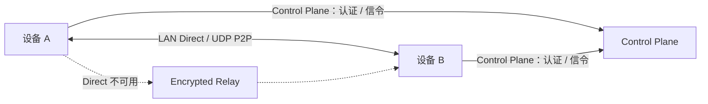

<div align="center">
  
  <h1>P2WLAN</h1>
  <p><strong>让不同网络下的设备，像连接在同一个局域网一样直接通信。</strong></p>
  <p>自动组建虚拟局域网 · P2P 优先 · 直连失败自动 Relay · 跨平台 · 可自托管</p>

  <p>
    <a href="README.md"><strong>简体中文</strong></a>
    · <a href="README.en.md">English</a>
  </p>

  <p>
    <a href="https://github.com/yhan-sun/p2wlan/releases"><strong>Download</strong></a>
    · <a href="#快速开始">快速开始</a>
    · <a href="#工作方式">工作方式</a>
    · <a href="#自托管">自托管</a>
  </p>

  <p>
    <a href="https://github.com/yhan-sun/p2wlan/releases"></a>
    <a href="https://github.com/yhan-sun/p2wlan/actions/workflows/ci.yml"></a>
    <a href="LICENSE"></a>
  </p>
</div>

## P2WLAN 是什么

P2WLAN 是一个开源、P2P 优先、可自托管的虚拟局域网。每台设备获得一个私有虚拟 IP，设备之间可以直接使用 `ping`、SSH、RDP、数据库或其他普通网络应用通信，而不需要为每台机器单独维护公网端口和路由。

连接建立时，P2WLAN 优先寻找可用的局域网或公网 UDP 直连；如果网络环境不允许直连，则自动使用加密 Relay 保持连接可用。

> **Preview**：项目目前适合真实网络测试、自托管和开发验证。尚未完成独立安全审计；不要将其视为官方 WireGuard 实现或 WireGuard 互操作方案。

## 为什么用 P2WLAN

| 能力 | 说明 |
| --- | --- |
| **P2P First** | 能直连就不经过中继，优先使用局域网和公网 UDP。 |
| **NAT Traversal** | 自动探测网络环境并尝试 UDP P2P 直连；复杂 NAT 下不保证一定成功。 |
| **End-to-End Encryption** | 设备间数据使用加密会话传输，Relay 只负责转发密文。 |
| **Automatic Relay Fallback** | Direct 不可用时自动切换到 Relay，不要求业务感知路径变化。 |
| **Cross-platform** | Flutter 客户端覆盖桌面和移动预览，Rust daemon / CLI 支持服务器与无桌面环境。 |
| **Self-hosted** | Control Plane、SQLite 和 Relay 可部署在自己的 Linux 服务器上。 |

## 使用场景

- 远程访问电脑、云主机、NAS 或 HomeLab
- SSH / RDP / Web 管理面板 / 数据库访问
- 跨地域、跨云厂商连接开发设备
- 家庭网络、移动热点、校园网等不同网络之间组网
- 在自己的服务器上运行 Control Plane 和 Relay

## 快速开始

**1. 下载**

前往 [GitHub Releases](https://github.com/yhan-sun/p2wlan/releases) 下载对应平台的最新版本。

| 平台 | Release 文件 | 状态 |
| --- | --- | --- |
| macOS Apple Silicon | `p2wlan-flutter-macos-arm64.dmg` | 支持 |
| macOS Intel | `p2wlan-flutter-macos-x64.dmg` | 支持 |
| Windows x64 | `p2wlan-flutter-windows-x64-setup.exe` | 支持 |
| Linux x64 | Flutter `.tar.gz` / CLI `.tar.gz` | 支持 |
| Linux arm64 | CLI `.tar.gz` | 支持 |
| Android arm64 | `p2wlan-flutter-android-arm64-release.apk` | Preview |
| iOS arm64 | `p2wlan-flutter-ios-arm64-unsigned.ipa` | 实验性，需签名 |

**2. 登录**

打开客户端并登录；服务器或无桌面环境可使用 CLI：

```bash
p2wlan login -u you@example.com
```

**3. 启动虚拟网络**

在客户端启动网络，或在 CLI 中执行：

```bash
p2wlan up
p2wlan status
```

**4. 使用虚拟 IP**

连接建立后，直接使用对端的 P2WLAN 虚拟 IP：

```bash
ping 10.20.0.5
ssh user@10.20.0.5
```

**5. 查看连接路径**

客户端会显示当前 Peer 使用的路径。遇到问题时，可先运行：

```bash
p2wlan doctor
p2wlan logs -f
```

Linux CLI 也提供官方安装脚本：

```bash
curl -fsSL https://raw.githubusercontent.com/yhan-sun/p2wlan/main/scripts/install-linux-cli.sh -o /tmp/p2wlan-install.sh
sudo sh /tmp/p2wlan-install.sh
```

## 工作方式

P2WLAN 把连接建立和数据传输分开：Control Plane 负责身份、设备、虚拟 IP 和信令；Rust daemon 负责本地虚拟网卡、加密数据面和连接路径；Relay 只在需要时转发密文。


```mermaid
flowchart LR
    A[设备 A] <-->|"LAN Direct / UDP P2P"| B[设备 B]
    A -->|"Control Plane：认证 / 信令"| C[Control Plane]
    B -->|"Control Plane：认证 / 信令"| C
    A -.->|"Direct 不可用"| R[Encrypted Relay]
    R -.-> B
```

连接路径可以概括为：

**LAN Direct → Public UDP Direct → Encrypted Relay**

Direct 依赖两端真实网络环境。NAT、CGNAT、防火墙或云安全组可能阻止直连；此时 Relay 提供可用的后备路径。

## 连接状态

| 状态 | 含义 |
| --- | --- |
| **LAN Direct** | 通过本地网络直接通信。 |
| **Direct** | 通过公网 UDP 建立 P2P 直连。 |
| **Relay** | 通过加密 Relay 转发密文。 |
| **Connecting** | 正在建立或确认连接路径。 |
| **Offline** | 对端离线或当前没有可用路径。 |

## 技术架构

| 模块 | 技术 | 职责 |
| --- | --- | --- |
| GUI | Flutter | 登录、设备管理、连接状态与诊断。 |
| Data Plane / Daemon | Rust | TUN、路由、Peer、NAT traversal、加密会话与 Relay fallback。 |
| Virtual interface | macOS `utun` / Windows Wintun / Linux TUN | 为应用提供普通的三层虚拟网络接口。 |
| Control Plane | Go + SQLite | 认证、设备注册、虚拟 IP、凭据、信令和 Relay 信息。 |
| Relay | Go | Relay 连接、票据校验和密文转发。 |

P2WLAN 使用自包含的 **WireGuard-like Noise** 数据面，并使用 X25519、ChaCha20-Poly1305、BLAKE2s 等密码学组件。**P2WLAN 不是官方 WireGuard 实现，也不声明 WireGuard 互操作兼容。**

## 自托管

Control Plane 和 Relay 位于 [`server/`](server/)；Linux CLI / daemon 位于 Rust workspace。一个最小的自托管构建可以从仓库根目录执行：

```bash
cd server
go build -o p2wlan-control .
go build -o p2wlan-relay ./relay
```

生产部署还需要自行配置 HTTPS/WSS、数据库、认证密钥和 Relay 地址。README 首页不展开完整生产配置；请以 [`server/`](server/) 中的当前代码和配置为准。

## 安全边界

- 设备业务流量在端点之间使用加密数据面传输。
- Relay 转发密文，不负责解密业务载荷。
- Relay 仍可能看到连接相关元数据，例如节点标识、时间和数据包大小。
- 项目处于 Preview，**尚未完成独立安全审计**。
- 不保证任意 NAT 环境都能建立 P2P 直连；失败时是否能 Relay 取决于 Relay 和控制面可用性。
- 高敏感生产环境请在部署前自行完成安全评估。

## 开发者

仓库结构保持按职责拆分：

- [`apps/flutter_client/`](apps/flutter_client/) — Flutter 客户端
- [`client/daemon/`](client/daemon/) — Rust daemon
- [`client/cli/`](client/cli/) — Rust CLI
- [`client/tun/`](client/tun/) — TUN / 虚拟网卡抽象
- [`client/crypto/`](client/crypto/) — 加密组件
- [`server/`](server/) — Go Control Plane
- [`server/relay/`](server/relay/) — Go Relay

更多实现细节应优先从源码、测试和 CI 中确认，而不是把内部状态机复制到项目首页。

## License

[MIT](LICENSE)
