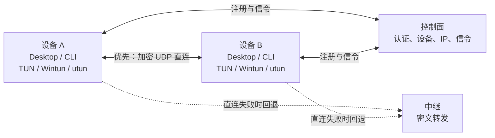

<div align="center">
  
  <h1>P2WLAN</h1>
  <p><strong>把分散在不同网络里的设备，连成一张真正可用的加密虚拟局域网。</strong></p>
  <p>Mac、Windows、Linux、云服务器、NAS、家庭设备，都可以拥有稳定的私有虚拟 IP。</p>

  <p>
    <a href="README.md"><strong>简体中文</strong></a>
    · <a href="README.en.md">English</a>
  </p>

  <p>
    <a href="https://github.com/yhan-sun/p2wlan/actions/workflows/ci.yml"></a>
    <a href="https://github.com/yhan-sun/p2wlan/releases"></a>
    <a href="LICENSE"></a>
    
    
  </p>

  <p>
    <a href="https://github.com/yhan-sun/p2wlan/releases"><strong>下载客户端</strong></a>
    · <a href="#快速开始">快速开始</a>
    · <a href="#连接路径">连接路径</a>
    · <a href="#协议边界">协议边界</a>
    · <a href="#自托管">自托管</a>
    · <a href="#安全边界">安全边界</a>
  </p>
</div>

## 项目简介

P2WLAN 是一个开源、P2P 优先、可自托管的虚拟内网项目。它会在每台设备上创建真实的系统虚拟网卡，分配稳定的 `10.20.x.x` 私有地址，并尽可能通过端到端加密的 UDP 直连传输数据。

如果直连被 NAT、CGNAT、企业防火墙、校园网或云安全组阻断，P2WLAN 会自动回退到加密中继，让网络保持可用。它不会把连接状态藏成一个模糊的“在线”：你可以清楚看到设备正在使用局域网直连、公网 UDP 直连、中继，还是暂时不可达。

> 当前项目处于 **Preview** 阶段，适合真实环境测试、自托管部署和开发验证。P2WLAN 已经具备加密数据面、NAT 探测、UDP 打洞和中继回退，但尚未完成独立安全审计，也不应被理解为官方 WireGuard 兼容实现。用于高敏感生产流量前，请先完成自己的安全审查，并理解直连能力仍取决于两端网络环境。

## 核心亮点

<table>
  <tr>
    <td width="33%" valign="top">
      <h3>真实虚拟网卡</h3>
      <p>基于 macOS <code>utun</code>、Windows Wintun 和 Linux TUN，虚拟 IP 可以直接用于 <code>ping</code>、SSH、RDP、数据库和浏览器访问。</p>
    </td>
    <td width="33%" valign="top">
      <h3>P2P 优先</h3>
      <p>优先尝试局域网直连和公网 UDP 直连，持续探测、保活和恢复；直连不可用时再切到中继。</p>
    </td>
    <td width="33%" valign="top">
      <h3>加密数据面</h3>
      <p>设备流量通过 WireGuard-like Noise 会话传输；中继只转发密文，不解密业务数据。</p>
    </td>
  </tr>
  <tr>
    <td width="33%" valign="top">
      <h3>连接可观测</h3>
      <p>客户端展示设备状态、连接路径、延迟、端点候选和本地诊断信息，方便判断问题发生在哪一层。</p>
    </td>
    <td width="33%" valign="top">
      <h3>完整自托管</h3>
      <p>控制面、SQLite 数据库和中继服务都可以部署在自己的公网 Linux 服务器上。</p>
    </td>
    <td width="33%" valign="top">
      <h3>跨平台体验</h3>
      <p>Release 会发布 Flutter 诊断客户端；Linux 仍保留适合服务器、NAS 和无桌面环境的 CLI/daemon 包。</p>
    </td>
  </tr>
</table>

## 适合场景

- **远程访问云主机**：通过虚拟 IP 访问 SSH、RDP、Web 控制台、数据库和开发服务，减少公网端口暴露。
- **家庭实验室与 NAS**：把笔记本、迷你主机、NAS、远程服务器放进同一张私有网络。
- **跨云组网**：让不同云厂商、不同地域、不同安全策略下的机器拥有统一的私有地址空间。
- **临时网络协作**：在酒店 Wi-Fi、移动热点、校园网、家庭宽带等复杂网络下建立可诊断的连接。
- **自托管与网络研究**：从源码审查 NAT 探测、中继票据、撤销机制、诊断端点和协议边界。

## 快速开始

从 [GitHub Releases](https://github.com/yhan-sun/p2wlan/releases) 下载最新版客户端。当前 Release 的 Flutter 客户端会逐步接管桌面端 daemon 生命周期；Rust p2wlan-daemon 仍负责虚拟网卡、路由和数据面，然后可用对端虚拟 IP 测试：

```bash
ping 10.20.0.5
ssh user@10.20.0.5
```

### macOS

Apple Silicon 下载 `p2wlan-flutter-macos-arm64.dmg`，Intel Mac 下载 `p2wlan-flutter-macos-x64.dmg`，拖入 Applications 后打开 `P2WLAN`。

Preview 构建可能尚未完成 Apple 公证。如果 Gatekeeper 阻止首次启动，请在 Finder 中右键应用并选择 Open。

### Windows

普通 Intel / AMD 电脑下载 `p2wlan-flutter-windows-x64-setup.exe`，按安装向导启动 `P2WLAN`。Windows ARM Flutter 安装包暂未打开，等 Flutter stable/action 能稳定解析 ARM64 SDK 后再加。

Flutter 客户端已接入 Dashboard 和系统托盘的 daemon 启停入口；虚拟网卡、路由和数据面仍由 Rust `p2wlan-daemon` 执行，Windows UAC、Linux 提权和发布包链路仍需完整烟测后再视为默认桌面路径。

### Linux

Linux 桌面可下载 `p2wlan-flutter-linux-x64.tar.gz` 运行 Flutter 诊断客户端。服务器、NAS 和无桌面环境继续使用 x64 / arm64 CLI/daemon 包：

```bash
curl -fsSL https://raw.githubusercontent.com/yhan-sun/p2wlan/main/scripts/install-linux-cli.sh -o /tmp/p2wlan-install.sh
sudo sh /tmp/p2wlan-install.sh

p2wlan login -u you@example.com
p2wlan up
p2wlan status
```

常用命令：

```bash
p2wlan doctor
p2wlan logs -f
p2wlan down
p2wlan update
```

## 连接路径

P2WLAN 会直接展示当前使用的连接路径，方便快速定位网络问题。

| 路径 | 含义 | 常见环境 |
| --- | --- | --- |
| **局域网直连** | 两台设备可在本地网络直接互通。 | 家庭 LAN、办公网络、实验室网络 |
| **公网 UDP 直连** | 通过公网 UDP 端点完成 NAT 穿透、peer-reflexive 发现或显式 UDP 暴露。 | 云服务器固定端口、限制较少的 NAT |
| **加密中继** | 直连未确认，流量通过 DERP-like 中继转发密文。 | CGNAT、UDP 被阻断、云安全组未放行 |
| **连接中 / 中继确认中** | 已看到对端并正在等待直连或 relay peer 确认。 | daemon 刚启动、候选端点刷新、对端刚重连 |
| **离线 / 不可达** | 控制面标记对端离线，或当前没有确认可用的直连/中继路径。 | 对端未运行、凭据过期、网络分区、中继不可用 |

直连候选来自本地地址、STUN 观测、公网手动配置、peer-reflexive 观测和少量受限预测。复杂 NAT 下，直连成功率取决于两端 NAT 映射与过滤行为；如果云服务器希望被公网 UDP 直连，请固定 UDP 监听端口，并同时在云安全组和操作系统防火墙中放行对应入站规则。

## 架构


```mermaid
flowchart LR
    A["设备 A<br/>Desktop / CLI<br/>TUN / Wintun / utun"]
    B["设备 B<br/>Desktop / CLI<br/>TUN / Wintun / utun"]
    C["控制面<br/>认证、设备、IP、信令"]
    R["中继<br/>密文转发"]

    A <-->|"优先：加密 UDP 直连"| B
    A <-->|"注册与信令"| C
    B <-->|"注册与信令"| C
    A -.->|"直连失败时回退"| R
    B -.->|"直连失败时回退"| R
```

| 层级 | 实现 | 主要职责 |
| --- | --- | --- |
| 桌面客户端 | Flutter 诊断客户端 / Tauri 旧客户端 | 设备状态、诊断、迁移中的桌面体验 |
| 本地守护进程 | Rust | 虚拟网卡、加密会话、Peer 状态、NAT 探测、中继回退 |
| 控制面 | Go, SQLite | 账号、设备注册、虚拟 IP 分配、凭据状态、中继票据、信令 |
| 中继服务 | Go | 密文转发、票据校验、撤销信息同步 |

## 协议边界

P2WLAN 当前采用自研的 WireGuard-like 数据面，而不是直接调用内核 WireGuard 或 `wireguard-go`。这让项目更容易在 TUN、桌面客户端、诊断和中继路径之间做端到端集成，但也意味着生产级部署前需要更严格的测试和审计。

| 边界 | 当前实现 | 说明 |
| --- | --- | --- |
| 数据面握手 | `Noise_IKpsk2_25519_ChaChaPoly_BLAKE2s` 风格 | 贴近 WireGuard 的 Noise IK 结构，但不声明官方 WireGuard 互操作兼容 |
| 密钥交换 | X25519 | 用于设备间加密会话协商 |
| 加密算法 | ChaCha20-Poly1305 | 用于握手消息和传输数据的 AEAD |
| 哈希 / KDF | BLAKE2s / HKDF-BLAKE2s | 保持 WireGuard 风格语义，不使用 BLAKE3 |
| 设备认证 | Ed25519 challenge-response | 用于控制面的设备凭据和信令身份绑定 |
| 控制信令 | HTTPS / WSS 上的 JSON 消息 | 便于调试；`proto/` 中保留 Protobuf 草案 |
| 中继 | DERP-like TCP/TLS 密文转发 | 不是标准 TURN；中继不解密业务载荷 |

长期生产化有两条路线：一是复用 `boringtun`、`wireguard-go` 或平台 WireGuard 实现来降低密码协议维护风险；二是保留自研数据面，但持续补齐测试向量、fuzz、重放/重密钥/异常包测试、互操作说明和独立安全审计。当前测试已覆盖 RFC ChaCha20-Poly1305 AEAD 向量和 WireGuard-like replay window 边界。

生产化前的完整验收项见 [生产化验收清单](docs/production-hardening.zh.md)，真实网络验证模板见 [NAT 穿透验收矩阵](docs/nat-traversal-matrix.zh.md)，长期技术路线见 [v2 架构路线图](docs/v2-architecture-roadmap.zh.md)。

## NAT 与中继

P2WLAN 的 NAT 穿透不是“只做 STUN”。当前守护进程会收集 host 与 STUN server-reflexive 候选，执行 UDP hole punching，学习 peer-reflexive 端点，维护直连保活，并在直连未确认时回退到中继。

仍需注意这些限制：

- **不是完整 RFC8445 ICE checklist**：候选优先级、提名、重试和失败原因已经有雏形，但还不是浏览器 WebRTC 那种完整 ICE/TURN 栈。
- **不是标准 TURN 服务**：relay 是 DERP-like 转发器；如果你的环境强制要求 TURN 语义，需要额外网关或后续实现。
- **复杂 NAT 成功率不可保证**：校园网、企业网、移动网络、CGNAT 和双 symmetric NAT 需要依赖真实网络矩阵验证；建议按 [NAT 穿透验收矩阵](docs/nat-traversal-matrix.zh.md) 逐项记录。
- **中继仍暴露元数据**：中继只能看到节点标识、时间和包大小，不能解密业务数据，但它仍是连接元数据观察点。

## MTU 与性能

默认 TUN MTU 为 `1420`，兼容大多数 WireGuard 风格封装场景，但它不是自动路径 MTU 探测结果。某些网络实际可用 MTU 可能更低，表现为大包丢失、SSH 卡顿、网页加载不完整或 relay 路径吞吐异常。

排查建议：

- 如果小包 `ping` 正常但大流量异常，先尝试把 MTU 调低到 `1380`、`1360` 或 `1280`。
- 如果经过中继路径，注意 relay 使用 TCP/TLS 承载密文包，延迟和拥塞行为会不同于直连 UDP。
- `p2wlan doctor` 和本地 diagnostics `/status` 会在观察到 relay 路径且 MTU 高于 `1380` 时给出结构化风险码和建议降级值。
- `scripts/mtu-smoke.sh` 会把 daemon 的 runtime MTU、relay-path 状态、风险码和建议安全 MTU 写入 `summary.env`，可用 `P2WLAN_MTU_SMOKE_SELF_TEST=1` 验证脚本解析逻辑。
- 如果底层网络丢弃 ICMP fragmentation-needed，可能出现 PMTU blackhole；这属于后续自动 PMTU 探测需要重点解决的问题。
- P2WLAN 是透明三层虚拟网卡，不会把 SSH、文件传输或游戏流量拆成独立应用层 stream；未来如果引入 QUIC，更适合优先评估 QUIC DATAGRAM 或 relay 传输，而不是强行重写应用协议。

## 平台状态

| 平台 | 客户端 | 虚拟网卡 | 当前状态 |
| --- | --- | --- | --- |
| macOS Apple Silicon / Intel | Flutter DMG，按 arm64 / x64 拆包 | `utun` 由 daemon 路径提供 | Flutter 诊断 + Dashboard/托盘生命周期控制；发布烟测进行中 |
| Windows 10/11 x64 | Flutter setup 安装包 | Wintun 由 daemon 路径提供 | Flutter 诊断 + Dashboard/托盘入口；UAC/安装包烟测待完成，ARM64 安装包待 Flutter SDK/action 支持 |
| Linux x64 桌面；Linux x64 / arm64 CLI | Flutter bundle + CLI/daemon tarball | TUN | 桌面诊断 + 托盘入口；服务器、提权和无桌面工作流继续走 CLI |
| Android arm64 | Flutter APK | 后续 Android VPN 路径 | Release 仅发布 arm64 |
| iOS arm64 | unsigned Flutter IPA | 后续 Network Extension 路径 | CI 可产物，需签名后安装 |

## 自托管

P2WLAN 的控制面和中继都可以部署在自己的公网 Linux 服务器上。个人测试或小规模自用场景，一台小型服务器通常就足够。

```bash
cd server
mkdir -p data
go build -o p2wlan-control .
go build -o p2wlan-relay ./relay
```

控制面示例：

```bash
JWT_SECRET="replace-with-a-long-random-secret" \
DB_PATH="./data/p2wlan.db" \
PORT=18080 \
RELAY_SERVERS="default@relay.example.com:18081" \
RELAY_REVOCATION_FEED_TOKEN="replace-with-a-second-random-secret" \
./p2wlan-control
```

中继示例：

```bash
RELAY_BIND=":18081" \
RELAY_REVOCATION_FEED_URL="https://control.example.com/api/v1/relay/revocations" \
RELAY_REVOCATION_FEED_TOKEN="same-token-as-control-plane" \
RELAY_REVOCATION_POLL_INTERVAL="30s" \
RELAY_AUTH_FAILURE_LIMIT="20" \
RELAY_AUTH_FAILURE_WINDOW="1m" \
./p2wlan-relay
```

公网部署建议在控制面前放置 HTTPS/WSS 反向代理，并妥善保护 SQLite 文件、诊断端点和中继令牌。relay 的运行时统计会累计认证失败与限速次数，并仅以短哈希来源键暴露失败来源窗口，避免泄漏 ticket/JWT 或客户端 payload 明文。

## 安全边界

- 加入同一虚拟网络的设备应被视为同一信任边界内的节点。
- X25519 节点身份用于数据面握手；Ed25519 设备身份用于控制面挑战签名和信令身份绑定，两者职责不同。
- 控制面可以看到账号、设备身份、虚拟 IP、候选端点、中继票据和连接元数据。
- 中继可以看到节点标识、时间和包大小，但只转发加密后的业务载荷。
- 默认自托管部署应在公网控制面前启用 HTTPS/WSS，在公网中继上启用 TLS，并定期轮换 JWT secret、中继撤销源令牌和设备凭据。
- 本地静态拒绝列表只影响本机守护进程或当前中继实例；线上中继撤销信息由控制面撤销源驱动。
- Preview 版本尚未完成独立安全审计。高敏感场景建议自托管、启用 TLS、轮换中继令牌、审查发布产物，并在可接受的风险边界内逐步放量。

## 故障排查

| 现象 | 优先检查 |
| --- | --- |
| 对端显示在线但无法直连 | 两端防火墙、UDP 监听端口、STUN 服务器可达性、云安全组入站 UDP |
| 刚启动时设备少或显示连接中 | daemon 会先从控制面拉取设备，再等待本地 UDP candidates 准备好；离线设备保留为离线，在线设备会在 candidates 发布后自动重试 |
| 总是走中继 | CGNAT、企业/校园网 UDP 限制、symmetric NAT、候选端点是否过期 |
| `ping` 正常但 SSH/RDP 卡顿 | MTU 过高、PMTU blackhole、relay 延迟或丢包 |
| 自托管 relay 连接失败 | relay 地址格式、TLS 证书、撤销源令牌、控制面下发的 relay catalog |
| 设备凭据异常 | Ed25519 keypair、challenge-response、控制面时间和 credential 状态 |

## 从源码构建

需要 Rust stable、Go 1.22+、Node.js 20+、pnpm 10+ 和 Flutter stable。Linux Flutter 桌面构建还需要 GTK 开发依赖；旧 Tauri 桌面构建仍需要 WebKit2GTK 开发依赖。

```bash
git clone https://github.com/yhan-sun/p2wlan.git
cd p2wlan
pnpm install --frozen-lockfile

cargo build -p p2wlan-daemon
cargo tauri dev

cd apps/flutter_client
flutter pub get
flutter run -d macos
```

macOS 打包建议使用项目脚本，确保 daemon 被放入应用资源目录：

```bash
pnpm run icons
pnpm run package:macos
```

## 质量检查

提交代码前建议运行相关检查：

```bash
cargo fmt --all --check
cargo clippy --workspace --all-targets --all-features -- -D warnings
cargo test --workspace --all-targets

cd server
go vet ./...
go test ./... -count=1
cd ..

pnpm audit --audit-level high
pnpm run build
./scripts/control-smoke.sh
```

真实 TUN smoke 测试需要管理员权限：

```bash
sudo -E ./scripts/tun-ping-smoke.sh
sudo -E ./scripts/mac-remote-smoke.sh --tun
```

## 仓库结构

```text
client/       Rust 网络核心：TUN、加密会话、NAT、中继、daemon、CLI
server/       Go 控制面、认证、SQLite、信令、中继服务、撤销源
src/          React 桌面客户端界面
src-tauri/    Tauri 外壳、托盘、权限、daemon 生命周期和平台打包
apps/flutter_client/ Flutter 诊断客户端：Android、iOS、macOS、Windows、Linux
scripts/      构建、安装、打包、直连验证和跨平台 smoke 脚本
fuzz/         协议与解析器模糊测试
proto/        Protobuf 协议草案
```

## 贡献

欢迎提交 Issue、Pull Request、真实网络测试结果、平台兼容性反馈和安全审查建议。当前最有价值的反馈包括：

- 家庭路由、校园网、企业网、移动热点和云厂商环境下的直连 / 中继结果；
- Windows 10/11 在不同网卡、驱动和防火墙配置下的兼容性；
- Linux NAS、服务器、桌面发行版的安装与权限体验；
- 中继区域、撤销机制、可观测性和性能优化；
- 控制面、中继票据、加密传输和本地权限边界审查。

请保持仓库干净，不要提交 `.docx`、`.pdf`、`.dmg`、`.zip`、`.tar.gz`、日志、本地数据库或运行时生成文件。需要说明的内容请使用 Markdown 源文件和可复现脚本。

## License

P2WLAN is released under the [MIT License](LICENSE).
