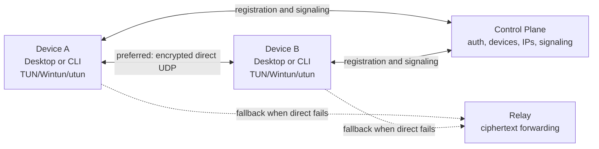

<div align="center">
  
  <h1>P2WLAN</h1>
  <p><strong>Open-source virtual LAN for the devices you actually use.</strong></p>
  <p>把 Mac、Windows、Linux、云服务器和家庭设备组成一张加密、可观测、可自托管的私有局域网。</p>

  <p>
    <a href="https://github.com/yhan-sun/p2wlan/actions/workflows/ci.yml"></a>
    <a href="https://github.com/yhan-sun/p2wlan/releases"></a>
    <a href="LICENSE"></a>
    
    
  </p>

  <p>
    <a href="https://github.com/yhan-sun/p2wlan/releases"><strong>Download</strong></a>
    · <a href="#quick-start">Quick Start</a>
    · <a href="#self-hosting">Self-hosting</a>
    · <a href="docs/SECURITY_REVIEW.md">Security</a>
    · <a href="docs/ROADMAP.md">Roadmap</a>
  </p>
</div>


## What Is P2WLAN

P2WLAN is an open-source virtual private LAN. It creates a real system network interface on each device, assigns stable `10.20.x.x` addresses, and connects devices through encrypted peer-to-peer paths whenever the network allows it.

When direct UDP is blocked by NAT, CGNAT, enterprise firewalls, or cloud security rules, P2WLAN falls back to an encrypted relay path so the network stays usable. The product goal is simple: make private device-to-device access feel like a local network, while keeping the control plane and relay fully self-hostable.

P2WLAN is currently in **Preview**. It is already useful for real-world testing and self-hosted deployments, but it should not be presented as equivalent to mature commercial remote-control networks. Direct connectivity still depends on the network on both sides.

## Why It Exists

Modern personal infrastructure is spread everywhere: a laptop at home, a Windows cloud desktop, a Linux server, a NAS, a lab machine, and temporary devices behind whatever Wi-Fi happens to be available. P2WLAN gives those machines one private address space, one connection model, and one place to understand how traffic is flowing.

No exposed SSH port just because you need a quick fix. No mystery about whether you are on LAN direct, public UDP direct, or relay. No black-box control plane that you cannot run yourself.

## Highlights

- **P2P first, relay when needed**: direct UDP probing, LAN discovery, public endpoint candidates, NAT keepalive, and encrypted relay fallback.
- **Real virtual networking**: macOS `utun`, Windows Wintun, and Linux TUN make virtual IPs work with ordinary tools like `ping`, `ssh`, `rdp`, databases, and browsers.
- **Connection visibility**: see whether a peer is using LAN direct, public UDP direct, relay, or is currently unreachable, with latency and diagnostics exposed locally.
- **Encrypted data plane**: device traffic is encrypted end to end; the relay forwards ciphertext and does not terminate private payloads.
- **Self-hostable control plane**: run your own Go control server, SQLite database, and relay on a small public Linux instance.
- **Cross-platform client**: Tauri desktop for macOS and Windows, plus a Linux CLI for servers, NAS devices, and headless machines.
- **Operationally honest**: network fallbacks are explicit, local denylists are local, revocation feed behavior is documented, and security boundaries are not hidden behind marketing language.

## Use Cases

- **Private access to cloud machines**: reach SSH, RDP, HTTP dashboards, databases, and dev servers through virtual IPs instead of opening every service to the public internet.
- **Home lab and NAS access**: connect laptops, mini PCs, NAS devices, and remote servers without manually maintaining VPN routes.
- **Cross-cloud operations**: put machines from different cloud providers and regions into one small virtual LAN.
- **Temporary field networks**: bring devices together across hotel Wi-Fi, mobile hotspots, campus networks, and home broadband with visible fallback behavior.
- **Self-hosted networking research**: inspect the control plane, relay behavior, NAT probing, revocation model, and protocol design from source.

## Quick Start

Download the latest client from [GitHub Releases](https://github.com/yhan-sun/p2wlan/releases), sign in on two devices, start the virtual network interface, then test another device by virtual IP:

```bash
ping 10.20.0.5
ssh user@10.20.0.5
```

### macOS

Download the universal `.dmg`, drag P2WLAN into Applications, open the app, and approve the system authorization prompt when starting the virtual interface.

Preview builds may use ad-hoc signing before full Apple notarization. If Gatekeeper blocks the first launch, open the app from Finder with right-click -> Open.

### Windows

Download the Windows release archive, keep these files in the same folder, and run `p2wlan-desktop.exe`:

```text
p2wlan-desktop.exe
p2pnet-daemon.exe
wintun.dll
```

Windows will ask for UAC approval when the virtual adapter is started. P2WLAN does not read or store your administrator password.

### Linux

Install the headless CLI on servers, NAS devices, and development machines:

```bash
curl -fsSL https://raw.githubusercontent.com/yhan-sun/p2wlan/main/scripts/install-linux-cli.sh -o /tmp/p2wlan-install.sh
sudo sh /tmp/p2wlan-install.sh

p2wlan login -u you@example.com
p2wlan up
p2wlan status
```

Useful commands:

```bash
p2wlan doctor
p2wlan logs -f
p2wlan down
p2wlan update
```

Linux desktop packaging is still being refined; the current Linux release is optimized for CLI and server-style usage.

## Connection Modes

P2WLAN exposes the path it is using instead of treating connectivity as a black box.

| Mode | What it means | Typical latency |
| --- | --- | --- |
| **LAN direct** | Both devices can reach each other on the local network. | Usually the lowest |
| **Public UDP direct** | Devices communicate through public UDP endpoints after NAT traversal or explicit UDP exposure. | Often close to native internet path |
| **Encrypted relay** | Direct path is unavailable, so packets are forwarded through a relay as ciphertext. | Depends on relay region and route |
| **Unreachable** | No valid direct or relay path is currently confirmed. | Not connected |

Direct UDP is not guaranteed. Double NAT, CGNAT, restrictive firewalls, symmetric mapping, blocked UDP, or missing cloud security-group rules can force relay mode. For cloud servers that should accept public UDP directly, configure a stable UDP listen port and allow it in both the cloud firewall and the operating-system firewall.

## Architecture


```mermaid
flowchart LR
    A["Device A<br/>Desktop or CLI<br/>TUN/Wintun/utun"]
    B["Device B<br/>Desktop or CLI<br/>TUN/Wintun/utun"]
    C["Control Plane<br/>auth, devices, IPs, signaling"]
    R["Relay<br/>ciphertext forwarding"]

    A <-->|"preferred: encrypted direct UDP"| B
    A <-->|"registration and signaling"| C
    B <-->|"registration and signaling"| C
    A -.->|"fallback when direct fails"| R
    B -.->|"fallback when direct fails"| R
```

- **Client daemon**: Rust networking core that owns the virtual interface, encrypted sessions, peer state, NAT probing, relay fallback, and diagnostics.
- **Desktop shell**: Tauri application for login, device status, system authorization, tray lifecycle, and connection visibility.
- **Control plane**: Go service for authentication, device registry, virtual IP allocation, credential state, relay tickets, and signaling.
- **Relay**: Go service that forwards encrypted packets when direct paths cannot be established.

## Self-hosting

P2WLAN can run on your own infrastructure. A small public Linux server is enough for a control plane and relay for testing or personal use.

```bash
cd server
mkdir -p data
go build -o p2wlan-control .
go build -o p2wlan-relay ./relay
```

Example control plane environment:

```bash
JWT_SECRET="replace-with-a-long-random-secret" \
DB_PATH="./data/p2wlan.db" \
PORT=18080 \
RELAY_SERVERS="default@relay.example.com:18081" \
RELAY_REVOCATION_FEED_TOKEN="replace-with-a-second-random-secret" \
./p2wlan-control
```

Example relay environment:

```bash
RELAY_BIND=":18081" \
RELAY_REVOCATION_FEED_URL="https://control.example.com/api/v1/relay/revocations" \
RELAY_REVOCATION_FEED_TOKEN="same-token-as-control-plane" \
RELAY_REVOCATION_POLL_INTERVAL="30s" \
./p2wlan-relay
```

Put HTTPS/WSS in front of the control plane for internet-facing deployments. Keep SQLite files, diagnostics endpoints, and relay tokens private. If the relay cannot fetch the revocation feed, it keeps the last successful snapshot; short-lived relay tickets still define the remaining exposure window.

More detail:

- [Protocol and deployment notes](docs/PROTOCOL.md)
- [Security boundaries and revocation model](docs/SECURITY_REVIEW.md)
- [Release packaging](docs/RELEASE_PACKAGING.md)

## Security Model

- P2WLAN creates a private virtual network; treat every joined device as part of the same trust boundary unless you add external controls.
- The control plane can see accounts, device identities, virtual IPs, endpoint candidates, relay tickets, and connection metadata.
- The relay can see node identifiers, timing, and packet sizes, but forwards encrypted payloads.
- Local static denylists only affect the local daemon or relay instance. The online relay revocation feed is the global source for relay-side credential, device, and ticket revocation after relay deployment.
- Current Preview releases have not completed an independent security audit. Self-host sensitive deployments, use TLS, rotate relay feed tokens, and review the source before carrying high-value traffic.

For responsible disclosure guidance and detailed boundaries, read [docs/SECURITY_REVIEW.md](docs/SECURITY_REVIEW.md).

## Platform Status

| Platform | Client | Virtual interface | Status |
| --- | --- | --- | --- |
| macOS Apple Silicon / Intel | Desktop app | `utun` | Preview, real bidirectional virtual-IP testing completed |
| Windows 10/11 x64 | Portable desktop app | Wintun | Preview, remote smoke coverage in progress |
| Linux x64 / arm64 | CLI | TUN | Preview, server/headless workflows supported |

## Documentation

- [Protocol](docs/PROTOCOL.md): packet flow, relay tickets, revocation feed, diagnostics, and security boundaries.
- [Roadmap](docs/ROADMAP.md): product milestones and remaining stabilization work.
- [Engine optimization plan](docs/ENGINE_OPTIMIZATION_PLAN.md): NAT traversal, relay behavior, diagnostics, and performance work.
- [macOS testing](docs/MAC_TESTING.md): platform-specific validation notes.
- [Windows testing](docs/WINDOWS_TESTING.md): Windows smoke and compatibility guidance.
- [Release packaging](docs/RELEASE_PACKAGING.md): build and publishing process for maintainers.

## Contributing

P2WLAN welcomes issues, pull requests, platform test reports, NAT traversal observations, documentation improvements, and security review.

The most useful contributions right now are:

- real-world direct-vs-relay reports from home routers, campus networks, mobile hotspots, and cloud providers;
- Windows 10/11 compatibility data across different adapters and firewall profiles;
- Linux packaging feedback for NAS, server, and desktop distributions;
- relay-region, revocation, and observability improvements;
- security review of the control plane, relay tickets, and encrypted transport.

Before submitting code changes, run the relevant Rust, Go, and frontend checks described in the maintainer docs. Keep user-facing claims conservative unless they are backed by reproducible tests.

## License

P2WLAN is released under the [MIT License](LICENSE).
