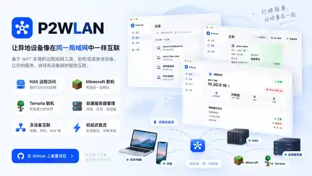
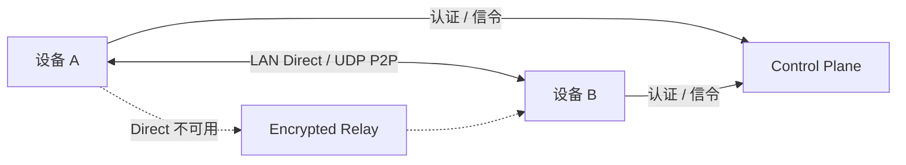

<p align="center">
  
</p>

<div align="center">
  <h1>P2WLAN</h1>
  <p><strong>让异地设备像在同一局域网中一样互联。</strong></p>
  <p>P2P 优先 · NAT 穿透 · Relay 自动回退 · 跨平台 · 房间互联 · 可自托管</p>

  <p>
    <a href="README.md"><strong>简体中文</strong></a>
    · <a href="README.en.md">English</a>
  </p>

  <p>
    <a href="https://github.com/yhan-sun/p2wlan/releases"><strong>下载</strong></a>
    · <a href="#快速开始">快速开始</a>
    · <a href="#适用场景">适用场景</a>
    · <a href="#工作方式">工作方式</a>
    · <a href="#自托管">自托管</a>
  </p>

  <p>
    <a href="https://github.com/yhan-sun/p2wlan/releases"></a>
    <a href="https://github.com/yhan-sun/p2wlan/actions/workflows/ci.yml"></a>
    <a href="LICENSE"></a>
  </p>
</div>

## P2WLAN 是什么

P2WLAN 是一个开源、P2P 优先、可自托管的虚拟局域网工具。它为设备分配私有虚拟 IP，让分布在家庭宽带、移动网络、校园网、云服务器等不同网络中的设备，能够像在同一个局域网里一样通信。

连接建立时，P2WLAN 会优先尝试 **LAN Direct / 公网 UDP P2P**；如果当前 NAT、防火墙或网络环境不允许直连，则自动回退到 **Encrypted Relay**。业务侧仍然使用同一个虚拟 IP，不需要为每台设备单独维护公网端口、动态域名或复杂路由。

> [!IMPORTANT]
> P2WLAN 当前仍处于 **Preview** 阶段，适合真实网络测试、自托管和开发验证。项目尚未完成独立安全审计；P2WLAN 也不是官方 WireGuard 实现，不声明 WireGuard 互操作兼容。

## 一眼看懂

| 能力 | 说明 |
| --- | --- |
| **P2P First** | 能直连就不经过中继，优先使用局域网和公网 UDP。 |
| **NAT Traversal** | 自动探测网络环境并尝试 UDP 打洞；复杂 NAT 下不保证一定成功。 |
| **Relay Fallback** | Direct 不可用时自动切换到加密 Relay，尽量保证连接可用。 |
| **End-to-End Encryption** | 设备间数据通过加密会话传输，Relay 只负责转发密文。 |
| **Rooms** | 用房间组织临时或固定的一组设备，适合朋友联机、协作和私有服务互通。 |
| **Cross-platform** | GUI 覆盖 Windows、macOS、Linux 与移动端预览；CLI / daemon 适合服务器和无桌面环境。 |
| **Self-hosted** | Control Plane、SQLite 与 Relay 可以部署到自己的 Linux 服务器。 |

## 界面预览

<p align="center">
  
</p>

从全局网络状态、设备在线情况，到多房间管理、连接方式和端到端延迟，常用信息可以直接在客户端里看到。设备名称和截图数据均为演示数据。

## 适用场景

P2WLAN 的目标不是替你定义业务，而是提供一张跨地域的虚拟三层网络。只要应用本身能通过 IP 通信，就可以把它放到这张网络上。

| 场景 | 可以怎么用 |
| --- | --- |
| **NAS / HomeLab** | 在外网访问 NAS 管理页、家庭服务器、虚拟机和其他内部服务，不必逐个暴露公网端口。 |
| **Minecraft 联机** | 把朋友的电脑加入同一房间，直接使用虚拟 IP 访问自建 Minecraft 服务器。 |
| **Terraria 联机** | 将不同网络中的玩家组织到同一虚拟网络，进行多人联机。 |
| **自建服务器** | 访问 Web 应用、API、数据库、面板、游戏服以及仅希望在私网开放的服务。 |
| **远程开发** | SSH、RDP、数据库连接、开发测试机互联，以及跨地区设备调试。 |
| **跨地域组网** | 家庭宽带、移动热点、校园网、云主机和不同云厂商之间互联。 |

### 房间：把“我要和谁互联”单独组织起来

房间适合需要独立边界的临时或固定网络：例如一个 Minecraft 生存服、一次朋友联机、一组 NAS 维护设备，或者一个开发测试环境。客户端可以集中查看房间成员、在线状态、虚拟 IP、当前连接路径和延迟，不需要把所有设备混在同一个列表里。

## 快速开始

### 1. 下载

前往 [GitHub Releases](https://github.com/yhan-sun/p2wlan/releases) 下载对应平台的最新版本。

| 平台 | Release 文件 | 状态 |
| --- | --- | --- |
| macOS 12+ Apple Silicon | `p2wlan-flutter-macos-arm64.dmg` | 支持 |
| macOS 12+ Intel | `p2wlan-flutter-macos-x64.dmg` | 支持 |
| Windows x64 | `p2wlan-flutter-windows-x64-setup.exe` | 支持 |
| Linux x64 | Flutter `.tar.gz` / CLI `.tar.gz` | 支持 |
| Linux arm64 | CLI `.tar.gz` | 支持 |
| Android 7.0+ (API 24+) arm64 | `p2wlan-flutter-android-arm64-release.apk` | Preview |
| iOS 15+ arm64 | `p2wlan-flutter-ios-arm64-unsigned.ipa` | 实验性，需签名 |

### 2. 登录

打开客户端并登录；服务器或无桌面环境可使用 CLI：

```bash
p2wlan login -u you@example.com
```

### 3. 启动虚拟网络

在客户端启动网络，或在 CLI 中执行：

```bash
p2wlan up
p2wlan status
```

### 4. 使用虚拟 IP

连接建立后，直接像访问普通局域网地址一样使用对端的 P2WLAN 虚拟 IP：

```bash
ping 10.20.0.5
ssh user@10.20.0.5
```

游戏服务器、NAS、Web 面板或数据库同理：应用只需要连接对端虚拟 IP 和对应业务端口。

### 5. 查看连接路径

客户端会显示 Peer 当前使用的路径。遇到问题时，可先运行：

```bash
p2wlan doctor
p2wlan logs -f
```

Linux CLI 也提供安装脚本：

```bash
curl -fsSL https://raw.githubusercontent.com/yhan-sun/p2wlan/main/scripts/install-linux-cli.sh -o /tmp/p2wlan-install.sh
sudo sh /tmp/p2wlan-install.sh
```

## 工作方式

P2WLAN 将连接控制和数据传输分开：

- **Control Plane**：身份、设备、虚拟 IP、凭据和信令。
- **Rust daemon**：虚拟网卡、路由、Peer、NAT traversal、加密数据面和路径选择。
- **Relay**：只在 Direct 不可用时参与，负责转发密文。


```mermaid
flowchart LR
    A[设备 A] <-->|"LAN Direct / UDP P2P"| B[设备 B]
    A -->|"认证 / 信令"| C[Control Plane]
    B -->|"认证 / 信令"| C
    A -.->|"Direct 不可用"| R[Encrypted Relay]
    R -.-> B
```

连接策略可以概括为：

**LAN Direct → Public UDP Direct → Encrypted Relay**

Direct 能否建立取决于两端真实网络环境。NAT、CGNAT、防火墙、云安全组等都可能阻止直连；此时 Relay 是后备路径，而不是对任意网络环境 P2P 成功率的承诺。

## 连接状态

| 状态 | 含义 |
| --- | --- |
| **LAN Direct** | 通过本地网络直接通信。 |
| **Direct** | 通过公网 UDP 建立 P2P 直连。 |
| **Relay** | 通过 Relay 转发加密数据。 |
| **Connecting** | 正在建立或确认连接路径。 |
| **Offline** | 对端离线或当前没有可用路径。 |

## 技术架构

| 模块 | 技术 | 职责 |
| --- | --- | --- |
| GUI | Flutter | 登录、设备 / 房间管理、连接状态与诊断。 |
| Data Plane / Daemon | Rust | TUN、路由、Peer、NAT traversal、加密会话与 Relay fallback。 |
| Virtual interface | macOS `utun` / Windows Wintun / Linux TUN | 为应用提供普通的三层虚拟网络接口。 |
| Control Plane | Go + SQLite | 认证、设备注册、虚拟 IP、凭据、信令和 Relay 信息。 |
| Relay | Go | Relay 连接、票据校验和密文转发。 |

P2WLAN 使用自包含的 **WireGuard-like Noise** 数据面，并使用 X25519、ChaCha20-Poly1305、BLAKE2s 等密码学组件。**P2WLAN 不是官方 WireGuard 实现，也不声明 WireGuard 互操作兼容。**

## 自托管

Control Plane 和 Relay 位于 [`server/`](server/)；Linux CLI / daemon 位于 Rust workspace。最小构建可以从仓库根目录执行：

```bash
cd server
go build -o p2wlan-control .
go build -o p2wlan-relay ./relay
```

生产部署还需要根据当前代码配置 HTTPS/WSS、数据库、认证密钥和 Relay 地址。README 首页只保留入口信息，具体配置请以 [`server/`](server/) 中的实现为准。

## 安全边界

- 设备业务流量通过端点间的加密数据面传输。
- Relay 转发密文，不负责解密业务载荷。
- Relay 仍可能观察连接相关元数据，例如节点标识、时间和数据包大小。
- 项目处于 **Preview**，尚未完成独立安全审计。
- 不保证任意 NAT 环境都能建立 P2P 直连；Relay 可用性同样依赖 Control Plane 和 Relay 可达。
- 高敏感生产环境请在部署前自行完成安全评估。

## 开发者

Flutter 开发和发布统一使用 **Flutter 3.47.2 / Dart 3.13.2**，仓库根目录 `.fvmrc` 是本地 FVM、CI 和发布流水线的版本来源。

仓库按职责拆分：

- [`apps/flutter_client/`](apps/flutter_client/) — Flutter 客户端
- [`client/daemon/`](client/daemon/) — Rust daemon
- [`client/cli/`](client/cli/) — Rust CLI
- [`client/tun/`](client/tun/) — TUN / 虚拟网卡抽象
- [`client/crypto/`](client/crypto/) — 加密组件
- [`server/`](server/) — Go Control Plane
- [`server/relay/`](server/relay/) — Go Relay

实现细节请优先以源码、测试和 CI 为准。

## License

[MIT](LICENSE)
