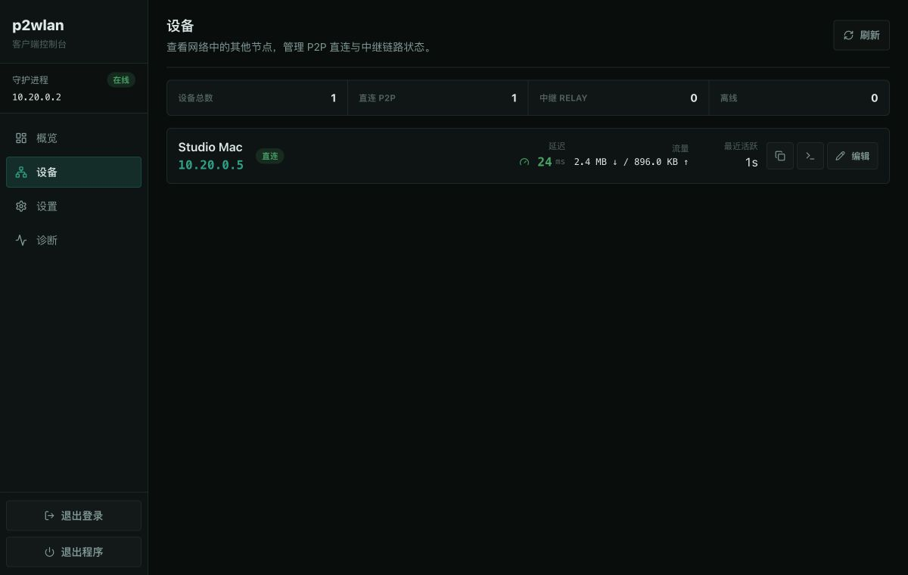
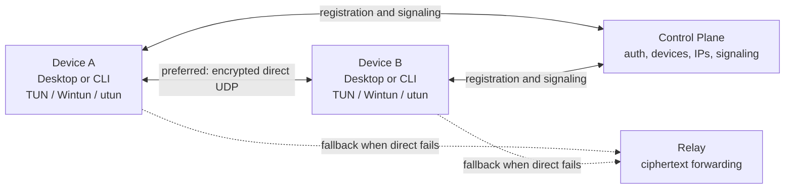

<div align="center">
  
  <h1>P2WLAN</h1>
  <p><strong>Self-hostable encrypted virtual LAN for real devices, real networks, and real diagnostics.</strong></p>
  <p>把 Mac、Windows、Linux、云服务器、NAS 和临时设备组成一张可观测、P2P 优先、可自托管的私有局域网。</p>

  <p>
    <a href="https://github.com/yhan-sun/p2wlan/actions/workflows/ci.yml"></a>
    <a href="https://github.com/yhan-sun/p2wlan/releases"></a>
    <a href="LICENSE"></a>
    
  </p>

  <p>
    <a href="https://github.com/yhan-sun/p2wlan/releases"><strong>Download</strong></a>
    · <a href="#quick-start">Quick Start</a>
    · <a href="#architecture">Architecture</a>
    · <a href="#self-hosting">Self-hosting</a>
    · <a href="docs/SECURITY_REVIEW.md">Security</a>
    · <a href="docs/ROADMAP.md">Roadmap</a>
  </p>
</div>



## Overview

P2WLAN is an open-source private virtual LAN. It creates a real system network interface on each device, assigns stable `10.20.x.x` virtual IPs, and prefers encrypted peer-to-peer paths whenever the network allows it.

When direct UDP is blocked by NAT, CGNAT, restrictive firewalls, or cloud security rules, P2WLAN falls back to an encrypted relay path so the private network remains usable. The product is designed to be operationally honest: you can see whether a peer is on LAN direct, public UDP direct, relay, or unreachable instead of guessing what happened underneath.

> P2WLAN is currently in **Preview**. It is useful for real testing and self-hosted deployments, but direct connectivity still depends on both sides of the network path. Treat high-value production traffic conservatively until the project completes broader compatibility work and independent security review.

## Product DNA

<table>
  <tr>
    <td width="33%" valign="top">
      <h3>Private by Default</h3>
      <p>Use virtual IPs for SSH, RDP, databases, dashboards, and dev services without exposing every service to the public internet.</p>
    </td>
    <td width="33%" valign="top">
      <h3>P2P First</h3>
      <p>Prefer LAN and public UDP direct paths, keep NAT mappings alive, and recover to relay only when direct transport is not confirmed.</p>
    </td>
    <td width="33%" valign="top">
      <h3>Self-hostable</h3>
      <p>Run the Go control plane, SQLite database, and relay on your own public Linux instance for transparent private networking.</p>
    </td>
  </tr>
  <tr>
    <td width="33%" valign="top">
      <h3>Observable</h3>
      <p>Inspect peer reachability, path type, latency, endpoint candidates, diagnostics, and daemon state from the client or CLI.</p>
    </td>
    <td width="33%" valign="top">
      <h3>Encrypted</h3>
      <p>Device traffic is protected by an encrypted data plane; relay nodes forward ciphertext and do not terminate private payloads.</p>
    </td>
    <td width="33%" valign="top">
      <h3>Cross-platform</h3>
      <p>Use Tauri desktop on macOS and Windows, plus a Linux CLI for servers, NAS devices, cloud machines, and headless workflows.</p>
    </td>
  </tr>
</table>

## Use Cases

- **Cloud machine access**: reach SSH, RDP, HTTP dashboards, databases, and dev servers through virtual IPs instead of public service exposure.
- **Home lab and NAS**: connect laptops, mini PCs, NAS devices, and remote servers without hand-maintaining VPN routes.
- **Cross-cloud operations**: place machines from different providers, regions, and network policies into one small private LAN.
- **Temporary field networks**: connect devices across hotel Wi-Fi, mobile hotspots, campus networks, and home broadband with explicit fallback behavior.
- **Networking research**: inspect NAT probing, direct-path verification, relay tickets, revocation feeds, protocol boundaries, and diagnostics from source.

## Quick Start

Download the latest client from [GitHub Releases](https://github.com/yhan-sun/p2wlan/releases), sign in on at least two devices, start the virtual network interface, then test another device by its virtual IP:

```bash
ping 10.20.0.5
ssh user@10.20.0.5
```

### macOS

Download the universal `.dmg`, drag P2WLAN into Applications, open the app, and approve the system authorization prompt when starting the virtual interface.

Preview builds may use ad-hoc signing before full Apple notarization. If Gatekeeper blocks the first launch, open the app from Finder with right-click -> Open.

### Windows

Download the Windows release archive, keep these files in the same folder, and run `p2wlan-desktop.exe`:

```text
p2wlan-desktop.exe
p2pnet-daemon.exe
wintun.dll
```

Windows asks for UAC approval when the virtual adapter starts. P2WLAN does not read or store your administrator password.

### Linux

Install the headless CLI on servers, NAS devices, and development machines:

```bash
curl -fsSL https://raw.githubusercontent.com/yhan-sun/p2wlan/main/scripts/install-linux-cli.sh -o /tmp/p2wlan-install.sh
sudo sh /tmp/p2wlan-install.sh

p2wlan login -u you@example.com
p2wlan up
p2wlan status
```

Useful commands:

```bash
p2wlan doctor
p2wlan logs -f
p2wlan down
p2wlan update
```

Linux desktop packaging is still being refined; the current Linux release is optimized for CLI and server-style usage.

## Connection Modes

P2WLAN exposes connection path state directly. That makes troubleshooting more practical than a single generic "online" label.

| Mode | Meaning | When you usually see it |
| --- | --- | --- |
| **LAN direct** | Devices can reach each other on the local network. | Same LAN, office network, home lab |
| **Public UDP direct** | Devices communicate through public UDP endpoints after probing or explicit UDP exposure. | Cloud server with UDP ingress, less restrictive NAT |
| **Encrypted relay** | Direct path is unavailable, so packets are forwarded through relay as ciphertext. | CGNAT, blocked UDP, strict firewall, missing security-group rule |
| **Unreachable** | No valid direct or relay path is currently confirmed. | Peer offline, auth expired, network partition, relay unavailable |

Direct UDP is not guaranteed. For cloud machines that should accept public UDP directly, configure a stable UDP listen port and allow it in both the cloud firewall and the operating-system firewall.

## Architecture


```mermaid
flowchart LR
    A["Device A<br/>Desktop or CLI<br/>TUN / Wintun / utun"]
    B["Device B<br/>Desktop or CLI<br/>TUN / Wintun / utun"]
    C["Control Plane<br/>auth, devices, IPs, signaling"]
    R["Relay<br/>ciphertext forwarding"]

    A <-->|"preferred: encrypted direct UDP"| B
    A <-->|"registration and signaling"| C
    B <-->|"registration and signaling"| C
    A -.->|"fallback when direct fails"| R
    B -.->|"fallback when direct fails"| R
```

| Layer | Implementation | Responsibility |
| --- | --- | --- |
| Desktop | React, Tauri | Login, device status, system authorization, tray lifecycle, settings, diagnostics |
| Daemon | Rust | Virtual interface, encrypted sessions, peer state, NAT probing, relay fallback, local diagnostics |
| Control plane | Go, SQLite | Accounts, device registry, virtual IP allocation, credential state, relay tickets, signaling |
| Relay | Go | Ciphertext forwarding, ticket validation, revocation-feed polling |
| Protocol docs | Markdown, protobuf draft | Packet flow, security boundaries, diagnostics, deployment notes |

## Platform Status

| Platform | Client | Virtual interface | Status |
| --- | --- | --- | --- |
| macOS Apple Silicon / Intel | Desktop app | `utun` | Preview, real bidirectional virtual-IP testing completed |
| Windows 10/11 x64 | Portable desktop app | Wintun | Preview, remote smoke coverage in progress |
| Linux x64 / arm64 | CLI | TUN | Preview, server and headless workflows supported |

## Self-hosting

P2WLAN can run on your own infrastructure. A small public Linux server is enough for a control plane and relay for testing or personal use.

```bash
cd server
mkdir -p data
go build -o p2wlan-control .
go build -o p2wlan-relay ./relay
```

Control plane example:

```bash
JWT_SECRET="replace-with-a-long-random-secret" \
DB_PATH="./data/p2wlan.db" \
PORT=18080 \
RELAY_SERVERS="default@relay.example.com:18081" \
RELAY_REVOCATION_FEED_TOKEN="replace-with-a-second-random-secret" \
./p2wlan-control
```

Relay example:

```bash
RELAY_BIND=":18081" \
RELAY_REVOCATION_FEED_URL="https://control.example.com/api/v1/relay/revocations" \
RELAY_REVOCATION_FEED_TOKEN="same-token-as-control-plane" \
RELAY_REVOCATION_POLL_INTERVAL="30s" \
./p2wlan-relay
```

Put HTTPS/WSS in front of the control plane for internet-facing deployments. Keep SQLite files, diagnostics endpoints, and relay tokens private. If the relay cannot fetch the revocation feed, it keeps the last successful snapshot; short-lived relay tickets still define the remaining exposure window.

More detail:

- [Protocol and deployment notes](docs/PROTOCOL.md)
- [Security boundaries and revocation model](docs/SECURITY_REVIEW.md)
- [Release packaging](docs/RELEASE_PACKAGING.md)

## Build from Source

Install Rust stable, Go 1.22+, Node.js 20+, and pnpm 10+. Linux desktop builds also need GTK/WebKit2GTK development dependencies.

```bash
git clone https://github.com/yhan-sun/p2wlan.git
cd p2wlan
pnpm install --frozen-lockfile

# Rust daemon
cargo build -p p2pnet-daemon

# Desktop development shell
cargo tauri dev
```

Build macOS release packages through the project script so the daemon is placed into the app resource directory:

```bash
pnpm run icons
pnpm run package:macos
```

## Quality Gates

Run the relevant checks before submitting code changes:

```bash
cargo fmt --all --check
cargo clippy --workspace --all-targets --all-features -- -D warnings
cargo test --workspace --all-targets

cd server
go vet ./...
go test ./... -count=1
cd ..

pnpm audit --audit-level high
pnpm run build
./scripts/control-smoke.sh
```

Real TUN smoke tests require elevated privileges:

```bash
# Linux network namespace two-node test
sudo -E ./scripts/tun-ping-smoke.sh

# macOS local plus remote Linux bidirectional ping
sudo -E ./scripts/mac-remote-smoke.sh --tun
```

Windows testing details are in [docs/WINDOWS_TESTING.md](docs/WINDOWS_TESTING.md). macOS testing details are in [docs/MAC_TESTING.md](docs/MAC_TESTING.md).

## Repository Map

```text
client/       Rust networking core: TUN, crypto, WireGuard-style sessions, NAT, relay, daemon, CLI
server/       Go control plane, auth, SQLite, signaling, relay server, revocation feed
src/          React desktop client interface
src-tauri/    Tauri shell, tray, permissions, daemon lifecycle, platform packaging
scripts/      Build, packaging, install, direct-path, and cross-platform smoke scripts
docs/         Protocol, security, roadmap, research, release, and platform testing notes
fuzz/         Fuzz targets for protocol/parser hardening
proto/        Protobuf protocol draft
```

## Documentation

- [Protocol](docs/PROTOCOL.md): packet flow, relay tickets, revocation feed, diagnostics, and security boundaries.
- [Security review](docs/SECURITY_REVIEW.md): trust boundaries, known risks, disclosure guidance, and preview-stage caveats.
- [Roadmap](docs/ROADMAP.md): product milestones and remaining stabilization work.
- [Engine optimization plan](docs/ENGINE_OPTIMIZATION_PLAN.md): NAT traversal, relay behavior, diagnostics, and performance work.
- [Release packaging](docs/RELEASE_PACKAGING.md): build and publishing process for maintainers.
- [macOS testing](docs/MAC_TESTING.md): platform-specific validation notes.
- [Windows testing](docs/WINDOWS_TESTING.md): Windows smoke and compatibility guidance.

## Contributing

P2WLAN welcomes issues, pull requests, platform test reports, NAT traversal observations, documentation improvements, and security review.

High-value contributions right now:

- real-world direct-vs-relay reports from home routers, campus networks, mobile hotspots, and cloud providers;
- Windows 10/11 compatibility data across adapters, drivers, and firewall profiles;
- Linux packaging feedback for NAS, server, and desktop distributions;
- relay-region, revocation, observability, and performance improvements;
- review of the control plane, relay tickets, encrypted transport, and local privilege boundaries.

Please keep the repository clean: do not commit exported artifacts or local packages such as `.docx`, `.pdf`, `.dmg`, `.zip`, `.tar.gz`, logs, local databases, or generated runtime files. Use source documents and reproducible scripts instead.

Before submitting code, run the relevant quality gates above and keep user-facing claims conservative unless they are backed by reproducible tests.

## License

P2WLAN is released under the [MIT License](LICENSE).
