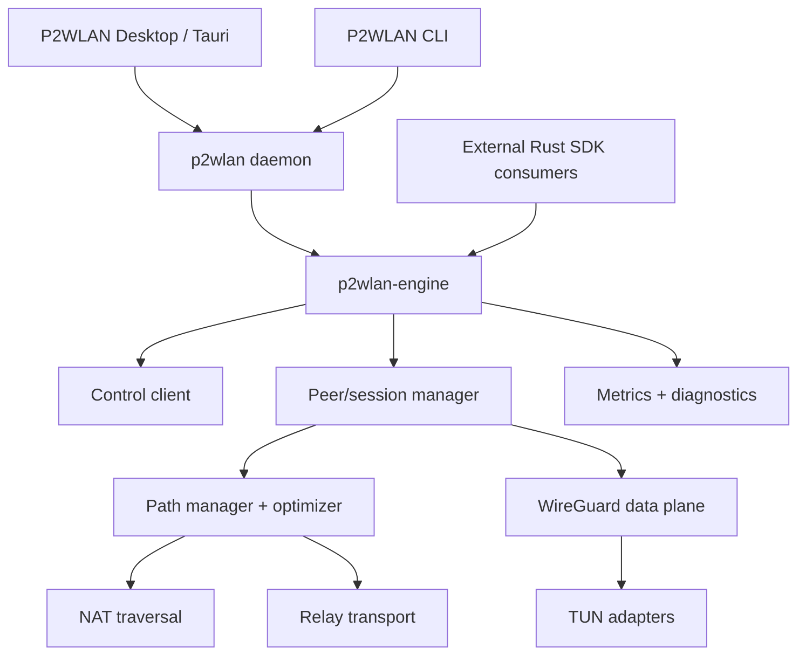
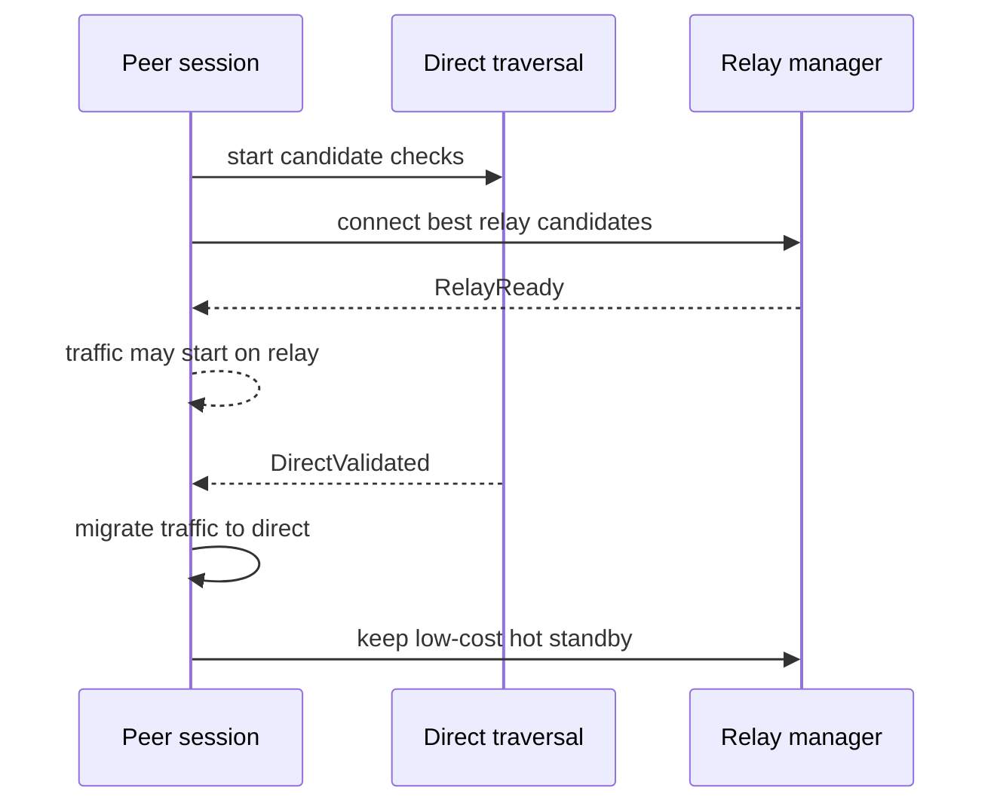

# P2WLAN 架构优化与自适应网络引擎实施方案

Status: Living Plan
Version: 1.1
Date: 2026-07-20
Applies to: P2WLAN 0.1.24 and later

## 1. 文档目的

本文定义 P2WLAN 从“可用的 P2P 虚拟内网产品”演进为“可复用的自适应 P2P 网络引擎”的技术路线、模块边界、协议要求、实施顺序和验收标准。

本文不是重新设计整个项目，也不是承诺一次性实现完整 ICE、QUIC、Multipath 或 AI。优化必须遵循以下顺序：

1. 先保证协议安全、连接正确性和故障可诊断。
2. 再提炼稳定 Engine 边界，让现有产品成为 Engine 的调用方。
3. 在真实网络数据基础上增加自适应穿透和路径优化。
4. 最后评估 Multipath、FEC、QUIC 等高级传输能力。

现有 [ROADMAP.md](ROADMAP.md) 继续描述产品功能阶段；本文负责跨模块架构、网络引擎和质量基线。协议字段与状态机的最终定义仍应同步到 [PROTOCOL.md](PROTOCOL.md)。

## 2. 结论与定位

### 2.1 推荐定位

> P2WLAN 是基于 WireGuard 的自适应点对点网络引擎，并提供开箱即用的跨平台虚拟局域网产品。

该定位包含两层：

- **产品层**：登录、设备管理、虚拟 IP、ACL、Magic DNS、桌面 UI、CLI、安装升级和诊断。
- **Engine 层**：身份、控制事件、候选收集、穿透、Relay、WireGuard、TUN、路径选择和迁移。

短期仍以虚拟局域网闭环为第一目标。游戏联机、远程桌面、文件传输、IoT 和边缘计算属于潜在 Engine 使用方，不作为当前版本的功能承诺。

### 2.2 非目标

以下内容不应成为 1.x 的前置条件：

- 不自研新的密码算法或替换 WireGuard。
- 不以“完整实现 RFC 8445 ICE”作为目标；只实现经过验证且需要的行为。
- 不为了使用 QUIC 或 protobuf 而重写已经稳定的链路。
- 不建立依赖 ISP、地区或路由器型号的全局 NAT 决策系统。
- 不在缺少真实指标时引入 AI 路径排序。
- 不承诺所有 NAT 环境都能直连；Relay 始终是可用性组成部分。

## 3. 当前实现基线

P2WLAN 已经是 Rust workspace，而不是单体客户端。当前主要模块如下：

| 模块 | 当前职责 | 优化重点 |
| --- | --- | --- |
| `client/tun` | Linux TUN、macOS utun、Windows Wintun | 生命周期、平台错误归一化 |
| `client/crypto` | 密钥和加密基础能力 | 身份绑定、敏感数据生命周期 |
| `client/wireguard` | WireGuard 会话和数据面 | transport 解耦、endpoint 漫游 |
| `client/nat` | host/srflx candidate、STUN、Punch/ACK | 认证 probe、candidate pair、NAT profile |
| `client/relay` | Relay client/server 和 frame | TLS、token、流控、协议版本 |
| `client/daemon` | 编排控制面、TUN、peer、direct/relay | 提炼 Engine、路径状态机 |
| `client/cli` | headless 管理和诊断 | Engine consumer |
| `src-tauri` | 桌面生命周期和 UI bridge | Engine consumer |
| `server/api`、`server/signaling` | 设备、网络图、信令 | 推送式 watch、会话凭据 |
| `server/relay` | Go Relay 部署实现 | 与 Rust Relay 协议一致、安全加固 |

已经具备的能力不能在后续计划中重复建设：

- host 和 STUN server-reflexive candidate 收集。
- UDP Punch/ACK、direct keepalive 和直连恢复。
- Direct 与 Relay fallback 共存。
- Relay supervisor 自动重连。
- 多 Relay 候选并发连接和基于 region/延迟的初始选择。
- Direct/Relay 可解释评分、路径切换 timeline、Relay keepalive RTT/jitter/Pong/Error 计数诊断，以及运行期 Relay 故障后的候选冷却重选。
- 网络变化后周期性重新收集和发布 UDP candidate。
- 多 STUN 观察点候选收集、行为型 `NatProfile` 本地诊断，以及 `p2wlan doctor` NAT/STUN 建议输出（`NAT-01a` 已落地；仍保持旧控制面 candidate wire format）。
- WireGuard 加密数据面和跨平台虚拟网卡基础实现。
- 本地 diagnostics、CLI 状态和部分真实 TUN smoke test。

当前实现是 **ICE-inspired traversal**，不是完整 ICE。当前 candidate 类型和静态优先级不能替代 candidate-pair checklist、nomination、可达性确认和持续 consent 检查。

## 4. 设计原则

### 4.1 正确性优先于直连率

一次被错误判定为可用的 Direct 路径，可能造成长时间黑洞；一次正确回退 Relay 只增加一些延迟。因此路径切换必须先保证可达性和恢复，再优化直连比例。

### 4.2 Relay 是基础路径，不是失败补丁

Relay 应尽快建立并保持低成本热备。Direct 探测与 Relay 建连可以并行，但用户数据不应无条件在两条路径重复发送。Direct 被确认后停止 Relay 数据转发，保留控制连接或低频保活，以便快速故障转移。

### 4.3 决策基于 candidate pair

路径质量取决于本地 candidate、远端 candidate、协议、网络接口和 Relay region 的组合。评分对象必须是 candidate pair/path，而不是孤立的 candidate 类型。

### 4.4 自适应必须有预算

Socket 数、Probe 频率、候选数量、STUN 请求和重试时间都必须受预算约束，并根据设备电量、网络类型、历史成功率和当前可用路径动态调整。

### 4.5 身份与地址分离

设备身份由长期公钥确定；虚拟 IP、物理 endpoint、Relay 连接和控制面 token 都是可变属性，不能作为身份凭据。

### 4.6 可观测后再智能化

没有统一的 path ID、原因码、状态变化和成功率指标，就无法验证 Prediction、Birthday 或路径评分是否有效。

## 5. 目标架构



### 5.1 Engine 边界

建议新增 `client/engine` crate，包名为 `p2wlan-engine`。第一阶段只移动编排职责，不重写底层 crate。桌面端和 CLI 默认通过 daemon host 使用 Engine；外部 Rust SDK 或测试程序可以选择进程内嵌入 Engine。

Engine 对外暴露四类能力：

```rust
pub struct Engine;

impl Engine {
    pub async fn start(config: EngineConfig) -> Result<Self>;
    pub async fn shutdown(&self) -> Result<()>;
    pub fn events(&self) -> broadcast::Receiver<EngineEvent>;
    pub async fn snapshot(&self) -> EngineSnapshot;
    pub async fn update_config(&self, patch: ConfigPatch) -> Result<ApplyResult>;
}
```

接口要求：

- `start` 必须是幂等可诊断的，失败时返回明确阶段和原因码。
- `shutdown` 必须等待 TUN、路由、Relay 和后台任务有序清理。
- `events` 是增量事件；`snapshot` 是可恢复的完整状态。
- 配置更新必须明确“立即生效”“需要重连”“需要重启”三种结果。
- UI 和 CLI 不直接持有 NAT、Relay 或 WireGuard 内部对象。
- Engine 不依赖 Tauri，也不包含桌面 UI 文案。

### 5.2 内部所有权

| 组件 | 唯一职责 | 不负责 |
| --- | --- | --- |
| `ControlActor` | 注册、鉴权、network map、信令流 | 路径选择 |
| `PeerManager` | peer 生命周期和 WireGuard 配置 | NAT 行为推断 |
| `PathManager` | candidate pair、探测、选择、迁移 | 用户身份认证 |
| `NatTraversal` | candidate 收集、STUN、映射分析、probe | Relay 数据转发 |
| `RelayManager` | Relay 连接、选择、热备、流控 | 解密用户数据 |
| `TunManager` | 虚拟网卡、路由、平台清理 | peer 发现 |
| `Diagnostics` | 事件、指标、快照、诊断包 | 修改连接策略 |

每个长生命周期任务都必须由一个 supervisor 持有，禁止产生无人等待、无人取消的后台任务。

## 6. 安全基线

安全改造是所有高级 NAT 功能的前置条件。

### 6.1 Relay 传输和注册

Relay 连接必须满足：

- 默认 TLS 1.3；自托管开发环境可显式允许明文，不允许静默降级。
- 控制面签发短期 Relay token，至少绑定 `device_id`、`network_id`、Relay audience、过期时间和随机 ID。
- Relay 校验 token 后再接受注册；客户端不能仅凭 node ID 占用路由表项。
- 同一设备重复注册必须有确定的替换规则并产生审计事件。
- Frame 包含协议版本、源/目标、长度和必要的会话标识；服务器校验源身份。
- 设置单连接和单设备的帧大小、速率、队列长度和并发限制。
- Rust Relay 与 Go Relay 共享测试向量和兼容性测试。

Relay token 建议是控制面签名的紧凑二进制声明或标准 JWT/PASETO。选择哪种格式不是关键，关键是短期、可验证、可撤销和 audience 限定。

### 6.2 认证 Probe

现有 14 字节 Punch/ACK 只适合早期验证。新协议至少包含：

```text
version | type | session_id | src_id | dst_id | timestamp | nonce | mac
```

要求：

- `session_id` 由已认证控制信令协商。
- 双方为每个 session 生成临时 X25519 公钥，并使用已有 Ed25519 Device Identity Key 对临时公钥、双方设备 ID、session ID 和过期时间签名。
- 双方验证控制面绑定的 Ed25519 公钥后，通过临时 X25519 DH 和带协议域分离的 KDF 派生 `probe_mac_key`；该密钥不能复用为 WireGuard 或控制面密钥。
- `mac` 使用 `probe_mac_key`，不能接受未认证 ACK 更新路径状态；具体 KDF、MAC、截断长度和 transcript 编码必须写入协议测试向量并接受安全评审。
- 时间戳允许有限时钟偏差，并维护短期 nonce 重放窗口。
- 未知 session、错误目标和过期 probe 在固定成本内丢弃。
- 对每个来源 IP、session 和目标 peer 限速。
- 协议版本不支持时返回诊断事件，不回显可被放大的载荷。

### 6.3 密钥和凭据

- 配置文件中的私钥、设备凭据和 refresh token 保持最小权限。
- 日志、诊断包和 UI 状态永不输出完整 token 或私钥。
- Device Identity Key 与 WireGuard key 的绑定由控制面验证并可轮换。
- 定义设备删除、凭据撤销和密钥轮换后的连接终止行为。

## 7. 控制面优化

### 7.1 从轮询演进为版本化事件流

当前短轮询可以保留为兼容 fallback，新客户端增加一个长连接 watch：

```text
Disconnected
  -> Authenticating
  -> SyncingSnapshot(version=N)
  -> Watching(from=N)
  -> Resyncing(on gap or retention expiry)
```

事件必须包含单调递增版本或游标。客户端检测到版本缺口时获取完整 snapshot，不能猜测丢失内容。

第一阶段可选 WebSocket、SSE 或 HTTP/2 streaming。只有在连接迁移、统一 UDP transport 或服务端规模数据证明有价值时，再选择 QUIC。传输协议不得泄漏到 Engine 公共事件模型。

### 7.2 Schema 和兼容性

- 所有消息有明确版本和未知字段处理策略。
- 服务端至少兼容当前和上一个客户端协议版本。
- 新增字段默认可选；删除字段必须经过弃用周期。
- JSON 可以继续服务管理 API；高频二进制通道可使用 protobuf。
- protobuf 不是目标本身，禁止仅为“统一格式”重写低频稳定 API。

### 7.3 信令可靠性

- 每条 offer/answer/candidate update 有 `message_id`、过期时间和幂等语义。
- 收件方确认处理进度，而不只是 HTTP 接收成功。
- 旧网络代际的 candidate update 不得覆盖新网络状态。
- 控制面重连后可恢复未完成的握手或明确终止旧 session。

## 8. NAT 穿透引擎

### 8.1 网络代际

每次检测到默认路由、接口地址、SSID/BSSID、移动网络或系统 sleep/wake 变化时，创建新的 `network_generation`。

旧代际 candidate 可以在迁移窗口内继续收包，但不能覆盖新代际的选择结果。所有异步 STUN、Probe 和信令结果必须携带代际，过期结果直接丢弃。

### 8.2 Candidate 类型

建议支持以下来源：

| 类型 | 来源 | 默认策略 |
| --- | --- | --- |
| Host IPv4/IPv6 | 系统接口枚举 | 总是收集，过滤虚拟/无效接口 |
| Server Reflexive | 至少两个独立 STUN 观察点 | 总是收集 |
| Port Mapping | PCP、NAT-PMP、UPnP IGD | 桌面/服务器按策略尝试 |
| Manually Advertised | 用户配置的公网 endpoint | 显式配置时优先验证 |
| Predicted | 映射分析推断 | 仅在 profile 可预测且预算允许时 |
| Relay | 控制面下发 | 始终准备至少一个可用项 |

IPv6 candidate 不能因为地址是全局单播就直接判定可达，仍需要双向 probe 和防火墙验证。

### 8.3 Candidate-pair 状态机

```text
Frozen -> Waiting -> Probing -> Succeeded -> Selected
                     |             |
                     v             v
                   Failed       Degraded
```

每个 pair 至少记录：

- 本地/远端 candidate ID 和 network generation。
- 接口、地址族、映射来源和 Relay region。
- 首次成功时间、最近成功时间和最后失败原因。
- RTT 的 EWMA、RTT 方差、loss 窗口和连续失败。
- 探测成本、是否按流量计费、是否处于省电网络。

### 8.4 NAT Profile 与 Mapping Analyzer

NAT Profile 描述观测行为，不使用过时的单一 Cone/Symmetric 标签作为唯一依据：

```text
mapping_behavior: endpoint-independent | address-dependent | address-port-dependent | unknown
filtering_behavior: endpoint-independent | address-dependent | address-port-dependent | unknown
port_preservation: always | often | rarely | unknown
port_delta: stable(+N) | bounded | random | unknown
hairpinning: supported | unsupported | unknown
mapping_lifetime: lower_bound / estimate / unknown
confidence: 0.0..1.0
observed_at / expires_at
```

Mapping Analyzer 通过同一本地 socket 向多个 STUN endpoint 采样，必要时再通过少量额外 socket 观察端口序列。必须限制采样数量，并避免把一次结果永久缓存。

当前已落地的 `NAT-01a` 只做低风险本地观测：

- 同一个 UDP socket 向所有已配置 STUN endpoint 采样，而不是首个成功即停止。
- 记录每个 STUN endpoint 的 mapped address、RTT 或错误。
- 推断 `mapping_behavior`、公网 IP/端口稳定性、端口保持、稳定端口 delta、疑似 symmetric/address-port-dependent 标记和置信度。
- daemon `/status` 暴露 `local_candidates` 和 `nat_profile`。
- `p2wlan doctor` 输出 NAT/STUN 摘要，并给出 UDP 阻断、疑似对称 NAT、缺少公网 candidate/`udp-advertise` 的建议。

`NAT-01a` 不改变控制面 candidate wire format，不实现 peer-reflexive、prediction 或 birthday probing；这些必须等待认证 Probe v2 和 candidate-pair 状态机承接。

### 8.5 自适应 Probe 预算

建议用策略档位代替固定 socket 数：

| 档位 | 适用条件 | 并发 pair | 额外预测端口 | 目标时长 |
| --- | --- | ---: | ---: | ---: |
| Conservative | 移动网络、省电、Relay 已低延迟可用 | 4 | 0 | 2s |
| Normal | 默认桌面网络 | 8 | 0-4 | 5s |
| Aggressive | 用户显式要求、Relay 延迟高、profile 可预测 | 16-24 | 8-24 | 8s |

硬限制：

- 全局 socket 上限。
- 单 peer、单远端 IP 和单网络的 packet rate 上限。
- 指数退避和最大连续探测时间。
- 已有健康 Direct 时不运行 aggressive 探测。
- 应用进入后台或系统低电量时降级。

### 8.6 Socket Pool

Socket pool 仅在证明创建成本或 NAT 映射复用确实是瓶颈后引入。设计要求：

- 按网络代际和地址族隔离，不能跨网络复用旧映射。
- socket 有 owner、租期、空闲回收和最大数量。
- 数据 socket 与实验性 prediction socket 分开计量。
- 网络切换后旧 socket 进入短暂 draining，然后关闭。
- 暴露当前 socket 数、创建失败和 NAT 映射数量指标。

## 9. Relay 架构

### 9.1 并行建连

推荐流程：



这解决的是首包等待和故障恢复，不意味着同时复制所有业务流量。

### 9.2 Multi Relay 的下一步

现有“并发选择一个 Relay”升级为：

- 控制面下发多个 region 和容量信息。
- 客户端维护一个 active Relay 和可选 hot standby。
- 持续采样 active RTT/queue delay，低频探测备选。
- 使用迟滞避免 Relay region 频繁抖动。
- Relay 故障时在目标时间内切换，不等待完整 Direct 超时。
- 后续再设计 Relay-to-Relay mesh；在此之前同一网络应下发可共同到达的 Relay。

### 9.3 Relay 流控

- 有界发送队列，队列满时按明确策略丢包，不能无限占用内存。
- 每 peer 公平调度，避免单一大流量 peer 饿死其他连接。
- 暴露 queue depth、drop、吞吐、连接数和处理延迟。
- 定义最大 frame 和不合法 frame 的断连策略。

## 10. 路径评分与切换

### 10.1 评分输入

第一版使用可解释规则，不使用机器学习：

```text
score = reachability
      + path_type_preference
      + latency_score
      + loss_score
      + stability_score
      + local_history_score
      - network_cost
      - migration_penalty
```

其中 `reachability` 是硬门槛；未经过认证 probe 或真实 WireGuard 流量确认的路径不能成为 active path。

建议默认偏好顺序仅作为先验：

1. 已验证同 LAN host pair。
2. 已验证 IPv6 direct。
3. 已验证 IPv4 direct，包括 port mapping 和 srflx。
4. 已验证 predicted pair。
5. Relay。

最终选择必须结合实时质量。低丢包的 30 ms Relay 可以优于严重抖动的 25 ms Direct。

### 10.2 切换规则

- **Direct -> Relay**：连续失败、短窗口丢包超过阈值或 WireGuard handshake 过期时快速回退。
- **Relay -> Direct**：Direct 连续多次成功，并满足最短稳定时间后切换。
- **Direct A -> Direct B**：新路径显著更好且超过迟滞阈值时切换。
- 每次切换记录 old/new path、原因、指标和耗时。
- 用户强制 Relay 策略高于自动评分。

阈值必须配置化并通过真实测试校准，不能把文档示例值硬编码为协议要求。

## 11. Session Migration

P2WLAN 的“session 不断”定义为：虚拟 IP、peer 身份和上层连接尽可能保持，底层物理路径允许变化。它不保证网络物理中断期间零丢包。

迁移过程：

1. 系统网络变化触发新 `network_generation`。
2. Relay manager 立即恢复或建立可用基础路径。
3. 新代际并行收集 candidate 和探测 Direct。
4. 新路径验证成功后更新 WireGuard endpoint/transport。
5. 旧路径保留短暂 draining 窗口。
6. 新路径出现健康流量后关闭旧资源。

验收场景：

- Wi-Fi A -> 手机热点。
- Wi-Fi -> 有线网络。
- macOS sleep -> wake。
- Windows 网卡 disable -> enable。
- 公网 IP 改变但本地接口未改变。
- Active Relay 重启。

## 12. 本地学习与隐私

第一阶段只做本地路径历史，不建设全局 NAT Database。

本地记录键建议由以下信息的不可逆摘要组成：

```text
network fingerprint + interface class + address family + peer/network class
```

记录内容仅包括策略结果，例如某类 candidate pair 成功率、连接耗时和 profile 置信度。SSID、BSSID、公网 IP、精确地理位置和路由器型号不应默认上传。

如果以后建设聚合服务，必须满足：

- 明确 opt-in。
- 数据最小化、短保留期和删除机制。
- 低基数分桶，防止重识别。
- 服务端数据只能调整探索顺序，不能跳过实时验证。
- 防止恶意样本导致所有客户端探测攻击目标地址。

“AI Candidate Ranking”只有在积累足够匿名样本、建立离线基准并证明规则模型不足后才进入评估。

## 13. 可观测性与诊断

### 13.1 结构化事件

至少定义：

```text
NetworkGenerationChanged
CandidatesGathered
CandidatePairStateChanged
RelayConnected / RelayDisconnected
PathSelected / PathDegraded / PathMigrated
ControlStreamConnected / ControlStreamResynced
PeerSessionReady / PeerSessionFailed
```

事件包含稳定 reason code，展示文案由 CLI/UI 映射。禁止依赖解析日志文本判断状态。

### 13.2 核心指标

| 类别 | 指标 |
| --- | --- |
| 可用性 | peer session 建立成功率、Relay 可用率 |
| 穿透 | Direct 成功率、按 candidate pair 类型分组的成功率 |
| 时间 | 首个可用路径、首个 Direct、failover、recovery 时间 |
| 质量 | RTT、jitter、loss、吞吐、Relay queue delay |
| 稳定性 | 每小时路径切换次数、黑洞时长、重连次数 |
| 资源 | CPU、内存、socket、后台流量、Relay 带宽 |
| 安全 | 无效 token、重放 probe、限速触发、不合法 frame |

### 13.3 用户诊断

`p2wlan doctor` 和桌面端应能回答：

- 当前路径为什么是 Relay？
- 最近一次 Direct 失败在哪个阶段？
- 双方有哪些有效 candidate？
- STUN 是否一致，NAT profile 置信度是多少？
- Relay 是否经过认证，当前 region 和延迟是多少？
- 最近一次网络切换是否完成重新收集和迁移？

诊断输出必须脱敏，并允许生成可分享的诊断包。

## 14. 测试体系

### 14.1 分层测试

| 层级 | 必须覆盖 |
| --- | --- |
| 单元测试 | frame/probe 编解码、重放窗口、评分、迟滞、预算、代际过滤 |
| 属性/模糊测试 | 不可信 Relay frame、probe、control event 解码 |
| 集成测试 | 两 daemon、Relay fallback、Direct 恢复、控制流断线续传 |
| Linux netns | address/filtering 行为、丢包、延迟、NAT 映射变化 |
| 跨平台实机 | macOS/Windows/Linux TUN、sleep/wake、接口切换 |
| 互联网矩阵 | 家庭宽带、热点、云公网、企业网、IPv6、CGNAT |
| 性能测试 | Direct/Relay RTT 和吞吐、空闲资源、100 peers |
| 安全测试 | 冒用 node ID、过期 token、伪造/重放 probe、队列耗尽 |

### 14.2 NAT 实验矩阵

测试结果按可观察行为记录，不只写“Full Cone/Symmetric”：

- endpoint-independent/address-dependent/address-port-dependent mapping。
- 不同 filtering behavior。
- port preservation、hairpin、mapping lifetime。
- 双重 NAT 和 CGNAT。
- IPv4-only、IPv6-only、双栈和 NAT64。
- UDP 被阻断、限速或短映射生命周期。

### 14.3 故障注入

- 在探测中途切换接口。
- 丢弃 candidate update 或制造版本缺口。
- Relay 建连后立即关闭。
- Direct 单向可达。
- 注入 1%、5%、20% 丢包和抖动。
- 让旧 generation 的 STUN 响应延迟到达。
- 模拟系统休眠导致所有 timer 延迟。

## 15. 质量目标

以下是 1.x 目标值，最终阈值应由基准环境校准：

| 指标 | 目标 |
| --- | --- |
| Relay 可用时首个可用路径 P95 | 小于 3 秒 |
| 健康 Direct 建立 P95 | 小于 5 秒 |
| Direct 故障切到热备 Relay P95 | 小于 1 秒 |
| 网络切换后恢复可用路径 P95 | 小于 5 秒 |
| 空闲 CPU | 小于 1% |
| 空闲内存 | 小于 50 MB |
| 稳定网络无原因路径切换 | 0 次/小时 |
| 未认证 Relay 注册和 Probe | 100% 拒绝 |

所有性能结果必须记录 git commit、客户端/服务端版本、OS、CPU、网络类型和 Relay region。

## 16. 分阶段实施计划

### Phase A：协议与安全基线

目标：消除高级优化会放大的身份冒用、伪造和资源耗尽风险。

当前实施入口：[PHASE_A1_RELAY_HARDENING_PROMPT.md](PHASE_A1_RELAY_HARDENING_PROMPT.md)。A1 先建立 Relay 资源边界与稳定协议错误，验收后再进入 Relay ticket/TLS 和认证 Probe。

任务：

- `SEC-01` 定义 Relay token、TLS 和注册状态机。
- `SEC-02` Rust/Go Relay 实现认证与有界队列。
- `SEC-03` 定义并实现认证 Probe v2、重放窗口和限速。
- `SEC-04` 增加协议版本、兼容测试和 fuzz target。
- `OBS-01` 建立稳定 reason code 和连接事件。

验收：未认证连接不能注册 Relay；伪造 ACK 不能改变 active path；安全测试和兼容测试进入 CI。

### Phase B：控制面与状态正确性

目标：网络变化和控制面断线时不会被旧状态覆盖。

任务：

- `CTL-01` network map snapshot + version/cursor。
- `CTL-02` watch stream 和轮询 fallback。
- `CTL-03` 信令幂等、过期和恢复。
- `PATH-01` 引入 network generation。
- `PATH-02` candidate-pair 状态机。

验收：丢事件、乱序响应和网络切换均能通过故障注入测试；状态只能向当前 generation 收敛。

### Phase C：Engine 提炼

目标：上层应用只依赖稳定 Engine API。

任务：

- `ENG-01` 新建 `p2wlan-engine` 和生命周期 API。
- `ENG-02` 将 daemon 编排逐步迁移到 Engine。
- `ENG-03` CLI、Tauri 使用 event/snapshot API。
- `ENG-04` 配置热更新结果和统一错误模型。
- `ENG-05` 后台任务 supervisor 和有序 shutdown。

验收：无 UI 环境可通过 Engine 建立两 peer；daemon 不再暴露内部 NAT/Relay 对象；停止后不遗留 TUN、路由和后台任务。

### Phase D：路径优化与迁移

目标：快速获得可用路径，并在网络变化时稳定迁移。

任务：

- `PATH-03` RTT EWMA、jitter、loss 和稳定性窗口。
- `PATH-04` 可解释评分、迟滞和冷却。
- `RLY-01` active + hot standby Relay。
- `RLY-02` Relay 持续测量和故障转移。
  - `RLY-02a` Relay keepalive RTT、jitter、Pong/Error 运行期诊断（已落地）。
  - `RLY-02b` 基于健康度的 Relay 故障转移、候选重选和冷却窗口（候选冷却与重选已落地；active/hot-standby 仍属于 `RLY-01`）。
- `MIG-01` 网络变化迁移和旧路径 draining。
- `OBS-02` path timeline 和诊断包。

验收：完成 Wi-Fi/热点、sleep/wake、Relay 重启和 Direct 黑洞测试，达到质量目标中的恢复时间。

### Phase E：自适应 NAT

目标：在不破坏资源和安全边界的前提下提升真实直连率。

任务：

- `NAT-01` 多观察点 STUN 和行为型 NAT Profile。
  - `NAT-01a` 同 socket 多 STUN 观察、`NatProfile`、daemon/doctor 诊断（已落地）。
  - `NAT-01b` 在 Probe v2 后补充 filtering 行为、hairpin、mapping lifetime 和真实 pair 成功率回写。
- `NAT-02` PCP/NAT-PMP/UPnP candidate。
- `NAT-03` 本地成功历史和过期策略。
- `NAT-04` 自适应 probe 预算。
- `NAT-05` 可预测 profile 下的受限端口 prediction。
- `NAT-06` 经基准证明有价值后再实现 socket pool。

验收：与 Phase D 固定策略进行 A/B 对照；Direct 成功率或建立时间有统计显著改善，同时 socket、流量和电量不超过预算。

### Phase F：高级传输研究

只有 Phase A-E 稳定后才立项：

- Relay over QUIC 或企业网络友好的 TLS/WebSocket 双 transport。
- Multipath 冗余或负载分担。
- 对特定实时业务的 FEC。
- 拥塞控制和 message-oriented SDK。
- 匿名聚合 NAT 经验库。

每一项必须先写 ADR，说明业务问题、基准、替代方案和回滚方式。

## 17. 发布与迁移策略

- Probe v1/v2、Relay v1/v2 在一个过渡版本内并存。
- 控制面根据客户端 capability 下发协议；不允许自动降级到不安全 Relay。
- 新路径优化器使用 feature flag，支持按设备或网络灰度。
- 每次灰度比较成功率、首路径时间、切换次数和 Relay 流量。
- 触发异常阈值时回退到简单 Direct/Relay 策略，而不是回退身份认证。
- 配置 schema 必须有迁移版本；迁移前保留可恢复备份。

## 18. 优先级总表

| 优先级 | 能力 | 原因 |
| --- | --- | --- |
| P0 | Relay TLS/认证、认证 Probe、限速 | 当前安全和正确性基础 |
| P0 | network generation、状态 reason code | 解决网络切换和旧结果污染 |
| P0 | Relay 稳定性与故障恢复 | 保证任何网络下基本可用 |
| P1 | 推送式控制面和信令恢复 | 降低握手延迟和轮询复杂度 |
| P1 | Engine API 和生命周期 | 支撑 CLI、GUI、SDK 复用 |
| P1 | loss/jitter、路径迟滞、热备 Relay | 提升稳定性和切换体验 |
| P2 | NAT Profile、端口映射协议、本地历史 | 提升直连率 |
| P2 | 受预算约束的 prediction | 覆盖部分可预测 NAT |
| P3 | Socket pool | 必须先证明收益大于资源成本 |
| P3 | QUIC、Multipath、FEC | 高复杂度，依赖明确业务需求 |
| Research | 聚合 NAT Database、AI Ranking | 依赖隐私方案和大规模高质量数据 |

## 19. Definition of Done

一个网络能力只有同时满足以下条件才算完成：

- 协议和状态机已写入文档并带版本。
- 正常路径、失败路径和取消路径都有测试。
- 输出结构化状态和稳定 reason code。
- 有资源上限，不产生无限队列、无限重试或后台任务泄漏。
- 对旧版本行为有兼容或明确拒绝策略。
- 至少在 Linux 自动化环境和目标 macOS/Windows 实机完成验证。
- 有基准数据证明它改善了目标指标。
- 发生问题时可以通过 feature flag 或配置回退。

## 20. 最近三个迭代建议

### Iteration 1：先让连接可信且可解释

- 完成 Relay token/TLS 设计和 Probe v2 设计。
- 给所有 path/relay/control 失败建立 reason code。
- 为网络切换引入 generation，阻止旧异步结果覆盖新状态。
- 扩展 `p2wlan doctor` 输出最近一次 Direct 失败阶段。

### Iteration 2：建立稳定路径状态机

- candidate-pair 表和状态转换。
- Relay 与 Direct 并行准备。
- active/standby 路径、切换迟滞和 timeline。
- Wi-Fi/热点、sleep/wake 和 Relay 重启自动化/实机测试。

### Iteration 3：提炼 Engine

- 建立 `p2wlan-engine` 生命周期、事件和 snapshot API。
- daemon 迁移为 Engine host。
- CLI/Tauri 只使用公共状态，不读取内部实现细节。
- 发布第一个仅建立 peer session 的 Rust SDK 示例。

完成这三个迭代后，再开始 NAT Mapping Analyzer。这样获得的数据可信、路径结果可解释，后续 Prediction 和自适应预算才能被客观验证。
