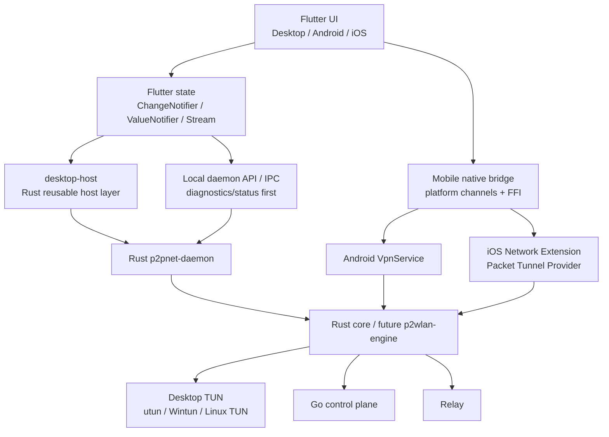

# ADR 0002: Flutter UI + Rust Core + 平台原生 VPN/TUN 客户端迁移

- Status: Accepted for phased migration
- Date: 2026-07-29
- Scope: P2WLAN desktop/mobile client architecture, UI migration, host boundary, mobile VPN/TUN integration

## 背景

P2WLAN 当前客户端由 Rust core、Tauri + React 桌面控制台、Go 控制面/Relay 组成。Rust 已负责客户端核心能力，包括 daemon、TUN、路由、WireGuard 数据面、NAT traversal、Relay fallback、crypto、peer/path selection 和 diagnostics。桌面 UI 当前使用 Tauri + React + TypeScript + Vite，Tauri 负责窗口、托盘、权限检查、daemon 生命周期、提权启动、日志目录和本地 bridge。

长期目标是支持手机、PC、Mac 的完整客户端。用户关心内存占用和长期跨平台维护成本，因此客户端 UI 方向改为 Flutter，但不能把 VPN/TUN、NAT、Relay 或加密数据面迁移到 Flutter。Flutter 是跨平台 UI 和产品交互层；Rust 仍是客户端网络核心；Android 和 iOS 必须通过平台官方 VPN/TUN 能力接入。

本 ADR 冻结迁移决策，避免后续实现误把 Flutter 原型扩展成网络核心重写，或在移动端绕开系统 VPN 框架。

## 当前架构边界

当前仓库边界如下：

| 路径 | 当前职责 | 迁移判断 |
| --- | --- | --- |
| `client/tun` | Linux TUN、macOS utun、Windows Wintun 抽象和实现 | 保留 Rust；移动端后续补 Android/iOS provider 适配层 |
| `client/daemon` | 控制面注册、TUN 初始化、路由、UDP、WireGuard、NAT、Relay、peer、diagnostics | 保留 Rust；不得为 Flutter 重写网络核心 |
| `client/nat` | STUN、candidate、punch、NAT profile | 保留 Rust |
| `client/relay` | Rust Relay client/server 协议能力 | 保留 Rust |
| `client/wireguard` | 加密会话和数据面 | 保留 Rust |
| `client/crypto` | 密钥、签名、加密基础能力 | 保留 Rust |
| `client/cli` | headless 管理和诊断 consumer | 保留；不因 Flutter 迁移删除 |
| `src-tauri` | Tauri 桌面宿主、daemon 生命周期、提权、托盘、窗口、日志 | 保留；可逐步抽出 reusable desktop-host |
| `src` | React 桌面 UI、状态映射、页面 | 保留；Flutter 稳定前不删除 |
| `server` | Go 控制面、认证、信令、中继服务 | 不属于本次迁移 |

当前 UI 与 Rust daemon 的主要通信方式：

1. React `src/lib/clientApi.ts` 通过本地 daemon diagnostics `GET /status` 获取运行状态。
2. Tauri command 封装 `desktop_status`、`daemon_status`、`daemon_start`、`daemon_start_elevated`、`daemon_stop`、`permission_status`、`daemon_log_tail`、`open_logs`、`app_quit` 等桌面宿主能力。
3. daemon 本地 diagnostics HTTP 提供 `GET /health`、`GET /status`、`POST /shutdown`。
4. React 状态层会监听 Tauri 事件 `p2wlan-status`，缺失时退回轮询 diagnostics。

该边界已经支持“新 UI 作为 daemon consumer”迁移。Flutter 首阶段应复用这个边界，而不是改动 Rust 数据面。

## 决策结论

P2WLAN 采用以下目标架构：



结论：

1. Flutter 替代 React 作为未来默认 UI，但现有 Tauri/React 客户端不删除、不停用，直到 Flutter 达到等价验收。
2. Flutter 不承载 VPN/TUN 核心逻辑，不实现 NAT traversal、WireGuard、Relay、路由或 packet pump。
3. Rust core/daemon 保持为客户端网络核心；未来可从 `client/daemon` 中抽出 `client/engine`，但第一阶段不重写。
4. 桌面端第一阶段优先复用现有 daemon diagnostics/status API，先实现只读状态原型。
5. 桌面 daemon 生命周期、提权启动、停止、日志、托盘等宿主能力应由 desktop-host 承担，优先复用现有 `src-tauri/src/daemon_manager.rs` 逻辑。
6. Android 必须走 `VpnService`；iOS 必须走 Network Extension / Packet Tunnel Provider。
7. 移动端不运行外部 daemon 进程，后续通过 flutter_rust_bridge/FFI 或 platform channel 将系统 VPN packet interface 与 Rust core 连接。

## 非目标

以下事项不属于本 ADR 第一阶段：

1. 不新增 Flutter 工程代码。
2. 不修改 Rust daemon、Tauri、React、CLI 或 server 代码。
3. 不删除现有 Tauri/React 客户端。
4. 不重写 Rust 网络核心、WireGuard、NAT traversal、Relay、crypto、TUN 或 diagnostics。
5. 不在 Dart 中实现 VPN/TUN、路由、packet pump、hole punching、Relay fallback 或加密会话。
6. 不引入大型 UI 框架、复杂状态管理框架或新依赖。
7. 不承诺首个 Flutter 原型具备启动/停止 TUN、提权授权、修改系统网络或移动 VPN 能力。
8. 不改变控制面、Relay 协议或服务端认证模型。

## 职责划分

### Flutter UI

Flutter 负责产品界面和轻量状态编排：

- 登录/注册表单、设置页、Dashboard、Nodes、Diagnostics、Tunnels、Onboarding。
- 展示 daemon status、peer path、relay 状态、NAT 诊断、日志摘要和错误提示。
- 管理 UI state，建议使用 Flutter 内置 `ChangeNotifier`、`ValueNotifier`、`StreamBuilder` 或极轻量 repository 模式。
- 管理用户可编辑设置和安全存储入口，但敏感长期设备身份、私钥和数据面状态仍由 Rust/daemon 管理。
- 在 P1 原型中只读状态，不负责提权启动、停止 daemon、打开日志目录、托盘或修改系统网络。

Flutter 明确不负责：

- VPN/TUN 核心逻辑。
- packet fd 读写循环。
- WireGuard session。
- NAT traversal。
- Relay fallback。
- 系统路由安装/清理。
- 移动平台 VPN service/extension 的生命周期核心。

### Rust Core / Daemon

Rust 继续负责客户端核心：

- TUN/Wintun/utun 创建、配置、读写和生命周期。
- Android/iOS 后续 packet interface 适配。
- WireGuard 加密数据面。
- 控制面注册、设备凭据、信令、peer map。
- STUN、candidate gather、UDP punch、NAT profile。
- Direct/Relay path selection、fallback、恢复和 diagnostics。
- 路由安装、清理、系统网络错误归一化。
- 本地 status/health/diagnostics API。

### desktop-host

desktop-host 是桌面客户端宿主层，目标是从 Tauri 专有代码中抽出可复用能力。它可以是 Rust crate，也可以先保持在 Tauri 内，后续由 Flutter desktop plugin 调用。

desktop-host 负责：

- 查找 `p2pnet-daemon` 二进制。
- 管理 daemon PID、diagnostics endpoint marker、日志路径。
- 检测已有 daemon、恢复后台 daemon 状态。
- 启动普通 daemon。
- macOS 管理员授权启动。
- Windows UAC 启动。
- Linux 后续 polkit/sudo/capability 指引。
- 停止 daemon，优先走本地 shutdown，再按 PID 安全终止。
- 权限检查、日志 tail、打开日志目录。
- 桌面托盘、关闭行为、开机启动等宿主能力的统一抽象。

desktop-host 不负责：

- 网络数据面。
- NAT/path 决策。
- 业务状态展示。
- 移动端 VPN provider。

### Mobile VPN Layer

移动端必须走平台原生 VPN/TUN 层：

- Android 必须使用 `VpnService` 获取系统授权和 TUN file descriptor。
- iOS 必须使用 Network Extension 的 Packet Tunnel Provider。
- Flutter app 只负责发起授权、展示状态、配置输入和与 provider 通信。
- Rust core 负责处理 packet、crypto、peer、NAT、Relay 和控制面连接。

移动端不允许：

- 用 Flutter/Dart 直接模拟 VPN/TUN。
- 绕过 Android `VpnService`。
- 绕过 iOS Network Extension / Packet Tunnel Provider。
- 在普通 app 进程里假装拥有系统 VPN 能力。

## 桌面通信方案

### P1：只读 diagnostics/status

P1 Flutter 原型范围必须严格限制为只读状态：

- 读取用户输入或默认 diagnostics URL。
- 调用现有 daemon `GET /health` 判断可达性。
- 调用现有 daemon `GET /status` 读取完整 diagnostics snapshot。
- 将 snapshot 映射为 Flutter/Dart 的 `DaemonStatus`、`PeerStatus`、`TunnelStatus`、`RouteStatus`。
- 轮询策略可先使用可见窗口 2 秒、后台 10 秒，保持与现有 React 行为接近。
- UI 至少覆盖 Dashboard、Peers 简表、Diagnostics 原始/摘要状态。

P1 明确不能做：

- 不启动 daemon。
- 不停止 daemon。
- 不调用 `POST /shutdown`。
- 不提权。
- 不修改路由、TUN、Wintun、utun。
- 不打开日志目录。
- 不做托盘。
- 不改 daemon API。

### P2：desktop-host lifecycle

P2 才接入桌面宿主能力：

- 抽出或复用现有 daemon lifecycle 逻辑。
- Flutter 通过 platform channel 或 Rust-backed plugin 调用 desktop-host。
- 能启动、提权启动、停止、读取权限、读取日志 tail、打开日志目录。
- 保持 diagnostics/status 为状态源，desktop-host 只提供生命周期和宿主能力。

### P3：IPC 加固

现有 loopback HTTP 适合 P1/P2 兼容，但后续应加固：

- 保持 `GET /status` 向后兼容。
- 新增本地 IPC 优先级：Unix domain socket、Windows named pipe，或带一次性本地 token 的 loopback HTTP。
- `POST /shutdown` 等控制面必须有本地认证，避免任意本机低权限进程误操作。
- status schema 需要版本字段和向后兼容策略。
- Flutter/Dart models 应由 schema 驱动或至少有 fixture 测试，避免字段漂移。

## 移动端 Android 架构方案

Android 客户端分层：

```text
Flutter Activity
  -> platform channel
  -> Android VpnService
  -> TUN file descriptor
  -> Rust core via FFI/flutter_rust_bridge
  -> control plane / NAT / relay / WireGuard
```

要求：

1. Android 必须走 `VpnService.prepare()` 和 `VpnService` 用户授权流程。
2. `VpnService.Builder` 负责配置虚拟地址、路由、DNS、MTU 等系统 VPN 参数。
3. TUN file descriptor 由 Android 原生层交给 Rust core 或 Rust-managed packet loop。
4. Rust core 不应假设自己能像桌面 root daemon 一样直接创建系统 TUN。
5. Flutter 只展示授权状态、连接状态、peer 状态和错误，不直接读写 packet fd。
6. Android 后台、前台服务通知、Doze、电量和网络变化恢复必须作为移动专项设计处理。

首个 Android POC 验收可以只要求：

- 成功触发系统 VPN 授权。
- 成功建立 `VpnService`。
- 能将 packet fd 生命周期传递给 Rust 侧 stub/adapter。
- 能从 Rust 状态流回传 Flutter。
- 停止后系统 VPN 图标消失且无残留路由。

## 移动端 iOS 架构方案

iOS 客户端分层：

```text
Flutter app
  -> app group / method channel
  -> Network Extension
  -> NEPacketTunnelProvider
  -> packetFlow
  -> Rust core staticlib/FFI
  -> control plane / NAT / relay / WireGuard
```

要求：

1. iOS 必须走 Network Extension / Packet Tunnel Provider。
2. VPN packet loop 必须运行在 Packet Tunnel Provider extension 中。
3. Flutter app 负责配置、登录、状态展示和启动/停止 VPN profile。
4. Rust core 需编译成 iOS 可链接静态库或 xcframework，供 extension 调用。
5. extension 与主 app 之间通过 App Group、provider messages 或系统允许的 IPC 交换配置和状态。
6. iOS entitlement、签名、App Group、Network Extension profile 是发布前置条件。

首个 iOS POC 验收可以只要求：

- 能安装/加载 VPN configuration。
- 能启动 Packet Tunnel Provider。
- provider 能初始化 Rust core stub/adapter。
- 能向 Flutter app 回传基础状态。
- 停止后 VPN profile 状态正确且无系统残留。

## 分阶段迁移计划

| 阶段 | 名称 | 范围 | 验收 |
| --- | --- | --- | --- |
| P0 | ADR 冻结 | 只新增本 ADR；不写代码 | git diff 只包含 ADR |
| P1 | Flutter 只读原型 | 新增 Flutter app；只读 `GET /health` / `GET /status`；展示 Dashboard/Peers/Diagnostics | 外部手动运行 daemon 后，Flutter 能显示虚拟 IP、peer、relay、health |
| P2 | Desktop host 接入 | 复用/抽出 daemon lifecycle；Flutter 可启动、提权启动、停止、读权限、读日志 | macOS/Windows 能完成 TUN 启停；Linux 给出明确权限路径 |
| P3 | 功能对齐 | 登录、设置、节点重命名、诊断报告、日志、托盘/关闭行为 | Flutter desktop 功能达到当前 React/Tauri 主要能力 |
| P4 | IPC 与 schema 加固 | 本地 IPC 认证、status schema 版本化、Dart fixture 测试 | 控制类 API 有本地认证；旧 `/status` 兼容 |
| P5 | Android VPN POC | VpnService + Rust core adapter | Android 能启动 VPN provider，并完成 packet fd 生命周期闭环 |
| P6 | iOS VPN POC | Network Extension + Rust core adapter | iOS 能启动 Packet Tunnel Provider，并完成状态闭环 |
| P7 | 双轨发布 | Flutter 成为默认客户端，Tauri 保留 fallback | Desktop smoke、内存基线和回归测试通过后再考虑 deprecate Tauri |

## 内存基线测量方案

迁移不能只凭“Flutter 没有 WebView”判断内存改善，必须用同一场景实测总内存。

### 测量对象

1. 当前 Tauri + React 客户端进程。
2. 当前 Rust `p2pnet-daemon` 进程。
3. Flutter desktop 客户端进程。
4. Flutter 运行时关联进程；如平台产生 helper 进程，必须计入总和。
5. 移动端后续单独测 app、VPN service/extension 和 Rust core 常驻内存。

### 桌面测量场景

每个平台至少测以下场景：

| 场景 | 操作 | 记录 |
| --- | --- | --- |
| S0 冷启动 idle | 打开客户端，不启动 TUN | UI RSS、daemon RSS、总 RSS |
| S1 daemon running | 启动 TUN，无 peer 或少量 peer | UI RSS、daemon RSS、总 RSS |
| S2 connected | 两台设备在线，至少一个 direct/relay path | UI RSS、daemon RSS、总 RSS |
| S3 diagnostics page | 打开诊断页并刷新 3 次 | 峰值 RSS、稳定 RSS |
| S4 long idle | 后台/托盘 30 分钟 | 起始 RSS、结束 RSS、增长量 |

### 建议命令

macOS：

```bash
ps -axo pid,rss,comm | grep -E 'p2wlan|p2pnet-daemon|Flutter'
vmmap <pid> | head
```

Windows PowerShell：

```powershell
Get-Process | Where-Object {$_.ProcessName -match "p2wlan|p2pnet|flutter"} |
  Select-Object ProcessName,Id,WorkingSet64,PrivateMemorySize64
```

Linux：

```bash
ps -o pid,rss,comm -C p2pnet-daemon -C p2wlan
cat /proc/<pid>/status | grep -E 'VmRSS|VmHWM|RssAnon'
```

### 判定口径

- 以用户可感知成本为准，比较 UI + daemon 总 RSS。
- 每个场景至少采样 3 次，记录冷启动后 30 秒稳定值。
- Flutter 版本不应显著高于 Tauri 版本；目标是常见 idle/diagnostics 场景总 RSS 低于 Tauri。
- 若 Flutter UI 降低内存但 daemon 增长抵消收益，必须定位 daemon 增长原因，不能把结果归因给 UI 迁移成功。

## 安全风险

1. 本地 diagnostics/control API 风险：现有 loopback HTTP 暴露 `POST /shutdown`，后续控制类 API 必须增加本地认证或迁移到 UDS/named pipe。
2. Token 存储风险：Flutter 不应把 auth token、device credential 或私钥明文放在普通 shared preferences；桌面用系统 keychain/credential vault，移动用 Keychain/Keystore。
3. 提权风险：macOS/Windows 提权逻辑必须由 desktop-host 严格控制，不允许 UI 拼接任意命令。
4. 移动 VPN entitlement 风险：Android/iOS 必须走系统授权和官方 VPN API，不允许绕开平台策略。
5. FFI 边界风险：Rust core 暴露给 Flutter/移动 provider 的 API 必须最小化，错误码结构化，不能泄露私钥、token 或精确本地网络敏感信息到日志。
6. 生命周期风险：移动平台后台限制可能导致控制面/relay 重连、packet loop 和状态上报异常，必须有明确 degraded/offline 状态。
7. Schema 漂移风险：Dart model 与 Rust diagnostics 字段不一致会造成误报或隐藏真实错误，必须用 fixtures 和版本字段验证。
8. 回归风险：迁移 UI 不能削弱现有 daemon、CLI、Tauri smoke 和诊断能力。

## 验收标准

通用验收：

- 现有 Tauri/React 代码未删除。
- Rust daemon、CLI、server 代码未因 UI 迁移被重写。
- Flutter 不承载 VPN/TUN 核心逻辑。
- Android 设计明确使用 `VpnService`。
- iOS 设计明确使用 Network Extension / Packet Tunnel Provider。
- 桌面第一阶段明确复用现有 daemon diagnostics/status API。
- P1 Flutter 原型只读状态，不负责提权启动、停止或改系统网络。

P1 Flutter 原型验收：

- 在不修改 daemon 的前提下，可配置 diagnostics URL。
- daemon 未运行时显示 offline/不可达，不崩溃。
- daemon 运行时可展示 node ID、virtual IP、network ID、health、UDP local addr、relay 状态、peer 数、peer path。
- 不调用 `daemon_start`、`daemon_start_elevated`、`daemon_stop` 或 `POST /shutdown`。
- 不需要新增 Rust、Tauri、React、CLI、server 依赖。
- 不影响现有 `pnpm run build`、`cargo test --workspace` 和 server 测试基线。

桌面完整迁移验收：

- macOS 能通过系统授权启动 TUN，并展示 utun 状态。
- Windows 能通过 UAC 启动 Wintun daemon，并展示路径状态。
- Linux 能明确支持 CLI/headless 路径；桌面提权方案未完成时必须给出可执行手动指引。
- Flutter 与 Tauri 在同一 daemon build 下显示一致的 peer/path/diagnostics。
- 内存基线报告覆盖 S0-S4，且总 RSS 不劣于 Tauri 路线。

移动 POC 验收：

- Android 使用 `VpnService`，能完成授权、启动、停止和 packet fd 生命周期闭环。
- iOS 使用 Network Extension / Packet Tunnel Provider，能完成启动、停止和基础状态回传。
- Flutter app 不直接读写 packet。
- Rust core 能接收移动 provider 提供的 packet interface 抽象。

## 回滚策略

1. Tauri/React 客户端在 Flutter 达到完整桌面验收前保持可构建、可发布、可回退。
2. Flutter app 独立放在新目录，不覆盖 `src`、`src-tauri` 或现有 release packaging。
3. P1/P2 期间如 Flutter 原型不稳定，发布继续使用 Tauri 客户端。
4. desktop-host 抽取必须保持 Tauri 适配层可用；若抽取造成回归，应先恢复 Tauri 调用路径，再继续重构。
5. 本地 IPC 加固必须兼容旧 `GET /status`，避免 CLI、React 或诊断脚本失效。
6. 移动端 POC 失败不影响桌面 daemon、CLI 或 Tauri release。
7. 任何阶段不得通过删除现有客户端或重写网络核心来“完成迁移”。
