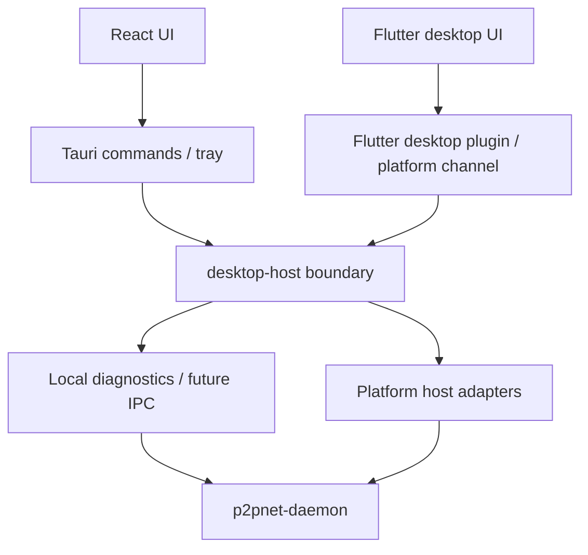

# ADR 0003: P2 desktop-host boundary for Tauri and Flutter desktop

- Status: Proposed for P2 design
- Date: 2026-07-29
- Scope: Desktop host boundary shared by the existing Tauri shell and the future Flutter desktop shell
- Related: `docs/adr/0002-flutter-rust-client-migration.md`

## Background

P1 Flutter is intentionally read-only: it calls the existing local daemon
diagnostics API with `GET /health` and `GET /status`. It does not start, stop,
elevate, configure, or modify system networking.

P2 will eventually give Flutter desktop the same host capabilities currently
owned by `src-tauri`, but P2 must not begin with a broad rewrite. The current
Tauri code already contains working platform behavior for daemon discovery,
permission checks, lifecycle, logs, and tray state. The next step is to define a
small reusable boundary that can later be implemented behind both:

- Tauri commands in `src-tauri/src/main.rs`.
- A Flutter desktop plugin or platform channel.

This ADR is design-only. It does not move code, add a Rust crate, or change
runtime behavior.

## Current Tauri Host Inventory

Reviewed files:

- `src-tauri/src/daemon_manager.rs`
- `src-tauri/src/main.rs`
- `src-tauri/src/permissions.rs`
- `src-tauri/src/tray.rs`

Current host responsibilities are concentrated as follows:

| File | Current responsibility | P2 extraction pressure |
| --- | --- | --- |
| `daemon_manager.rs` | Daemon runtime state, diagnostics URL selection, health/status reads, daemon binary discovery, argument building, config/log/PID/endpoint paths, direct start, elevated start, stop, shutdown, PID fallback, log tail, cleanup | Too broad; should be split into status/discovery, lifecycle, platform elevation, process registry, and log access |
| `main.rs` | Tauri command facade, app state, app setup, tray install, command registration, `open_logs`, `daemon_log_tail`, `app_quit`, `window_chrome_ready` | Keep Tauri-specific window and command glue here; call desktop-host for host operations |
| `permissions.rs` | Platform permission checks and user-facing guidance for macOS root, Linux root/cap_net_admin, Windows admin/Wintun | Good candidate for early extraction because it is mostly read-only and independent of Tauri |
| `tray.rs` | Tauri tray UI, menu events, status polling loop, event emission, copy peer IP | Keep tray UI in Tauri; only share host operations and presentation-safe status models |

Important existing APIs:

- `permission_status`
- `daemon_status`
- `desktop_status`
- `daemon_configure`
- `daemon_start`
- `daemon_start_elevated`
- `daemon_stop`
- `daemon_log_tail`
- `open_logs`
- `app_quit`

## Decision

Introduce a future `desktop-host` boundary as a Rust host library or module that
contains platform and daemon host capabilities that are independent of the UI
framework. Tauri and Flutter desktop should both call that boundary instead of
duplicating lifecycle logic.

The first P2 implementation must be a small extraction with no behavior change:

1. Extract shared **types and read-only host queries** first.
2. Leave existing start/stop/elevated behavior in Tauri until the read-only
   boundary is proven by tests.
3. Move lifecycle in narrow slices only after Tauri commands can be mapped one
   for one to desktop-host methods.

The P2 first cut should not extract all of `DaemonManager`. It should extract a
small, testable layer around:

- `DaemonStartOptions`
- `DaemonOperationPhase`
- `DaemonOperationStatus`
- `DesktopStatus`
- diagnostics URL normalization and loopback validation
- `GET /health` / `GET /status` client
- default config/log/PID/endpoint path calculation
- log-tail read helper
- permission status data model and check function

Lifecycle extraction should come later, after this read-only surface is stable.

## Architecture



## desktop-host Responsibilities

desktop-host owns UI-independent desktop host behavior:

- Maintain daemon operation state and busy/error transitions.
- Resolve the daemon binary path from env var, side-by-side bundle layout, dev
  target directory, and `PATH`.
- Normalize and validate diagnostics URLs, limited to loopback hosts.
- Choose an available diagnostics port near the requested port.
- Read daemon `GET /health` and `GET /status`.
- Produce `DesktopStatus` with diagnostics, liveness, stale diagnostics, and
  operation state.
- Persist and recover diagnostics endpoint marker.
- Read and verify PID marker.
- Discover daemon PID by diagnostics bind where needed.
- Build daemon command-line arguments from typed start options.
- Compute config/log/PID/endpoint paths.
- Read recent daemon log lines.
- Check platform permissions and return user-facing remediation guidance.
- Start daemon without elevation when the host process already has required
  privileges.
- Start daemon with platform elevation after explicit UI request.
- Stop daemon using safe ordered shutdown paths.
- Clean up only processes that are verified as `p2pnet-daemon`.

## Non-Responsibilities

desktop-host must not own:

- Flutter widgets, React components, routing, or UI state management.
- Tauri tray rendering, menu item construction, or window chrome.
- Mobile Android `VpnService`.
- iOS Network Extension / Packet Tunnel Provider.
- VPN/TUN packet loops.
- WireGuard, NAT traversal, relay selection, crypto, peer routing, or daemon
  network core.
- Login UI, account flows, or control-plane auth UI.
- Server/control-plane API implementation.
- Product presentation state that is purely UI-specific.

## Rust Trait/API Draft

This is an interface sketch, not implementation code.

```rust
#[derive(Debug, Clone, serde::Serialize, serde::Deserialize)]
pub struct DesktopHostStartOptions {
    pub diagnostics_url: Option<String>,
    pub control_server: Option<String>,
    pub auth_token: Option<String>,
    pub network_id: Option<String>,
    pub device_name: Option<String>,
    pub tun_interface: Option<String>,
    pub udp_bind: Option<String>,
    pub udp_advertise: Option<String>,
    pub socket_pool: Option<String>,
    pub mtu: Option<u32>,
}

#[derive(Debug, Clone, Copy, serde::Serialize, serde::Deserialize)]
#[serde(rename_all = "snake_case")]
pub enum DesktopHostPhase {
    Stopped,
    Authorizing,
    Launching,
    WaitingForDaemon,
    Running,
    Stopping,
    Error,
}

#[derive(Debug, Clone, serde::Serialize, serde::Deserialize)]
#[serde(rename_all = "camelCase")]
pub struct DesktopHostOperation {
    pub phase: DesktopHostPhase,
    pub message: String,
    pub started_at_ms: u64,
    pub last_error: Option<String>,
}

#[derive(Debug, Clone, serde::Serialize, serde::Deserialize)]
#[serde(rename_all = "camelCase")]
pub struct DesktopHostStatus {
    pub operation: DesktopHostOperation,
    pub diagnostics: Option<serde_json::Value>,
    pub diagnostics_url: String,
    pub diagnostics_alive: bool,
    pub diagnostics_stale: bool,
    pub diagnostics_error: Option<String>,
}

#[derive(Debug, Clone, serde::Serialize, serde::Deserialize)]
#[serde(rename_all = "camelCase")]
pub struct DesktopHostPermissionStatus {
    pub platform: String,
    pub can_create_tun: String,
    pub can_modify_routes: String,
    pub needs_elevation: bool,
    pub recommended_action: String,
    pub elevated_command_preview: Option<String>,
    pub details: Vec<String>,
    pub checks: Vec<DesktopHostPermissionCheck>,
}

#[async_trait::async_trait]
pub trait DesktopHost: Send + Sync {
    async fn permission_status(&self) -> Result<DesktopHostPermissionStatus, DesktopHostError>;
    async fn daemon_status(
        &self,
        diagnostics_url: Option<String>,
    ) -> Result<serde_json::Value, DesktopHostError>;
    async fn desktop_status(
        &self,
        diagnostics_url: Option<String>,
    ) -> Result<DesktopHostStatus, DesktopHostError>;
    async fn configure(
        &self,
        options: DesktopHostStartOptions,
    ) -> Result<DesktopHostOperation, DesktopHostError>;
    async fn start(
        &self,
        options: Option<DesktopHostStartOptions>,
    ) -> Result<DesktopHostOperation, DesktopHostError>;
    async fn start_elevated(
        &self,
        options: Option<DesktopHostStartOptions>,
    ) -> Result<DesktopHostOperation, DesktopHostError>;
    async fn stop(
        &self,
        diagnostics_url: Option<String>,
    ) -> Result<DesktopHostOperation, DesktopHostError>;
    fn recent_daemon_log_lines(&self, max_lines: usize) -> Result<Vec<String>, DesktopHostError>;
    fn log_dir(&self) -> Result<std::path::PathBuf, DesktopHostError>;
    fn cleanup_on_host_exit(&self);
}
```

For the first P2 extraction, avoid adding `async_trait` or a public trait if it
would introduce dependencies. A concrete `DesktopHost` struct with equivalent
methods is acceptable. The trait above describes the long-term contract only.

### Error Model Draft

```rust
#[derive(Debug, Clone, serde::Serialize, serde::Deserialize)]
#[serde(rename_all = "snake_case")]
pub enum DesktopHostErrorKind {
    InvalidDiagnosticsUrl,
    DaemonUnavailable,
    DaemonStatusDecodeFailed,
    PermissionDenied,
    ElevationCancelled,
    DaemonBinaryNotFound,
    ExistingDaemonConflict,
    StartTimeout,
    StopTimeout,
    UnsafePidRefused,
    PlatformUnsupported,
    Io,
    Internal,
}

#[derive(Debug, Clone, serde::Serialize, serde::Deserialize)]
#[serde(rename_all = "camelCase")]
pub struct DesktopHostError {
    pub kind: DesktopHostErrorKind,
    pub message: String,
    pub recoverable: bool,
    pub details: Vec<String>,
}
```

Tauri may still convert this to `Result<T, String>` initially. Flutter should
receive structured errors over the platform channel once the plugin exists.

## Tauri Command Mapping

| Current Tauri command | Future desktop-host call | Notes |
| --- | --- | --- |
| `permission_status` | `host.permission_status()` | First extraction candidate; read-only and low risk |
| `daemon_status` | `host.daemon_status(diagnostics_url)` | Read-only; should preserve existing JSON payload |
| `desktop_status` | `host.desktop_status(diagnostics_url)` | Read-only/statusful; should remain source for tray polling |
| `daemon_configure` | `host.configure(options)` | Updates remembered start options only; no lifecycle side effect |
| `daemon_start` | `host.start(options)` | Later extraction; keep exact privilege behavior |
| `daemon_start_elevated` | `host.start_elevated(options)` | Later extraction; highest-risk platform slice |
| `daemon_stop` | `host.stop(diagnostics_url)` | Later extraction; depends on shutdown/IPC security plan |
| `daemon_log_tail` | `host.recent_daemon_log_lines(max_lines)` | Early extraction candidate; read-only |
| `open_logs` | `host.log_dir()` + Tauri open-shell adapter | desktop-host returns path; Tauri owns `open`/`explorer`/`xdg-open` side effect |
| `app_quit` | Tauri calls `host.stop(...)` then Tauri app exit | App exit remains Tauri-specific |
| `window_chrome_ready` | No desktop-host mapping | Pure window behavior, stays in Tauri |

Tray mapping:

| Current tray behavior | Future boundary |
| --- | --- |
| Poll `daemon_manager.desktop_status(None)` | Poll `host.desktop_status(None)` |
| Emit `p2wlan-status` | Tauri-only event bridge |
| Connect menu calls `begin_start_elevated(None)` | Tauri calls `host.start_elevated(None)` after UI confirmation |
| Disconnect menu calls `begin_stop(None)` | Tauri calls `host.stop(None)` |
| Open logs menu calls `open_logs()` | Tauri opens `host.log_dir()` |
| Copy peer IP | Tauri-only clipboard behavior |

## Flutter Platform Channel / Plugin Mapping

P2 Flutter should add a small desktop plugin/channel only after this boundary is
implemented on the Rust side. Suggested channel shape:

| Flutter method | desktop-host call | P2 phase |
| --- | --- | --- |
| `permissionStatus()` | `permission_status()` | Early, read-only |
| `desktopStatus({diagnosticsUrl})` | `desktop_status(...)` | Early, read-only |
| `daemonStatus({diagnosticsUrl})` | `daemon_status(...)` | Early, read-only |
| `configureStartOptions(options)` | `configure(options)` | Middle; no lifecycle |
| `daemonLogTail({maxLines})` | `recent_daemon_log_lines(...)` | Middle; read-only |
| `openLogDir()` | Native plugin opens `host.log_dir()` | Middle; host returns path, plugin performs UI shell open |
| `startDaemon(options)` | `start(options)` | Later P2; explicit user action only |
| `startDaemonElevated(options)` | `start_elevated(options)` | Later P2; explicit user action only |
| `stopDaemon({diagnosticsUrl})` | `stop(...)` | Later P2; explicit user action only |

Flutter must not call lifecycle methods from app startup, background refresh, or
passive navigation. Lifecycle methods require a direct user action and a visible
confirmation path.

## macOS / Windows / Linux Differences

### macOS

Current behavior:

- Permission check uses effective UID and explains root requirement for utun and
  route changes.
- Elevated start uses AppleScript `do shell script ... with administrator
  privileges`.
- Elevated daemon is detached and tracked through PID/endpoint markers plus
  diagnostics endpoint recovery.
- Ready timeout is longer because cold start may create utun, gather candidates,
  and reconnect control-plane state.

P2 implications:

- The AppleScript shell construction should be isolated in a macOS adapter.
- Quoting and token handling must remain heavily tested.
- Root-owned stale marker files must be handled without breaking future starts.
- Flutter plugin must not reimplement AppleScript. It should call desktop-host.

### Windows

Current behavior:

- Permission check uses `net session` for admin detection.
- Wintun runtime discovery checks env var, executable directory, current dir,
  and `PATH`.
- Elevated start uses `ShellExecuteExW` with `runas`.
- PID is captured from process handle when possible.
- Stale daemon cleanup can require UAC.

P2 implications:

- Windows elevation and process commands belong in a Windows adapter.
- Wintun discovery remains host responsibility, not Flutter UI responsibility.
- Any PowerShell/CIM process lookup must avoid leaking tokens in UI-visible
  errors unless explicitly redacted.
- Stop behavior must distinguish daemon-initiated shutdown from forced process
  termination.

### Linux

Current behavior:

- Permission check requires root or points users toward `cap_net_admin`.
- Graphical elevated start is not implemented.
- Current fallback tells users to start daemon manually with sudo/polkit.

P2 implications:

- P2 should not invent Linux GUI elevation as part of the first slice.
- Keep Linux lifecycle conservative: read-only status first, manual startup
  guidance second, polkit/sudo design later.
- If `setcap` is supported, document install-time and packaging implications
  separately.

## Privileged Start Risks

Privileged start is the highest-risk P2 area. Risks:

- Shell quoting bugs may allow argument injection, especially with paths,
  device names, control URLs, or tokens.
- Auth tokens are currently passed as daemon command-line arguments, which can
  be visible to local process inspection tools.
- macOS AppleScript prompts can be cancelled or delayed; UI must reflect
  `Authorizing` and timeout states.
- Windows UAC can be cancelled; stale elevated daemons may remain.
- PID files can be stale, missing, root-owned, or point to the wrong process.
- Existing daemon conflict messages must not encourage unsafe process
  termination without verification.
- Cleanup on app exit can accidentally stop a daemon the app did not start if
  process ownership and endpoint markers are not precise.
- Tray and Flutter lifecycle calls can race unless the host state machine owns
  all transitions.

Mitigations:

- Keep a single host state machine for `Authorizing`, `Launching`,
  `WaitingForDaemon`, `Running`, `Stopping`, and `Error`.
- Verify every PID by command line or process name before any termination path.
- Prefer daemon-authenticated shutdown over forced process termination.
- Redact tokens from logs and user-facing errors.
- Preserve current Tauri behavior until Flutter uses the same host boundary.
- Add tests for shell quoting, Windows argument quoting, stale endpoint files,
  stale PID files, and existing daemon conflict detection before moving code.

## POST /shutdown and Local IPC Security Plan

Current local daemon control includes unauthenticated loopback `POST /shutdown`.
P1 Flutter deliberately never calls it. P2 must not expand control use without a
security plan.

Plan:

1. Keep `GET /health` and `GET /status` backward compatible.
2. Treat `POST /shutdown` as legacy-compatible but not sufficient for new
   control APIs.
3. Add a local control credential for control endpoints before introducing more
   lifecycle calls outside Tauri.
4. Prefer platform IPC for control paths:
   - macOS/Linux: Unix domain socket with owner-only permissions.
   - Windows: named pipe with restrictive ACL.
5. If loopback HTTP remains, require a per-launch random token stored in an
   owner-readable marker file or passed through a protected channel.
6. Split diagnostics from control:
   - Diagnostics: read-only `GET /health`, `GET /status`.
   - Control: authenticated shutdown and future lifecycle commands.
7. desktop-host should own control-token loading and request signing; Flutter
   should never directly construct shutdown URLs.
8. Do not add Flutter lifecycle calls that hit `POST /shutdown` until the
   authentication or IPC plan is implemented.

## P2 Minimal Implementation Order

P2 should be sliced to keep the existing Tauri app releasable after every step.

### P2.0 Documentation and Tests Only

- Land this ADR.
- Add no runtime code.
- Keep P1 Flutter read-only.

### P2.1 First Code Cut: Read-Only Host Types and Helpers

First implementation should extract the smallest safe subset:

- Shared status/start option types.
- Diagnostics URL parsing and loopback validation.
- `health_url_from_status_url`.
- `diagnostics_bind_from_url`.
- `GET /health` / `GET /status` client.
- Default config/log/PID/endpoint path helpers.
- `recent_daemon_log_lines`.
- Permission status models and read-only check.

Tauri should continue to expose the same commands. No Flutter lifecycle calls
should be added in this step.

Why this first: it has minimal platform side effects, builds confidence in the
shared boundary, and gives Flutter the same read-only host vocabulary without
touching privileged lifecycle.

### P2.2 Tauri Adapter Uses Read-Only Host

- Wire `permission_status`, `daemon_status`, `desktop_status`, and
  `daemon_log_tail` through the extracted read-only host.
- Preserve existing serialized field names and user-facing behavior.
- Keep tray start/stop wired to the old `DaemonManager` lifecycle until tests
  prove parity.

### P2.3 Flutter Desktop Plugin Read-Only Host

- Add Flutter desktop platform channel/plugin for read-only methods only:
  `permissionStatus`, `desktopStatus`, `daemonStatus`, `daemonLogTail`.
- Keep P1 direct HTTP path as fallback if the plugin is unavailable.
- Do not add start/stop/elevated methods yet.

### P2.4 Lifecycle Extraction Behind Tauri

- Move `configure`, normal `start`, and operation state machine next.
- Then move `start_elevated` per platform adapter.
- Move `stop` last, after shutdown/IPC security is agreed.

### P2.5 Flutter Lifecycle Enablement

- Expose Flutter lifecycle buttons only after desktop-host lifecycle is shared,
  security checks are in place, and Tauri behavior remains unchanged.
- Lifecycle calls require explicit user action and visible operation state.

## Rollback Strategy

- Keep `src-tauri` as the source of truth until each desktop-host slice has
  equivalent tests and behavior.
- Do not delete existing Tauri code during P2 extraction; route commands through
  adapters only after parity.
- Each extraction PR should be reversible by restoring the Tauri command to the
  previous `DaemonManager` call.
- Flutter plugin must be optional during P2; direct read-only diagnostics HTTP
  remains the fallback.
- If lifecycle extraction regresses, disable Flutter lifecycle entry points and
  keep Tauri lifecycle path active.
- Do not deprecate Tauri/React until desktop-host powers both shells and memory,
  lifecycle, and diagnostics smoke tests pass.

## Acceptance Criteria for This Design

- Document identifies desktop-host responsibilities and non-responsibilities.
- Document proposes a Rust API/trait boundary without implementing it.
- Document maps current Tauri commands and tray events to desktop-host calls.
- Document maps future Flutter platform channel/plugin methods.
- Document calls out macOS, Windows, and Linux differences.
- Document treats privileged start and local shutdown as explicit risks.
- Document says the first P2 implementation should extract read-only helpers and
  types, not perform a broad lifecycle rewrite.
- No daemon is started or stopped as part of this ADR.
- No Rust/Tauri/React/Flutter behavior code is modified.
