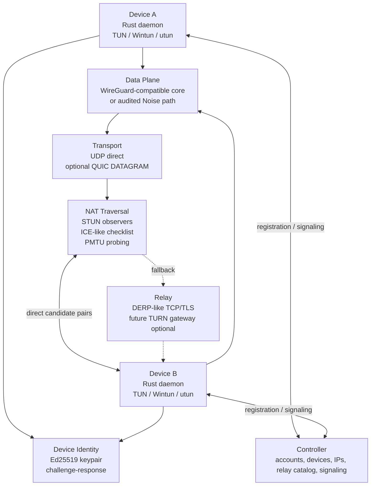

# P2WLAN v2 Architecture Roadmap

This document turns the production direction into phased engineering work. v2 is not about collecting protocol names; it is about making identity, data plane, traversal, relay, observability, and release evidence line up behind clear boundaries.

## Target Architecture

## Phased Plan

| Phase | Goal | Key implementation | Evidence |
| --- | --- | --- | --- |
| v1.1 Clear boundaries | Make the current Preview auditable | README/doctor/UI state protocol, relay, MTU, and NAT limits clearly | `/status` exposes protocol/MTU; hardening checklist and NAT matrix are traceable |
| v1.2 Stronger traversal | Improve hard-NAT success | Multiple STUN observers, candidate reason codes, socket-pool cooldown, relay health | NAT-01 through NAT-08 matrix records with explainable failures |
| v1.3 Performance hardening | Reduce MTU blackholes and relay stalls | `scripts/mtu-smoke.sh`, manual MTU downgrade, later automatic PMTU probing | 1420/1380/1280 smoke records and visible high-MTU relay risk |
| v2.0 Data-plane decision | Reduce crypto maintenance risk | Prefer `boringtun`/`wireguard-go`/platform WireGuard; if in-repo crypto remains, add audit and vectors | External review, fuzzing, replay/rekey/malformed-packet tests |
| v2.1 Standardized transport | Better mobile and enterprise-network behavior | Evaluate QUIC DATAGRAM or relay transport first; avoid mapping transparent L3 traffic to application streams | TCP/UDP/relay stress, network switch, recovery tests |
| v2.2 Protocol evolution | Evolvable control-plane messages | Versioned JSON or protobuf/capnproto dual-stack migration | Golden fixtures, backward-compat tests, staged migration |

## Core Tradeoffs

- **Noise vs WireGuard userspace**: production defaults should prefer audited WireGuard userspace. The in-repo Noise path can remain valuable research, but it needs external review and fixed test vectors.
- **BLAKE2s vs BLAKE3**: keep BLAKE2s/HKDF-BLAKE2s for the WireGuard-like path. A BLAKE3-based protocol should be separately named and reviewed.
- **Where QUIC fits**: QUIC is a better fit for relay/transport enhancement or QUIC DATAGRAM than for splitting transparent VPN traffic into SSH/file/game application streams.
- **Relay vs TURN**: the current relay is DERP-like ciphertext forwarding. Standard TURN requires allocation, permission, channel, refresh, and authentication semantics and should be a separate gateway capability.
- **Device identity**: Ed25519 owns control-plane identity, challenge-response, and signaling binding. X25519 remains the data-plane key-exchange mechanism.

## Suggested Rust Boundaries

| Component | Candidate library | Purpose |
| --- | --- | --- |
| async runtime | `tokio` | daemon, UDP, control client, relay client |
| QUIC | `quinn` | later QUIC DATAGRAM or relay transport evaluation |
| TUN | existing `client/tun` plus platform backends | TUN/Wintun/utun abstraction |
| WireGuard userspace | `boringtun` or `wireguard-go` interop layer | reduce in-house crypto risk |
| Noise research path | `snow` or existing in-repo crypto | production only after audit and vectors are complete |
| schema | versioned JSON, protobuf, capnproto | control signaling and dual-stack migration |

## Definition Of Done

- README, CLI doctor, Diagnostics UI, and `/status` report the same protocol-boundary facts.
- The NAT matrix covers at least eight real scenarios with direct/relay/MTU results.
- Relay-visible metadata is documented, and tests protect private payload plaintext.
- MTU has a smoke script, manual downgrade path, and automatic PMTU plan.
- Production claims wait for either external security review or a mature WireGuard userspace path.
