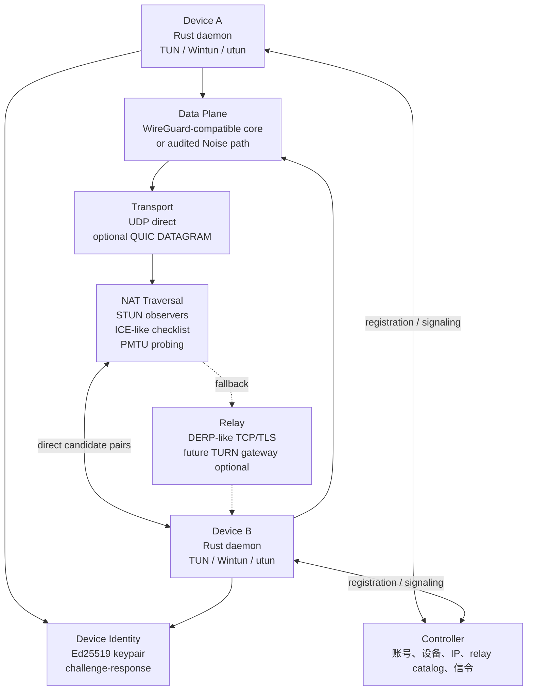

# P2WLAN v2 架构路线图

本文把生产化方向拆成可落地阶段。v2 的核心不是堆协议名，而是把身份、数据面、穿透、中继、可观测性和验收证据收敛成一套清晰边界。

## 目标架构

## 分阶段方案

| 阶段 | 目标 | 关键实现 | 验收证据 |
| --- | --- | --- | --- |
| v1.1 边界清晰 | 当前 Preview 可审计 | README/doctor/UI 明确协议、relay、MTU、NAT 限制 | `/status` 暴露 protocol/MTU，生产化清单和 NAT 矩阵可追踪 |
| v1.2 穿透增强 | 提升复杂 NAT 成功率 | 多 STUN observer、candidate reason code、socket-pool 冷却、relay health | NAT-01 到 NAT-08 有矩阵记录，失败可解释 |
| v1.3 性能硬化 | 降低 MTU blackhole 和 relay 卡顿 | `scripts/mtu-smoke.sh`、手动 MTU 降级、后续自动 PMTU 探测 | 1420/1380/1280 smoke 记录，relay 高 MTU 风险可见 |
| v2.0 数据面选择 | 降低密码协议维护风险 | 优先评估 `boringtun`/`wireguard-go`/平台 WireGuard；若保留自研则补审计和测试向量 | 外部审计、fuzz、replay/rekey/malformed packet 测试 |
| v2.1 标准化传输 | 更好移动和企业网络适应性 | QUIC DATAGRAM 或 relay transport 优先；避免把透明 L3 流量拆成应用 stream | TCP/UDP/relay 压测、网络切换和恢复测试 |
| v2.2 协议演进 | 控制面消息可演进 | JSON versioning 或 protobuf/capnproto 双栈迁移 | golden fixtures、向后兼容测试、灰度迁移 |

## 关键技术取舍

- **Noise vs WireGuard userspace**：生产默认应优先复用已审计 WireGuard userspace；自研 Noise 路径保留研究价值，但必须有外部审计和固定测试向量。
- **BLAKE2s vs BLAKE3**：WireGuard-like 路径保持 BLAKE2s/HKDF-BLAKE2s 语义，不混入 BLAKE3；若另起新协议，需要独立命名和审计。
- **QUIC 的位置**：QUIC 更适合作为 relay/transport 增强或 QUIC DATAGRAM 承载，不应把透明 VPN 流量强行映射为 SSH/file/game 等应用 stream。
- **Relay vs TURN**：当前 relay 是 DERP-like 密文转发；标准 TURN 需要 allocation、permission、channel、refresh 和认证语义，应该作为独立 gateway 能力。
- **设备身份**：Ed25519 只负责控制面身份、challenge-response、信令绑定；X25519 继续用于数据面密钥交换。

## 推荐 Rust 组件边界

| 组件 | 候选库 | 用途 |
| --- | --- | --- |
| async runtime | `tokio` | daemon、UDP、control client、relay client |
| QUIC | `quinn` | 后续 QUIC DATAGRAM 或 relay transport 评估 |
| TUN | 现有 `client/tun` + 平台后端 | TUN/Wintun/utun 抽象 |
| WireGuard userspace | `boringtun` 或 `wireguard-go` 互操作层 | 降低自研 crypto 风险 |
| Noise research path | `snow` 或现有 in-repo crypto | 仅在审计和测试向量齐全后进入生产路径 |
| schema | versioned JSON, protobuf, capnproto | 控制面信令和迁移期双栈解析 |

## Definition Of Done

- README、CLI doctor、Diagnostics UI、`/status` 对协议边界给出同一套事实。
- NAT 矩阵覆盖至少 8 个真实场景，并保留 direct/relay/MTU 结果。
- Relay metadata 暴露范围写清楚，payload 明文不可见有测试保证。
- MTU 有 smoke 脚本、手动降级路径和自动 PMTU 探测计划。
- Production 声明前完成外部安全审计或切换到成熟 WireGuard userspace。
